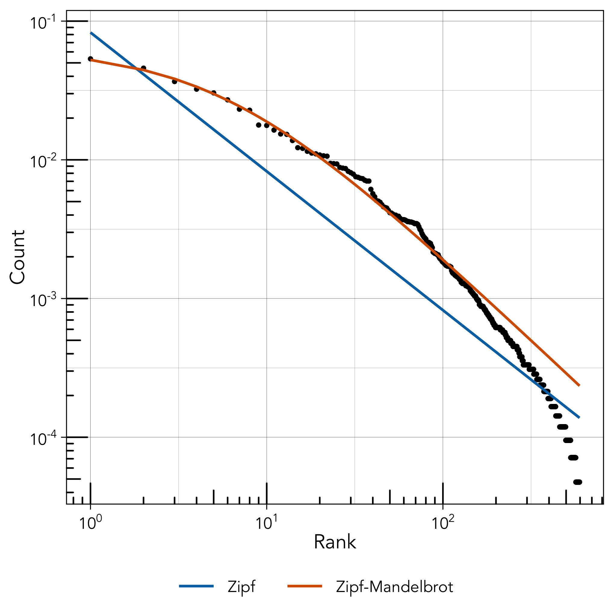
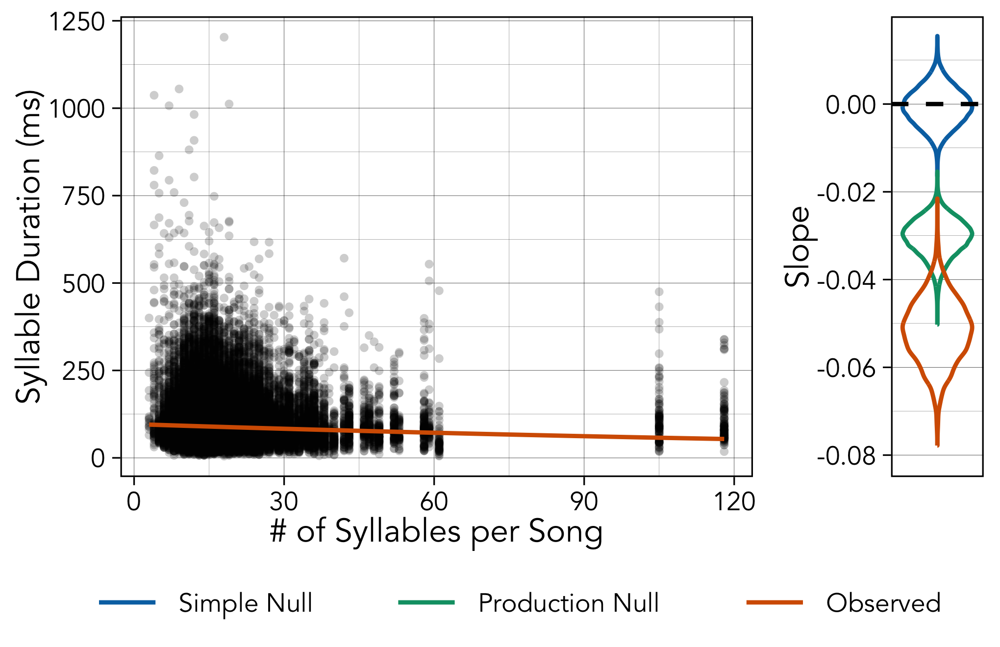
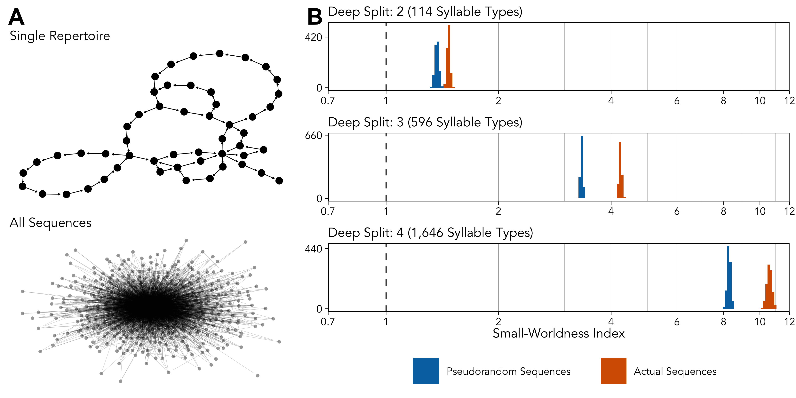
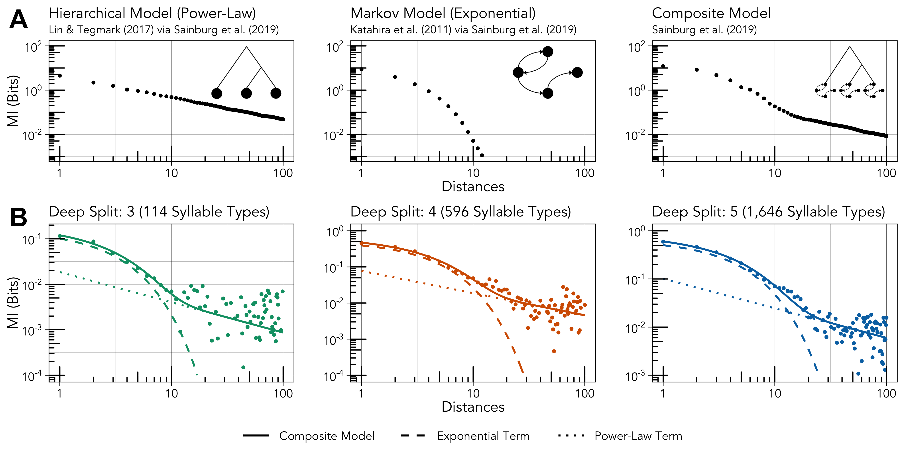

<!-- 3 large figures (1.5 pgs) -->
<!-- 3 small figures + tables (0.75 pgs) -->
<!-- 12-2.25 = 9.75 pgs -->
<!-- 9.75*850 = 8288 words in budget -->

```{r, echo = FALSE, eval = TRUE}
#optionally hide all code
knitr::opts_chunk$set(echo = FALSE)

#set fonts of flextables
flextable::set_flextable_defaults(font.family = "Garamond", font.size = 10, padding.top = 1, padding.bottom = 1, keep_with_next = TRUE)
```

<!--- Bibliography management done via (cmd+k to insert): https://gsverhoeven.github.io/post/zotero-rmarkdown-csl/ -->
<!-- Github hosting done via: https://mbounthavong.com/blog/2022/7/30/hosting-a-r-markdown-html-file-on-a-github-page -->

```{css, echo = FALSE}
pre, code {white-space:pre !important; overflow-x:auto}

/* Move code folding buttons to the left */
div.col-md-12 .pull-right {
  float: left !important
}
```

<!-- <br> -->

<!-- # Links {-} -->

<!-- * Main text: https://masonyoungblood.github.io/linguistic_efficiency/ -->
<!-- * Supplementary information: https://masonyoungblood.github.io/linguistic_efficiency/supplement/supplement.html -->
<!-- * PsyArXiv preprint: https://psyarxiv.com/bghqm -->
<!-- * GitHub repository: https://github.com/masonyoungblood/linguistic_efficiency -->

# Introduction

## Efficiency & Complexity

<!--Vocal communication is costly. Individuals learn and produce signals in noisy environments, all while avoiding predators adapted to detect them.As a result, c -->Communication systems tend to be optimized for efficiency, or the benefit that they bestow relative to the costs of learning and producing them:

\begin{equation}
\textrm{efficiency} \propto \frac{\sum{\pi}}{C_{L} + \sum{C_{P}}}
(\#eq:efficiency)
\end{equation}

where $\sum{\pi}$ is the lifetime benefit of the communication system, $C_{L}$ is the cost of learning it, and $\sum{C_{P}}$ is the lifetime cost of producing it [@gruber_etal22]. <!--Note that efficiency here is optimized over the course of cultural and biological evolution, as $\sum{\pi}$, $C_{L}$, and $\sum{C_{P}}$ are incomputable by the individual. -->This framing is consistent with understandings of efficiency in linguistics [@gibson_etal19]: the famous "principle of least effort" can be thought of as a minimization of these costs [@zipf49].

On the other hand, simpler sounds that are easier to learn and produce vary across fewer dimensions and are less distinctive from one another [@mitonGraphicComplexityWriting2021]. Signals need to be distinguishable to be functional [@deboer00], and complexity expands the possibilities within a signal space in a way that enhances functionality (e.g. to communicate concepts in language, or attract mates in birdsong) [@fitch00]. But there is, of course, a limit. Simulations show that cultural evolution plateaus when complex behaviors are too costly [@mesoudi11]. Evidence from linguistics, animal behavior, and cultural evolution suggests that communication systems generally evolve to balance this complexity-efficiency trade-off [@gibson_etal19; @gruber_etal22; @youngblood_etal23]<!--[@jaeger_tily11; @hahn_etal20]-->.

<!--Notions of complexity vary widely and are sometimes uncorrelated across levels of analysis [@mikula_etal18; @benedict_najar19]. -->In the birdsong literature, complexity is usually described at one of three levels: syllables (individual sounds within songs), songs (sequences of syllables), or repertoires (full set of syllables or songs that a bird produces). Syllable and repertoire complexity are approximated with measures of production cost (e.g. frequency bandwidth, number of transitions in pitch [@youngbloodContentBiasCultural2022]<!--[@benedict_najar19]-->) and learning cost (e.g. diversity of unique syllables or songs [@garamszegi_etal05]<!--[@soma_garamszegi11]-->), respectively. Song complexity, on the other hand, is often characterized by measures of hierarchical or combinatorial structure [@kershenbaumAnimalVocalSequences2014; @sainburgParallelsSequentialOrganization2019]. Structured signals are more compressible and learnable [@raviv_etal21; @Verhoef2012; @gibson_etal19], which allows more information to "pass through the bottleneck" of cultural transmission [@kirby17; @gruber_etal22]. The former increases both production and learning costs, whereas the latter decreases learning costs. Both notions of complexity, however, should boost the benefits of communication by expanding the signal space. Syllable complexity allows for greater diversity in syllable types, and song complexity allows those syllable types to be combined into a wider array of song types.

The effect of this complexity-efficiency trade-off has been confirmed by experiments showing that artificial languages gain efficiency [@fedzechkina_etal12]<!--[@fay_ellison13; @robertsHowCommunicationChanges2015]--> and structure [@kirby_etal08]<!--[@raviv_etal19; @ISI:000357544300009; @nolle_etal18]--> as they are culturally transmitted and used by participants. <!--Efficiency gains can occur from language use alone [@motamedi_etal19], but the emergence of structure seems to require both use and cultural transmission [@carr_etal17; @ISI:000357544300009]. Most experimental work has focused on compositional structure, or the lexical relationships that determine meaning. Birdsong has no mapping between signals and meanings and thus no compositional structure [@miyagawa_etal13], but iterated learning may still lead to combinatorial structure [@kirby_etal14]. -->Studies of continuous whistled communication systems that resemble birdsong have also detected increases in combinatorial structure (i.e. signals comprised of constituent parts that are recombined in different ways) [@Verhoef2012]<!--[@ISI:000388565700005; @ISI:000334983600006; @tamariz_kirby16]-->. Birdsong experiments yield similar results. Zebra finches raised in isolation sing atypical songs, but over several generations they converge towards wild-type song by shortening the longest syllables and gaining spectral structure [@Feher2009]. <!--In a replication of @Feher2009, isolate song also increased in efficiency: song bouts and motifs became shorter and denser, and syllables became shorter and lower in amplitude [@diezZebraFinchesGo2020]. Zebra finches also appear to learn songs more accurately when they have more acoustic variation and less extreme features, possibly as a way to balance the diversity of sequences and efficiency of syllables [@tchernichovskiBalancedImitationSustains2021]. -->Even foraging behaviors that are culturally transmitted become more efficient over time, a tendency that is accelerated by population turnover because new group members are more likely to adopt the more efficient behavior [@Chimento2020].

## Linguistic Laws & Structure

Pressure for compression and efficiency lead to regularities in organization that are so universal in human language that they are referred to as linguistic laws. The three most commonly-studied of these are Zipf's rank-frequency law, Zipf's law of abbreviation, and Menzerath's law [@semple_etal22].

Zipf's rank-frequency law predicts that the frequency of an item will be proportional to the inverse of its rank (i.e. first most common, second most common, etc.), a relationship that holds for most, if not all, of the world's languages [@piantadosi14]. In this study, I will focus on Mandelbrot's more flexible parameterization of Zipf's rank-frequency law (see [Analysis]) [@Mandelbrot1953; @Mandelbrot1962], which is its most common form in contemporary linguistics [@piantadosi14]. Non-human animal communication systems, including bird and cetacean vocalizations [@allenNetworkAnalysisReveals2019; @Briefer2010; @cody_etal16; @hailman_etal85; @mccowan_etal99] and lizard courtship displays [@martins94], exhibit more redundancy than languages, leading to a convex rank-frequency relationship that is better captured by the Zipf-Mandelbrot distribution. Zipf and Mandelbrot both interpreted this rank-frequency law as resulting from a minimization of production and perception costs [@zipf49; @Mandelbrot1953], and there are models showing that it can be derived from communicative efficiency [@manin09; @salge_etal15; @ferrer-i-cancho16]. However, some of these models assume that signals map to objects or concepts which is not the case in birdsong, and other causes are still debated [@piantadosi14]<!--[@simon55; @allegrini_etal04; @corral_serra20]-->. Even though there is still uncertainty about its causes, the presence of Zipf's rank-frequency law in non-human communication systems has been interpreted as evidence for both communicative efficiency and information content [@genty_byrne10; @kershenbaum_etal21]<!--[@mccowan_etal99; @stepanov_etal23]-->.

Zipf's law of abbreviation predicts that common items will tend to be shorter than rare items because their production cost is lower [@zipf49]. This negative correlation between frequency and duration is widespread in both written [@bentz_ferrer-i-cancho16] and spoken language [@petrini_etal23], and has also been observed in writing systems [@koshevoy_etal23] and non-human communication like chimpanzee gestures [@heesen_etal19] and bird and primate vocalizations [@semple_etal10; @huang_etal20; @favaro_etal20]. <!--In some cases, like hyrax vocalizations, Zipf's law of abbreviation is absent for duration but is present for other measures of production cost such as amplitude [@demartsev_etal19]. -->The explanation for Zipf's law of abbreviation is simple: when common items have a lower production cost than rare items then the overall production cost of signals goes down [@ferrer-i-cancho_etal13]. <!--Shorter signals carry other benefits as well, such as reduced predation risk and reverberation in the environment [@ferrer-i-cancho_etal13].-->

Menzerath's law predicts that longer sequences will be comprised of shorter items to balance production costs [@menzerath54]. This negative correlation between sequence length and item length is found at various levels of analysis in language (e.g. clauses in sentences, morphemes in words) [@cramer05; @stave_etal21; @eroglu13] as well as in music [@boroda_altmann91]. In non-human communication, Menzerath's law appears to be present in chimpanzee gesture [@heesen_etal19] and in some primate and bird vocalizations [@gustisonGeladaVocalSequences2016; @huang_etal20; @favaro_etal20; @jamesPhylogenyMechanismsShared2021; @fedurek_etal17]<!--, although its detection may depend on the type of vocalization [@clink_lau20] and level of analysis [@clink_etal20]-->. The explanation for Menzerath's law is an extension of Zipf's law of abbreviation: when production costs are increased in one domain (e.g. song sequence length) they should be decreased in another (e.g. syllable duration).

Beyond linguistic laws, there are two proxy measure of linguistic structure that have recently been investigated in non-human communication: small-world structure [@watts_strogatz98] and mutual information decay [@sainburgParallelsSequentialOrganization2019].

Small-world networks are highly clustered and have short average path lengths, so that it only takes a few steps to jump between any pair of nodes (think "six degrees of separation") [@watts_strogatz98; @humphriesNetworkSmallworldnessQuantitative2008]. These sorts of networks are quite common in biological and social systems [@watts_strogatz98; @humphriesNetworkSmallworldnessQuantitative2008], including language. For example, networks of neighboring words in sentences and co-occurring words in thesauruses exhibit small-world structure [@canchoSmallWorldHuman2001; @steyvers_tenenbaum05]<!--[@motter_etal02]-->. <!--One explanation for this is that short distances between concepts make language easier to process [@beckage_etal11]. More broadly, though, s-->Small-worldness is thought to reflect general systematic structure and recurrence, which in turn improve the compressibility and learnability of information [@raviv_etal21; @allenNetworkAnalysisReveals2019; @ISI:000357544300009]. It is also hypothesized to reflect the emergence of syntactic structure over time [@sole_etal10], as both nightingales and children in more advanced stages of vocal development have greater small-world structure in their transition networks [@weissUseNetworkAnalysis2014; @beckage_etal11]. Humpback whales [@allenNetworkAnalysisReveals2019] and several songbird species [@sasahara_etal12; @weissUseNetworkAnalysis2014; @cody_etal16; @hedleyCompositionSequentialOrganization2016] all exhibit small-worldness in their song syntax to a similar degree.<!--: $SWI \sim 1.69-4.7$. The small-worldness index ($SWI$) is based on the level of clustering and the distances between nodes in the network of signal transitions, where values $> 1$ are consistent with small-world structure [@humphriesNetworkSmallworldnessQuantitative2008] (see [Analysis]).-->

Mutual information is a measure of dependency, or the amount of information that the presence of one thing has about another. In the context of language, past words provide information that can help predict future words above chance levels (i.e. "do you need anything from the" $\to$ "store"). <!--Many large language models, for example, are optimized for precisely this task [@schrimpf_etal21; @shlegeris_etal22]. -->Intuitively, a word contains more information about the very next word than the one that comes after it [@pothos_juola07], but correlations can be detected even at very long distances of hundreds of words [@alvarez-lacalle_etal06; @altmann_etal12]. The rate at which the mutual information of words decreases with increasing distance can provide clues about underlying syntactic structure. Simple models of grammar that assume Markov processes (i.e. next word depends only on last few words) lead to exponential decay in mutual information with distance, whereas hierarchical processes (i.e. word order comes from nested syntactic rules that allow for long-range dependencies [@frank_etal12], common view going back to @chomsky57) lead to power-law decay [@li90; @linCriticalBehaviorPhysics2017]<!--[@alvarez-lacalle_etal06]-->. <!--Some past studies have shown that mutual information decay in real language often follows a power-law [@li90; @ebeling94; @linCriticalBehaviorPhysics2017], but other work suggests a more complicated picture somewhere between these accounts [@melnyk_etal05; @frank_etal12]. -->In German, Italian, Japanese, and English, mutual information decay is exponential at short distances and fits a power-law at long distances, suggesting that sequences are generated by a combination of Markovian and hierarchical processes [@sainburgParallelsSequentialOrganization2019; @sainburg_etal22]. This pattern has also been documented in four bird species, suggesting that sequential organization of song is more complex than previously thought [@sainburgParallelsSequentialOrganization2019].

<!-- ```{r law-table, echo = FALSE, message = FALSE} -->
<!-- #load libraries -->
<!-- library(dplyr) -->
<!-- library(flextable) -->

<!-- #construct table -->
<!-- base_table <- data.frame(property = c("Zipf's rank-frequency law", "Zipf's law of abbreviation", "Menzerath's law", "Small-worldness index", "Mutual information decay"), -->
<!--                          level = c("Syllables", "Syllables", "Both", "Songs", "Songs"), -->
<!--                          descr = c("Frequency follows a power-law with rank", "Common items are shorter", "Longer sequences are comprised of shorter items", "Sequences have general systematic structure", "Sequences have Markovian or hierarchical structure"), -->
<!--                          expl = c("Unclear", "Production cost", "Production cost", "Learning cost", "Learning cost")) -->

<!-- #print table -->
<!-- flex_table <- flextable(base_table) %>%  -->
<!--   theme_vanilla() %>% set_table_properties(layout = "autofit") %>% -->
<!--   set_header_labels(property = "Law/Property", level = "Level", descr = "Description", expl = "Explanation") %>% -->
<!--   set_caption("The linguistic laws and structural properties explored in this study.") -->
<!-- knitr::knit_print(flex_table, ft.split = FALSE) -->
<!-- ``` -->

## Granularity

In languages, the boundaries between signals at different levels of hierarchy (e.g. phonemes, words) are apparent to the humans who use them. In non-human communication systems, categorizing signals into types is its own challenge. <!--For relatively small datasets it is possible to manually inspect recorded signals and assign types. Increasingly, researchers are turning to automated methods such as hierarchical clustering [@Ju2019; @youngbloodContentBiasCultural2022], dimension reduction [@sainburg_etal20], and machine learning [@rivera_etal23; @merinorecalde23] that classify signals into types based on their acoustic features.  -->Automated methods that classify signals into types based on their acoustic features [@sainburg_etal20; @rivera_etal23; @merinorecalde23] reduce subjectivity and enable people to work with much more data, but they also require tuning. For example, hierarchical clustering<!--, which is my preferred classification method,--> requires the user to choose an appropriate threshold below which the "branches" of the "tree" are combined into types (see Figure \@ref(fig:figure-clustering)). This threshold effectively controls the granularity of clustering: higher values over-lump signals into fewer categories, while lower values over-split signals into more categories. The granularity of an analysis may influence the kinds of patterns that can detected. Philosophers of cultural evolution call this the "grain problem"---some statistical patterns may be more apparent at certain levels of analysis [@charbonneau_bourrat21]. In Gibbon vocalizations, for example, evidence for language-like compression is present for notes but not for phrases [@clink_etal20]. <!--Some have even proposed that adherence to Zipf's laws could be used a assess whether classification algorithms have identified relevant units in animal communication systems [@kershenbaum_etal16].-->

## Aim & Model

The aim of this study is to assess the evidence for language-like efficiency and structure in house finch (*Haemorhous mexicanus*) song across three levels of granularity in syllable clustering. By doing so, I hope to (1) identify which features of birdsong may be most subject to the complexity-efficiency trade-off, and (2) determine how clustering decisions affect the manifestation of linguistic laws in non-human communication systems. The data for this study come from a large corpus of house finch songs collected between 1975 and 2019 [@Mundinger1975; @Ju2019; @youngbloodContentBiasCultural2022]. House finch song is an excellent model for these questions for several reasons. First, house finch song is socially learned [@Mann2020] and culturally evolves [@Mundinger1975], and thus should be subject to information compression. Second, male house finches are more likely to learn complex syllables [@youngbloodContentBiasCultural2022]---a content bias that may be an adaptation to female preferences for complexity. In house finches, males that sing longer songs at a faster rate are more attractive [@Nolan2004] and have higher reproductive performance [@Mennill2006], and courtship songs are longer and contain more syllable types [@Ciaburri2019]. Because these measures of complexity relate to production and learning costs, they may increase pressure for efficiency in other domains such as duration. Finally, house finch song is known to be subject to efficiency constraints. When house finches tutored by canaries reproduce the trills of their foster parents they are slower and much shorter [@Mann2020], and house finches increase the frequency of their vocalizations to minimize competition with the lower frequency sounds [@bermudez-cuamatzin_etal23]<!--[@fernandez-juricic_etal05; @bermudez-cuamatzin_etal09], in spite of the fact that urban birds evolve longer bills for foraging that should lead to lower frequencies [@giraudeau_etal14]-->.

# Analysis

Unless otherwise stated, all models were fit in STAN using the brms package in R [@burkner17], with 20,000 iterations across four MCMC chains. Model comparison was conducted using the widely-applicable information criterion (WAIC), a more robust alternative to AIC [@watanabe21], and a Bayesian form of R^2^ [@gelman_etal19]. Prior specifications, model diagnostics, and full model output for all analyses can be found in the [Supplementary Information](https://masonyoungblood.github.io/linguistic_efficiency/supplement/supplement.html). <!--I use the diagnostic heuristics recommended by @gelman_etal14: effective sample size $> 100$, and $1 < \hat{R} < 1.1$.-->

## Data

The recordings used in this study (2,724 songs from 331 individuals) were collected in 1975 [@Mundinger1975], 2012 [@Ju2019], and 2019 [@youngbloodContentBiasCultural2022] in the New York metropolitan area, and analyzed by @youngbloodContentBiasCultural2022 using Luscinia (https://rflachlan.github.io/Luscinia/) (full recording and analysis details, and an example of an analyzed song, are in @youngbloodContentBiasCultural2022 and the [Supplementary Information](https://masonyoungblood.github.io/linguistic_efficiency/supplement/supplement.html)). The main analysis was conducted using recordings from all three years, but the patterns are qualitatively the same when each year is analyzed separately (see [Supplementary Information](https://masonyoungblood.github.io/linguistic_efficiency/supplement/supplement.html)).

<!-- The data used in this study comes directly from the repository of @youngbloodContentBiasCultural2022 (https://github.com/masonyoungblood/TransmissionBias). -->

```{r load-data, eval = FALSE}
#load data from repository for Youngblood & Lahti (2022)
load(url("https://github.com/masonyoungblood/TransmissionBias/raw/master/example/data.RData"))
```

## Clustering

Clustering was conducted using the log-transformed mean frequency traces (mean frequency in each 1 ms bin) for each syllable in every song [@Lachlan2018]. First, the normalized distances between all of the syllables were calculated via dynamic time warping with a window size of 10 (10% of the average signal length) using the dtwclust package in R [@SardaEspinosa2019]. A window size of 10% of the signal length is commonly used in speech processing research and seems to be a practical upper limit for many applications [@Ratanamahatana2005]. Infinite distances (0.19% of cases) caused by comparisons of syllables with extreme signal length differences were assigned the maximum observed distance value. Next, hierarchical clustering and dynamic tree cut were used to cluster the syllables into types [@Ju2019, @Roginek2018]. Hierarchical clustering was conducted with the UPGMA method implemented in the fastcluster package in R [@JSSv053i09], and dynamic tree cut was conducted with the dynamicTreeCut package in R [@langfelder_etal08].

For dynamic tree cut, I ran the hybrid algorithm with a minimum cluster size of 1 to maximize the representation of rare syllable types, and used the deep split parameter ($DS$) to determine the granularity of clustering (details of $DS$ are in the [Supplementary Information](https://masonyoungblood.github.io/linguistic_efficiency/supplement/supplement.html)). I restricted this analysis to $DS = \{2, 3, 4\}$ because values of $DS = \{0, 1\}$ lead to extremely unrealistic underestimates of the number of syllables types. $DS = 2$ leads to over-lumping of syllables into types ($n = 114$; low granularity), $DS = 3$ leads to a typical syllable classification ($n = 596$) [@youngbloodContentBiasCultural2022; @Ju2019; @Roginek2018], and $DS = 4$ lead to over-splitting ($n = 1646$; high granularity). The dendrogram and syllable classifications can be seen in Figure \@ref(fig:figure-clustering).

```{r clustering, eval = FALSE}
#load library
library(dtwclust)

#log transform each syllable individually
data$meanfreq <- sapply(1:nrow(data), function(x){log(data$meanfreq[[x]])})

#z-score normalization across entire dataset
m <- mean(unlist(data$meanfreq))
sd <- sd(unlist(data$meanfreq))
data$meanfreq <- sapply(1:nrow(data), function(x){(data$meanfreq[[x]]-m)/sd})

#set window size
window <- round(mean(lengths(data$meanfreq))*0.10) #10

#calculate distances
distances <- proxy::dist(data$meanfreq, method = "dtw_basic", window.size = window, normalize = TRUE)

#strip everything from distances
attr(distances, "dimnames") <- NULL
attr(distances, "method") <- NULL
attr(distances, "call") <- NULL
class(distances) <- "matrix"

#replace infinite distances with the maximum value
distances[which(distances == Inf)] <- max(distances[-which(distances == Inf)])

#convert to format compatible with hclust
dtw_dist <- stats::as.dist(distances)

#run clustering
clustering <- fastcluster::hclust(dtw_dist, method = "average")

#save clustering
save(clustering, file = "data_models/clustering.RData")

#run hybrid tree cut
hybrid_cut <- parallel::mclapply(0:4, function(x){dynamicTreeCut::cutreeDynamic(dendro = clustering, distM = distances, method = "hybrid", minClusterSize = 1, deepSplit = x)}, mc.cores = 5)

#save hybrid tree cut
save(hybrid_cut, file = "data_models/hybrid_cut.RData")
```

```{r clustering-plot, eval = FALSE, echo = FALSE}
#load library
library(WGCNA)

#load clustering data
load("data_models/clustering.RData")
load("data_models/hybrid_cut.RData")

#manage fonts
quartzFonts(avenir = c("Avenir Book", "Avenir", "Avenir", "Avenir"))
par(family = "avenir")

#export plot to file
png("plots/clustering.png", width = 6.8, height = 3.4, units = "in", res = 600)
plotDendroAndColors(clustering, 
                    colors = matrix(c(hybrid_cut[[3]], hybrid_cut[[4]], hybrid_cut[[5]]), ncol = 3), 
                    dendroLabels = FALSE, main = NULL, lwd = 0.5, ylab = "", yaxt = "n",
                    groupLabels = c("Deep Split: 2\n(114 Syllable Types)", "Deep Split: 3\n(596 Syllable Types)", "Deep Split: 4\n(1,646 Syllable Types)"),
                    hang = -1, addGuide = FALSE, marAll = c(0.3, 4.5, 0, 0), cex.colorLabels = 0.55)
dev.off()
```

```{r figure-clustering, echo = FALSE, fig.align = "center", out.width = "100%", fig.cap = "The results of hierarchical clustering. The colored bars below the dendrogram correspond to the categories assigned to each syllable when deep split is 2 (over-lumping), 3 (baseline), and 4 (over-splitting)."}

```

Once syllable types were identified by hierarchical clustering, I followed @Ju2019 and @youngbloodContentBiasCultural2022 in calculating the following syllable-level acoustic features for further analysis: average frequency (Hz), minimum frequency (Hz), maximum frequency (Hz), bandwidth (Hz), duration (ms), concavity (changes in the sign of the slope of the mean frequency trace/ms) and excursion (cumulative absolute change in Hz/ms). Concavity and excursion are both indicators of syllable complexity [@Ju2019; @podosFinescaleBroadlyApplicable2016]. Concavity was calculated after smoothing the mean frequency trace using a polynomial spline with a smoothing parameter of 5 [@youngbloodContentBiasCultural2022].

```{r preparation, eval = FALSE}
#load data from clustering
load("data_models/clustering.RData")
load("data_models/hybrid_cut.RData")

#calculate concavity
inds <- 1:nrow(data)
inds <- inds[-which(lengths(data$meanfreq) < 6)] #remove things that are too short to analyze but have a concavity of 0
concavity <- rep(0, nrow(data))
for(i in inds){
  temp <- pspline::sm.spline(data$meanfreq[[i]], spar = 5)
  temp <- diff(c(temp$ysmth)) #extract first derivative (slopes)
  concav <- 0
  for(j in 2:length(temp)){
    if((temp[[j]] < 0 & temp[[j-1]] > 0) | (temp[[j]] > 0 & temp[[j-1]] < 0)){
      concavity[i] <- concavity[i] + 1
    }
  }
  concavity[i] <- concavity[i]/length(temp)
  #concavity[i] <- concavity[i]
}

#calculate excursion
excursion <- rep(0, nrow(data))
for(i in inds){
  temp <- data$meanfreq[[i]]
  excursion[i] <- sum(sapply(2:length(temp), function(x){abs(temp[x]-temp[x-1])}))/length(temp)
}

#add to data table
data$concavity <- concavity
data$excursion <- excursion

#calculate other measures from mean frequency trace
data$average <- sapply(1:nrow(data), function(x){mean(data$meanfreq[[x]])})
data$min <- sapply(1:nrow(data), function(x){min(data$meanfreq[[x]])})
data$max <- sapply(1:nrow(data), function(x){max(data$meanfreq[[x]])})
data$bandwidth <- sapply(1:nrow(data), function(x){max(data$meanfreq[[x]])-min(data$meanfreq[[x]])}) 
data$duration <- sapply(1:nrow(data), function(x){length(data$meanfreq[[x]])}) 

#add syllable types to data file
data$cluster_0 <- as.numeric(hybrid_cut[[1]])
data$cluster_1 <- as.numeric(hybrid_cut[[2]])
data$cluster_2 <- as.numeric(hybrid_cut[[3]])
data$cluster_3 <- as.numeric(hybrid_cut[[4]])
data$cluster_4 <- as.numeric(hybrid_cut[[5]])

#add year
data$year <- NA
data$year[which(substring(data$individual, 1, 4) == "1975")] <- 1
data$year[which(substring(data$individual, 1, 4) == "2012")] <- 2
data$year[which(substring(data$individual, 1, 4) == "2019")] <- 3

#add counts
syl_freqs_0 <- as.data.frame(table(data$cluster_0))
syl_freqs_1 <- as.data.frame(table(data$cluster_1))
syl_freqs_2 <- as.data.frame(table(data$cluster_2))
syl_freqs_3 <- as.data.frame(table(data$cluster_3))
syl_freqs_4 <- as.data.frame(table(data$cluster_4))
data$count_0 <- sapply(1:nrow(data), function(x){syl_freqs_0$Freq[which(syl_freqs_0$Var1 == data$cluster_0[x])]})
data$count_1 <- sapply(1:nrow(data), function(x){syl_freqs_1$Freq[which(syl_freqs_1$Var1 == data$cluster_1[x])]})
data$count_2 <- sapply(1:nrow(data), function(x){syl_freqs_2$Freq[which(syl_freqs_2$Var1 == data$cluster_2[x])]})
data$count_3 <- sapply(1:nrow(data), function(x){syl_freqs_3$Freq[which(syl_freqs_3$Var1 == data$cluster_3[x])]})
data$count_4 <- sapply(1:nrow(data), function(x){syl_freqs_4$Freq[which(syl_freqs_4$Var1 == data$cluster_4[x])]})

#add song lengths
song_freq_table <- as.data.frame(table(data$song))
data$song_length <- sapply(1:nrow(data), function(x){song_freq_table$Freq[which(song_freq_table$Var1 == data$song[x])]})

#create data frame of syllable types
syl_types <- lapply(0:4, function(x){
  col_id <- which(names(data) == paste0("cluster_", x))
  temp <- data.frame(type = sort(unique(as.data.frame(data)[, col_id])), count = NA, concavity = NA, excursion = NA, average = NA, min = NA, max = NA, bandwidth = NA, duration = NA)
  
  #get average measures for each syllable type
  for(i in 1:nrow(temp)){
    inds <- which(as.data.frame(data)[, col_id] == temp$type[i])
    temp$count[i] <- length(inds)
    temp$concavity[i] <- median(data$concavity[inds])
    temp$excursion[i] <- median(data$excursion[inds])
    temp$average[i] <- median(data$average[inds])
    temp$min[i] <- median(data$min[inds])
    temp$max[i] <- median(data$max[inds])
    temp$bandwidth[i] <- median(data$bandwidth[inds])
    temp$duration[i] <- median(data$duration[inds])
  }
  
  return(temp)
})

#save processed version of data
processed_data <- list(data = data, syl_types = syl_types)
save(processed_data, file = "data_models/processed_data.RData")
```

```{r, echo = FALSE}
#load processed data
load("data_models/processed_data.RData")
data <- processed_data$data
```

## Zipf's Rank-Frequency Law

Mandelbrot's generalization of Zipf's rank-frequency law takes the following form [@Mandelbrot1953; @Mandelbrot1962]:

\begin{equation}
f(r) = \frac{c}{(r + \beta)^\alpha}
(\#eq:zipf-rf-a)
\end{equation}

where $f(r)$ is the normalized frequency at each rank $r$, $c$ is a normalization term, and $\alpha$ and $\beta$ are parameters that control slope and convexity (respectively). According to @izsak06, the bounds of \@ref(eq:zipf-rf-a) are $\alpha > 1$, $\beta > -1$, and $c > 1$. When $\beta = 0$, this function simplifies to the original form of Zipf's rank-frequency law: $f(r) \propto 1/r^\alpha$.

<!-- $c$ is usually a normalization constant [@izsak06; @mouillot_lepretre00; @macutek22] defined as: -->

<!-- \begin{equation} -->
<!-- c = \sum_{i=1}^{\infty}\frac{1}{(r + \beta)^\alpha} -->
<!-- (\#eq:zipf-rf-b) -->
<!-- \end{equation} -->

<!-- In practice, this form of Zipf's rank-frequency law is notoriously difficult to fit to data due to strong correlations between $\alpha$ and $\beta$, which in turn determine $c$ [@mouillot_lepretre00; @izsak06; @macutek22]. Here, I use a simplified version of \@ref(eq:zipf-rf-a) that treats $c$ as a third parameter that is estimated alongside $\alpha$ and $\beta$ [@ausloos14], as has been done in studies of chickadee calls [@hailman94; @freeberg_lucas12; @ficken_etal94, which should be interpreted as an approximation of the Zipf-Mandelbrot distribution. -->

I fit \@ref(eq:zipf-rf-a) to the rank-frequency distributions of the syllable classifications from each level of deep split in two batches. First, I fit all three parameters to approximate Mandelbrot's versions of the rank-frequency law. Then, I set $\beta = 0$ to approximate Zipf's original formulation.

```{r, eval = FALSE}
#load library
library(brms)

#load processed data and rename
load("data_models/processed_data.RData")
data <- processed_data$data
syl_types <- processed_data$syl_types
rm(processed_data)

#get frequencies for three levels of deep split
freqs_a <- as.numeric(sort(table(data$cluster_2), decreasing = TRUE))/nrow(data)
freqs_b <- as.numeric(sort(table(data$cluster_3), decreasing = TRUE))/nrow(data)
freqs_c <- as.numeric(sort(table(data$cluster_4), decreasing = TRUE))/nrow(data)
data_a <- data.frame(freq = freqs_a, rank = 1:length(freqs_a))
data_b <- data.frame(freq = freqs_b, rank = 1:length(freqs_b))
data_c <- data.frame(freq = freqs_c, rank = 1:length(freqs_c))

#set priors
zipf_priors <- prior(normal(0, 10), lb = 1, nlpar = "a") + 
  prior(normal(0, 10), lb = 0, nlpar = "c")
mand_priors <- prior(normal(0, 10), lb = 1, nlpar = "a") + 
  prior(normal(0, 10), lb = -1, nlpar = "b") + 
  prior(normal(0, 10), lb = 0, nlpar = "c")

#fit the zipf models
zipf_fit_a <- brm(bf(freq ~ c/(rank^a), a + c ~ 1, nl = TRUE),
                  data = data_a, prior = zipf_priors,
                  iter = 5000, cores = 4)
zipf_fit_b <- brm(bf(freq ~ c/(rank^a), a + c ~ 1, nl = TRUE),
                  data = data_b, prior = zipf_priors,
                  iter = 5000, cores = 4)
zipf_fit_c <- brm(bf(freq ~ c/(rank^a), a + c ~ 1, nl = TRUE),
                  data = data_c, prior = zipf_priors,
                  iter = 5000, cores = 4)

#fit the mandelbrot models
mand_fit_a <- brm(bf(freq ~ c/((rank + b)^a), a + b + c ~ 1, nl = TRUE),
                  data = data_a, prior = mand_priors,
                  iter = 5000, cores = 4)
mand_fit_b <- brm(bf(freq ~ c/((rank + b)^a), a + b + c ~ 1, nl = TRUE),
                  data = data_b, prior = mand_priors,
                  iter = 5000, cores = 4)
mand_fit_c <- brm(bf(freq ~ c/((rank + b)^a), a + b + c ~ 1, nl = TRUE),
                  data = data_c, prior = mand_priors,
                  iter = 5000, cores = 4)

#store and save all relevant output
zipf_rf_models <- list(data = list(ds_2 = data_a,
                                   ds_3 = data_b,
                                   ds_4 = data_c),
                       zipf = list(ds_2 = summary(zipf_fit_a)$fixed,
                                   ds_3 = summary(zipf_fit_b)$fixed, 
                                   ds_4 = summary(zipf_fit_c)$fixed), 
                       mand = list(ds_2 = summary(mand_fit_a)$fixed, 
                                   ds_3 = summary(mand_fit_b)$fixed, 
                                   ds_4 = summary(mand_fit_c)$fixed), 
                       prior = prior_summary(mand_fit_a),
                       waic = data.frame(zipf = c(waic(zipf_fit_a)$waic, waic(zipf_fit_b)$waic, waic(zipf_fit_c)$waic),
                                         mand = c(waic(mand_fit_a)$waic, waic(mand_fit_b)$waic, waic(mand_fit_c)$waic)),
                       r2 = c(bayes_R2(zipf_fit_a)[1], bayes_R2(zipf_fit_b)[1], bayes_R2(zipf_fit_c)[1], 
                              bayes_R2(mand_fit_a)[1], bayes_R2(mand_fit_b)[1], bayes_R2(mand_fit_c)[1]))
save(zipf_rf_models, file = "data_models/zipf_rf_models.RData")
```

```{r, eval = FALSE, echo = FALSE}
#load library
library(brms)

#load processed data and rename
load("data_models/processed_data.RData")
data <- processed_data$data
syl_types <- processed_data$syl_types
rm(processed_data)

#iterate through years and run models
zipf_rf_models_year <- lapply(1:3, function(i){
  #store data from target year
  temp <- data[which(data$year == i), ]
  
  #get frequencies for three levels of deep split
  freqs_a <- as.numeric(sort(table(temp$cluster_2), decreasing = TRUE))/nrow(temp)
  freqs_b <- as.numeric(sort(table(temp$cluster_3), decreasing = TRUE))/nrow(temp)
  freqs_c <- as.numeric(sort(table(temp$cluster_4), decreasing = TRUE))/nrow(temp)
  data_a <- data.frame(freq = freqs_a, rank = 1:length(freqs_a))
  data_b <- data.frame(freq = freqs_b, rank = 1:length(freqs_b))
  data_c <- data.frame(freq = freqs_c, rank = 1:length(freqs_c))
  
  #set priors
  zipf_priors <- prior(normal(0, 10), lb = 1, nlpar = "a") + 
    prior(normal(0, 10), lb = 0, nlpar = "c")
  mand_priors <- prior(normal(0, 10), lb = 1, nlpar = "a") + 
    prior(normal(0, 10), lb = -1, nlpar = "b") + 
    prior(normal(0, 10), lb = 0, nlpar = "c")
  
  #fit the zipf models
  zipf_fit_a <- brm(bf(freq ~ c/(rank^a), a + c ~ 1, nl = TRUE),
                    data = data_a, prior = zipf_priors,
                    iter = 5000, cores = 4)
  zipf_fit_b <- brm(bf(freq ~ c/(rank^a), a + c ~ 1, nl = TRUE),
                    data = data_b, prior = zipf_priors,
                    iter = 5000, cores = 4)
  zipf_fit_c <- brm(bf(freq ~ c/(rank^a), a + c ~ 1, nl = TRUE),
                    data = data_c, prior = zipf_priors,
                    iter = 5000, cores = 4)
  
  #fit the mandelbrot models
  mand_fit_a <- brm(bf(freq ~ c/((rank + b)^a), a + b + c ~ 1, nl = TRUE),
                    data = data_a, prior = mand_priors,
                    iter = 5000, cores = 4)
  mand_fit_b <- brm(bf(freq ~ c/((rank + b)^a), a + b + c ~ 1, nl = TRUE),
                    data = data_b, prior = mand_priors,
                    iter = 5000, cores = 4)
  mand_fit_c <- brm(bf(freq ~ c/((rank + b)^a), a + b + c ~ 1, nl = TRUE),
                    data = data_c, prior = mand_priors,
                    iter = 5000, cores = 4)
  
  #return all relevant output
  return(list(waic = data.frame(zipf = c(waic(zipf_fit_a)$waic, waic(zipf_fit_b)$waic, waic(zipf_fit_c)$waic),
                                mand = c(waic(mand_fit_a)$waic, waic(mand_fit_b)$waic, waic(mand_fit_c)$waic)),
              r2 = c(bayes_R2(zipf_fit_a)[1], bayes_R2(zipf_fit_b)[1], bayes_R2(zipf_fit_c)[1], 
                     bayes_R2(mand_fit_a)[1], bayes_R2(mand_fit_b)[1], bayes_R2(mand_fit_c)[1])))
})

#save data
save(zipf_rf_models_year, file = "data_models/zipf_rf_models_year.RData")
```

```{r zipf-rank-plot, eval = FALSE, echo = FALSE}
#load library and data
library(ggplot2)
load("data_models/zipf_rf_models.RData")

#create three separate data frames for each level of deep split
lines_a <- data.frame(freqs = c(zipf_rf_models$zipf$ds_2[2, 1]/(zipf_rf_models$data$ds_2$rank^zipf_rf_models$zipf$ds_2[1, 1]),
                                zipf_rf_models$mand$ds_2[3, 1]/((zipf_rf_models$data$ds_2$rank + zipf_rf_models$mand$ds_2[2, 1])^zipf_rf_models$mand$ds_2[1, 1])), 
                      ranks = rep(zipf_rf_models$data$ds_2$rank, 2), 
                      models = rep(c("Zipf  ", "Zipf-Mandelbrot"), each = nrow(zipf_rf_models$data$ds_2)))
lines_b <- data.frame(freqs = c(zipf_rf_models$zipf$ds_3[2, 1]/(zipf_rf_models$data$ds_3$rank^zipf_rf_models$zipf$ds_3[1, 1]),
                                zipf_rf_models$mand$ds_3[3, 1]/((zipf_rf_models$data$ds_3$rank + zipf_rf_models$mand$ds_3[2, 1])^zipf_rf_models$mand$ds_3[1, 1])), 
                      ranks = rep(zipf_rf_models$data$ds_3$rank, 2), 
                      models = rep(c("Zipf  ", "Zipf-Mandelbrot"), each = nrow(zipf_rf_models$data$ds_3)))
lines_c <- data.frame(freqs = c(zipf_rf_models$zipf$ds_4[2, 1]/(zipf_rf_models$data$ds_4$rank^zipf_rf_models$zipf$ds_4[1, 1]),
                                zipf_rf_models$mand$ds_4[3, 1]/((zipf_rf_models$data$ds_4$rank + zipf_rf_models$mand$ds_4[2, 1])^zipf_rf_models$mand$ds_4[1, 1])), 
                      ranks = rep(zipf_rf_models$data$ds_4$rank, 2), 
                      models = rep(c("Zipf  ", "Zipf-Mandelbrot"), each = nrow(zipf_rf_models$data$ds_4)))

#create zipf rank plot for three levels of deep split
rank_plot_a <- ggplot() + 
  geom_point(data = zipf_rf_models$data$ds_2, aes(x = rank, y = freq), size = 0.3, color = "black") + 
  geom_line(data = lines_a, aes(x = ranks, y = freqs, color = models), linewidth = 0.5) + 
  scale_x_continuous(trans = "log10", labels = scales::trans_format("log10", scales::math_format(10^.x))) + 
  scale_y_continuous(trans = "log10", labels = scales::trans_format("log10", scales::math_format(10^.x))) + 
  theme_linedraw(base_size = 8, base_family = "Avenir") + annotation_logticks(size = 0.3) + 
  scale_color_manual(values = c("#0072B2", "#D55E00")) + 
  labs(subtitle = paste0("Deep Split: 2 (", prettyNum(nrow(syl_types[[3]]), big.mark = ","), " Syllable Types)")) + 
  xlab("Rank") + ylab("Count") + theme(legend.position = "none")
rank_plot_b <- ggplot() + 
  geom_point(data = zipf_rf_models$data$ds_3, aes(x = rank, y = freq), size = 0.3, color = "black") + 
  geom_line(data = lines_b, aes(x = ranks, y = freqs, color = models), linewidth = 0.5) + 
  scale_x_continuous(trans = "log10", labels = scales::trans_format("log10", scales::math_format(10^.x))) + 
  scale_y_continuous(trans = "log10", labels = scales::trans_format("log10", scales::math_format(10^.x))) + 
  theme_linedraw(base_size = 8, base_family = "Avenir") + annotation_logticks(size = 0.3) + 
  scale_color_manual(values = c("#0072B2", "#D55E00")) + 
  labs(subtitle = paste0("Deep Split: 3 (", prettyNum(nrow(syl_types[[4]]), big.mark = ","), " Syllable Types)")) + 
  xlab("Rank") + ylab("Count") + theme(legend.position = "none")
rank_plot_c <- ggplot() + 
  geom_point(data = zipf_rf_models$data$ds_4, aes(x = rank, y = freq), size = 0.3, color = "black") + 
  geom_line(data = lines_c, aes(x = ranks, y = freqs, color = models), linewidth = 0.5) + 
  scale_x_continuous(trans = "log10", labels = scales::trans_format("log10", scales::math_format(10^.x))) + 
  scale_y_continuous(trans = "log10", labels = scales::trans_format("log10", scales::math_format(10^.x))) + 
  theme_linedraw(base_size = 8, base_family = "Avenir") + annotation_logticks(size = 0.3) + 
  scale_color_manual(values = c("#0072B2", "#D55E00")) + 
  labs(subtitle = paste0("Deep Split: 4 (", prettyNum(nrow(syl_types[[5]]), big.mark = ","), " Syllable Types)")) + 
  xlab("Rank") + ylab("Count") + theme(legend.position = "none")
legend_plot <- ggplot() + geom_line(data = lines_c, aes(x = ranks, y = freqs, color = models), linewidth = 0.5) + 
  theme_linedraw(base_size = 8, base_family = "Avenir") + scale_color_manual(values = c("#0072B2", "#D55E00")) + 
  theme(legend.title = element_blank(), legend.position = "bottom")

#combine them and export to files
png("plots/rank_count.png", width = 6.8, height = 2.6, units = "in", res = 600)
cowplot::plot_grid(cowplot::plot_grid(rank_plot_a, rank_plot_b, rank_plot_c, nrow = 1), cowplot::get_legend(legend_plot), nrow = 2, rel_heights = c(1, 0.1))
dev.off()
png("plots/rank_count_small.png", width = 3.4, height = 3.4, units = "in", res = 600)
cowplot::plot_grid(rank_plot_b + labs(subtitle = NULL), cowplot::get_legend(legend_plot), nrow = 2, rel_heights = c(1, 0.1))
dev.off()
```

```{r figure-zipf-rank-small, echo = FALSE, fig.align = "center", out.width = "50%", fig.cap = "The relationship between rank (x-axis) and count (y-axis) at the intermediate granularity level (DS = 3, 596 syllable types). The blue and orange lines denote the expected distributions according to Zipf's rank-frequency law (blue) and Mandelbrot's extension of it (orange)."}

```

```{r, echo = FALSE}
load("data_models/zipf_rf_models.RData")
load("data_models/zipf_rf_models_year.RData")
```

The observed frequency distribution is consistent with the Zipf-Mandelbrot distribution at all three levels of granularity ($R^2 = \{`r signif(zipf_rf_models$r2[4], digits = 3)`, `r signif(zipf_rf_models$r2[5], digits = 3)`, `r signif(zipf_rf_models$r2[6], digits = 3)`\}$ at $DS = \{2, 3, 4\}$), but is only weakly consistent with the the original form of Zipf's rank frequency law ($R^2 = \{`r signif(zipf_rf_models$r2[1], digits = 3)`, `r signif(zipf_rf_models$r2[2], digits = 3)`, `r signif(zipf_rf_models$r2[3], digits = 3)`\}$ at $DS = \{2, 3, 4\}$). Figure \@ref(fig:figure-zipf-rank-small) shows the rank-frequency distribution at the intermediate granularity level ($DS = 3$; 596 syllable types), while all three can be seen in the [Supplementary Information](https://masonyoungblood.github.io/linguistic_efficiency/supplement/supplement.html). <!--$R^2$ is the most commonly reported goodness-of-fit measure for both forms of Zipf's rank-frequency law, and is generally $> 0.8$ in studies of human language [@linders_louwerse23].--> The Zipf-Mandelbrot distribution also outcompetes Zipf's original form and has $R^2 > `r min(signif(c(zipf_rf_models_year[[1]]$r2[4:6], zipf_rf_models_year[[2]]$r2[4:6], zipf_rf_models_year[[3]]$r2[4:6]), digits = 2))`$ when models are fit separately to the data from each year (1975, 2012, and 2019; see [Supplementary Information](https://masonyoungblood.github.io/linguistic_efficiency/supplement/supplement.html)).

<!-- The $WAIC$ values and fitted parameters for all six models can be found in the [Supplementary Information]. -->

## Zipf's Law of Abbreviation

Zipf's law of abbreviation predicts that common items will be shorter in duration than rarer ones. Rather than focusing duration alone, I explored whether the frequency of syllables is negatively correlated with four different measures of production cost: duration (ms), bandwidth (Hz), concavity (changes in the sign of the slope of the mean frequency trace/ms) and excursion (cumulative absolute change in Hz/ms). <!--As mentioned in [Clustering], concavity and excursion are both indicators of syllable complexity [@Ju2019; @podosFinescaleBroadlyApplicable2016].-->

For each level of deep split and each measure of production cost, I constructed a log-normal model with the measure in question as the outcome variable, count as the predictor variable, and syllable type as a varying intercept. The alternative formulation, a Poisson model with count as the outcome variable, does not allow for the correct random effects structure (e.g. counts are identical across observations of the same syllable type). <!--Zipf's law of abbreviation predicts that there will be a strong effect of count on each measure of production cost.-->

```{r zipf-abbr, eval = FALSE}
#load packages
library(brms)

#load processed data and rename
load("data_models/processed_data.RData")
data <- processed_data$data

#set priors, a has lower bound on intercept (because outcome is only positive) while b does not
zipf_priors_a <- prior(normal(0, 4), lb = 0, class = "Intercept") + 
  prior(normal(0, 0.5), class = "b") + 
  prior(normal(0, 0.5), lb = 0, class = "sd") + 
  prior(normal(0, 0.5), lb = 0, class = "sigma")
zipf_priors_b <- prior(normal(0, 4), class = "Intercept") + 
  prior(normal(0, 0.5), class = "b") + 
  prior(normal(0, 0.5), lb = 0, class = "sd") + 
  prior(normal(0, 0.5), lb = 0, class = "sigma")

#run duration model across all three deep split values
duration_model_2 <- brm(log(duration) ~ scale(count_2) + (1|cluster_2), data = data, prior = zipf_priors_a, iter = 5000, cores = 4)
duration_model_3 <- brm(log(duration) ~ scale(count_3) + (1|cluster_3), data = data, prior = zipf_priors_a, iter = 5000, cores = 4)
duration_model_4 <- brm(log(duration) ~ scale(count_4) + (1|cluster_4), data = data, prior = zipf_priors_a, iter = 5000, cores = 4)

#run bandwidth model across all three deep split values
bandwidth_model_2 <- brm(log(bandwidth) ~ scale(count_2) + (1|cluster_2), data = data, prior = zipf_priors_a, iter = 5000, cores = 4)
bandwidth_model_3 <- brm(log(bandwidth) ~ scale(count_3) + (1|cluster_3), data = data, prior = zipf_priors_a, iter = 5000, cores = 4)
bandwidth_model_4 <- brm(log(bandwidth) ~ scale(count_4) + (1|cluster_4), data = data, prior = zipf_priors_a, iter = 5000, cores = 4)

#run concavity model across all three deep split values, with 0.0001 added to avoid log-transformation issues
concavity_model_2 <- brm(log(concavity + 0.0001) ~ scale(count_2) + (1|cluster_2), data = data, prior = zipf_priors_b, iter = 5000, cores = 4)
concavity_model_3 <- brm(log(concavity + 0.0001) ~ scale(count_3) + (1|cluster_3), data = data, prior = zipf_priors_b, iter = 5000, cores = 4)
concavity_model_4 <- brm(log(concavity + 0.0001) ~ scale(count_4) + (1|cluster_4), data = data, prior = zipf_priors_b, iter = 5000, cores = 4)

#run excursion model across all three deep split values, with 0.0001 added to avoid log-transformation issues
excursion_model_2 <- brm(log(excursion + 0.0001) ~ scale(count_2) + (1|cluster_2), data = data, prior = zipf_priors_b, iter = 5000, cores = 4)
excursion_model_3 <- brm(log(excursion + 0.0001) ~ scale(count_3) + (1|cluster_3), data = data, prior = zipf_priors_b, iter = 5000, cores = 4)
excursion_model_4 <- brm(log(excursion + 0.0001) ~ scale(count_4) + (1|cluster_4), data = data, prior = zipf_priors_b, iter = 5000, cores = 4)

#combine into object that contains model estimates, diagnostics, and prior specifications, and then save
zipf_models <- list(duration = list(summary(duration_model_2)$fixed, summary(duration_model_3)$fixed, summary(duration_model_4)$fixed, prior_summary(duration_model_2)),
                    bandwidth = list(summary(bandwidth_model_2)$fixed, summary(bandwidth_model_3)$fixed, summary(bandwidth_model_4)$fixed, prior_summary(bandwidth_model_2)),
                    concavity = list(summary(concavity_model_2)$fixed, summary(concavity_model_3)$fixed, summary(concavity_model_4)$fixed, prior_summary(concavity_model_2)),
                    excursion = list(summary(excursion_model_2)$fixed, summary(excursion_model_3)$fixed, summary(excursion_model_4)$fixed, prior_summary(excursion_model_2)))
save(zipf_models, file = "data_models/zipf_models.RData")
```

```{r, echo = FALSE, eval = FALSE}
#load processed data and rename
load("data_models/processed_data.RData")
data <- processed_data$data
data$year <- as.factor(data$year)

#create function for extracting effect and confidence intervals from model
extraction <- function(model){
  temp_a <- fixef(model)[2]
  temp_b <- confint(model)[5, ]
  return(as.numeric(c(temp_a, temp_b)))
}

#run duration model across all three deep split values
duration_model_2 <- extraction(lme4::lmer(log(duration) ~ scale(count_2) + (1|cluster_2) + (1|year), data = data))
duration_model_3 <- extraction(lme4::lmer(log(duration) ~ scale(count_3) + (1|cluster_3) + (1|year), data = data))
duration_model_4 <- extraction(lme4::lmer(log(duration) ~ scale(count_4) + (1|cluster_4) + (1|year), data = data))

#run bandwidth model across all three deep split values
bandwidth_model_2 <- extraction(lme4::lmer(log(bandwidth) ~ scale(count_2) + (1|cluster_2) + (1|year), data = data))
bandwidth_model_3 <- extraction(lme4::lmer(log(bandwidth) ~ scale(count_3) + (1|cluster_3) + (1|year), data = data))
bandwidth_model_4 <- extraction(lme4::lmer(log(bandwidth) ~ scale(count_4) + (1|cluster_4) + (1|year), data = data))

#run concavity model across all three deep split values, with 0.0001 added to avoid log-transformation issues
concavity_model_2 <- extraction(lme4::lmer(log(concavity + 0.0001) ~ scale(count_2) + (1|cluster_2) + (1|year), data = data))
concavity_model_3 <- extraction(lme4::lmer(log(concavity + 0.0001) ~ scale(count_3) + (1|cluster_3) + (1|year), data = data))
concavity_model_4 <- extraction(lme4::lmer(log(concavity + 0.0001) ~ scale(count_4) + (1|cluster_4) + (1|year), data = data))

#run excursion model across all three deep split values, with 0.0001 added to avoid log-transformation issues
excursion_model_2 <- extraction(lme4::lmer(log(excursion + 0.0001) ~ scale(count_2) + (1|cluster_2) + (1|year), data = data))
excursion_model_3 <- extraction(lme4::lmer(log(excursion + 0.0001) ~ scale(count_3) + (1|cluster_3) + (1|year), data = data))
excursion_model_4 <- extraction(lme4::lmer(log(excursion + 0.0001) ~ scale(count_4) + (1|cluster_4) + (1|year), data = data))

#combine into object that contains median estimate and bounds of 95% CI for main effect of each model at each level of deep split
zipf_models_year <- list(duration = rbind(duration_model_2, duration_model_3, duration_model_4),
                         bandwidth = rbind(bandwidth_model_2, bandwidth_model_3, bandwidth_model_4),
                         concavity = rbind(concavity_model_2, concavity_model_3, concavity_model_4),
                         excursion = rbind(excursion_model_2, excursion_model_3, excursion_model_4))
save(zipf_models_year, file = "data_models/zipf_models_year.RData")
```

```{r zipf-abbr-tables, echo = FALSE, message = FALSE}
#load packages
library(flextable)
library(dplyr)

#load data
load("data_models/zipf_models.RData")

#format table
base_table <- round(rbind(zipf_models$duration[[1]][2, 1:4], zipf_models$duration[[2]][2, 1:4], zipf_models$duration[[3]][2, 1:4],
                          zipf_models$bandwidth[[1]][2, 1:4], zipf_models$bandwidth[[2]][2, 1:4], zipf_models$bandwidth[[3]][2, 1:4],
                          zipf_models$concavity[[1]][2, 1:4], zipf_models$concavity[[2]][2, 1:4], zipf_models$concavity[[3]][2, 1:4],
                          zipf_models$excursion[[1]][2, 1:4], zipf_models$excursion[[2]][2, 1:4], zipf_models$excursion[[3]][2, 1:4]), digits = 2)
base_table <- cbind(rep(c("duration ~ count", "bandwidth ~ count", "concavity ~ count", "excursion ~ count"), each = 3), rep(c(2, 3, 4), 4), base_table)
base_table <- cbind(base_table, ifelse(base_table[, 5]*base_table[, 6] > 0, "*", ""))
colnames(base_table) <- c("Model", "DS", "Est.", "Err.", "2.5%", "97.5%", " ")
rownames(base_table) <- NULL

#print table
flex_table <- flextable(base_table) %>% 
  merge_at(1:3, 1) %>% merge_at(4:6, 1) %>% merge_at(7:9, 1) %>% merge_at(10:12, 1) %>%
  theme_vanilla() %>% set_table_properties(layout = "autofit") %>%
  set_caption("The estimated effect of count on each measure of production cost, using the syllable classifications from each level of deep split. 95% credible intervals that do not overlap with 0 are marked with an asterisk.")
flex_table
```

```{r zipf-abbr-plot, echo = FALSE, eval = FALSE}
#load library
library(ggplot2)

#load data and models
load("data_models/processed_data.RData")
data <- processed_data$data
load("data_models/zipf_models.RData")

#create zipfian distributions for duration across three values of deep split
zipf_plot_a <- cowplot::plot_grid(ggplot(data = syl_types[[3]], aes(x = duration, y = count)) + geom_point(color = "black", size = 0.3) + 
                     geom_smooth(method = "glm", method.args = list(family = "poisson"), color = "#D55E00", linewidth = 0.5) + scale_y_continuous(labels = scales::label_number(suffix = "k", scale = 1e-3)) + 
                     theme_linedraw(base_size = 8, base_family = "Avenir") + ylab(NULL) + xlab("") + labs(subtitle = paste0("Deep Split: 2 (", prettyNum(nrow(syl_types[[3]]), big.mark = ","), " Syllable Types)")),
                  ggplot(data = syl_types[[4]], aes(x = duration, y = count)) + geom_point(color = "black", size = 0.3) + 
                     geom_smooth(method = "glm", method.args = list(family = "poisson"), color = "#D55E00", linewidth = 0.5) + scale_y_continuous(labels = scales::label_number(suffix = "k", scale = 1e-3)) + 
                     theme_linedraw(base_size = 8, base_family = "Avenir") + ylab(NULL) + xlab("Median Duration (ms)") + labs(subtitle = paste0("Deep Split: 3 (", prettyNum(nrow(syl_types[[4]]), big.mark = ","), " Syllable Types)")),
                   ggplot(data = syl_types[[5]], aes(x = duration, y = count)) + geom_point(color = "black", size = 0.3) + 
                     geom_smooth(method = "glm", method.args = list(family = "poisson"), color = "#D55E00", linewidth = 0.5) + scale_y_continuous(labels = scales::label_number(suffix = "k", scale = 1e-3)) + 
                     theme_linedraw(base_size = 8, base_family = "Avenir") + ylab(NULL) + xlab("") + labs(subtitle = paste0("Deep Split: 4 (", prettyNum(nrow(syl_types[[5]]), big.mark = ","), " Syllable Types)")),
                   nrow = 1)

#create zipfian distributions for concavity across three values of deep split
zipf_plot_b <- cowplot::plot_grid(ggplot(data = syl_types[[3]], aes(x = concavity, y = count)) + geom_point(color = "black", size = 0.3) + 
                          geom_smooth(method = "glm", method.args = list(family = "poisson"), color = "#D55E00", linewidth = 0.5) + scale_y_continuous(labels = scales::label_number(suffix = "k", scale = 1e-3)) + 
                          theme_linedraw(base_size = 8, base_family = "Avenir") + ylab(NULL) + xlab(""),
                        ggplot(data = syl_types[[4]], aes(x = concavity, y = count)) + geom_point(color = "black", size = 0.3) + 
                          geom_smooth(method = "glm", method.args = list(family = "poisson"), color = "#D55E00", linewidth = 0.5) + scale_y_continuous(labels = scales::label_number(suffix = "k", scale = 1e-3)) + 
                          theme_linedraw(base_size = 8, base_family = "Avenir") + ylab(NULL) + xlab("Median Concavity (#/ms)"),
                        ggplot(data = syl_types[[5]], aes(x = concavity, y = count)) + geom_point(color = "black", size = 0.3) + 
                          geom_smooth(method = "glm", method.args = list(family = "poisson"), color = "#D55E00", linewidth = 0.5) + scale_y_continuous(labels = scales::label_number(suffix = "k", scale = 1e-3)) + 
                          theme_linedraw(base_size = 8, base_family = "Avenir") + ylab(NULL) + xlab(""),
                        nrow = 1)

#create zipfian distributions for excursion across three values of deep split
zipf_plot_c <- cowplot::plot_grid(ggplot(data = syl_types[[3]], aes(x = bandwidth, y = count)) + geom_point(color = "black", size = 0.3) + 
                          geom_smooth(method = "glm", method.args = list(family = "poisson"), color = "#D55E00", linewidth = 0.5) + scale_y_continuous(labels = scales::label_number(suffix = "k", scale = 1e-3)) + 
                          theme_linedraw(base_size = 8, base_family = "Avenir") + ylab(NULL) + xlab(""),
                        ggplot(data = syl_types[[4]], aes(x = bandwidth, y = count)) + geom_point(color = "black", size = 0.3) + 
                          geom_smooth(method = "glm", method.args = list(family = "poisson"), color = "#D55E00", linewidth = 0.5) + scale_y_continuous(labels = scales::label_number(suffix = "k", scale = 1e-3)) + 
                          theme_linedraw(base_size = 8, base_family = "Avenir") + ylab(NULL) + xlab("Median Bandwidth (Hz)"),
                        ggplot(data = syl_types[[5]], aes(x = bandwidth, y = count)) + geom_point(color = "black", size = 0.3) + 
                          geom_smooth(method = "glm", method.args = list(family = "poisson"), color = "#D55E00", linewidth = 0.5) + scale_y_continuous(labels = scales::label_number(suffix = "k", scale = 1e-3)) + 
                          theme_linedraw(base_size = 8, base_family = "Avenir") + ylab(NULL) + xlab(""),
                        nrow = 1)

#create zipfian distributions for bandwidth across three values of deep split
zipf_plot_d <- cowplot::plot_grid(ggplot(data = syl_types[[3]], aes(x = excursion, y = count)) + geom_point(color = "black", size = 0.3) + 
                          geom_smooth(method = "glm", method.args = list(family = "poisson"), color = "#D55E00", linewidth = 0.5) + scale_y_continuous(labels = scales::label_number(suffix = "k", scale = 1e-3)) + 
                          theme_linedraw(base_size = 8, base_family = "Avenir") + ylab(NULL) + xlab(""),
                        ggplot(data = syl_types[[4]], aes(x = excursion, y = count)) + geom_point(color = "black", size = 0.3) + 
                          geom_smooth(method = "glm", method.args = list(family = "poisson"), color = "#D55E00", linewidth = 0.5) + scale_y_continuous(labels = scales::label_number(suffix = "k", scale = 1e-3)) + 
                          scale_x_continuous(breaks = c(40, 100, 160, 220)) + 
                          theme_linedraw(base_size = 8, base_family = "Avenir") + ylab(NULL) + xlab("Median Excursion (Hz/ms)"),
                        ggplot(data = syl_types[[5]], aes(x = excursion, y = count)) + geom_point(color = "black", size = 0.3) + 
                          geom_smooth(method = "glm", method.args = list(family = "poisson"), color = "#D55E00", linewidth = 0.5) + scale_y_continuous(labels = scales::label_number(suffix = "k", scale = 1e-3)) + 
                          scale_x_continuous(breaks = c(50, 100, 150, 200, 250)) + 
                          theme_linedraw(base_size = 8, base_family = "Avenir") + ylab(NULL) + xlab(""),
                        nrow = 1)

#create blank plot with y-axis for plotting
y_axis <- ggplot(data = syl_types[[5]], aes(x = excursion, y = count)) + ylab("Count") + xlab("") + 
  theme_linedraw(base_size = 8, base_family = "Avenir") + theme(panel.grid = element_blank(), axis.title.x = element_blank(), axis.text = element_blank(), axis.ticks = element_blank(), panel.background = element_blank(), panel.border = element_blank())

#save plot to file
png("plots/dists.png", width = 6.8, height = 4.4, units = "in", res = 600)
cowplot::plot_grid(ggplot() + theme_void(), y_axis, cowplot::plot_grid(zipf_plot_a, zipf_plot_c, zipf_plot_b, zipf_plot_d, nrow = 4, rel_heights = c(1.12, 1, 1, 1)), ncol = 3, rel_widths = c(0.02, 0.003, 1))
dev.off()
```

Duration, bandwidth, and excursion had strong negative effects on count at all three levels of granularity (Table \@ref(tab:zipf-abbr-tables)). Concavity had no effect on count at the first two levels of granularity, but had a very weak negative effect at the third level of granularity. These patterns are apparent in the plots of median production costs and counts in the [Supplementary Information](https://masonyoungblood.github.io/linguistic_efficiency/supplement/supplement.html). The results are qualitatively identical when the year of recording (1975, 2012, or 2019) is included as a varying intercept (see [Supplementary Information](https://masonyoungblood.github.io/linguistic_efficiency/supplement/supplement.html)).

## Menzerath's Law

Menzerath's law predicts that longer sequences will be comprised of smaller items. Importantly, Menzerath's law is sometimes detected in random sequences from null models [@g_torre_etal21; @tanaka-ishii21; @ferrer-i-cancho_etal14]. There are two sorts of null models that make sense in this context: (1) random sequences with the same number of syllables as real songs, and (2) pseudorandom sequences that match both the number of syllables and cumulative duration in time. @jamesPhylogenyMechanismsShared2021 interpret the latter as approximating simple motor constraints---Menzerath's law resulting from efficiency in production alone---where stronger effects in the real data would indicate additional mechanisms (e.g. communicative efficiency). In this study, I compare the real data against each of these to assess both the presence of Menzerath's law and whether it is beyond what would be expected from production constraints.

The production constraint model of @jamesPhylogenyMechanismsShared2021 works as follows. For each iteration of the model, a pseudorandom sequence was produced for each real song in the dataset. Syllables were randomly sampled (with replacement) from the population until the duration of the random sequence exceeded the duration of the real song. If the difference between the duration of the random sequence and the real song was <50% of the duration of the final syllable, then the final syllable was kept in the sequence. Otherwise, it was removed. Each iteration of the model produces a set of random sequences with approximately the same distribution of durations as the real data.

To estimate the strength of Menzerath's law, I constructed a log-normal model with syllable duration as the outcome variable, song length in number of syllables as the predictor variable, and the song as a varying intercept [@safryghinVariableExpressionLinguistic2022]. <!--The production constraint model removes variation accounted for by the year and individual bird, so song is the only varying intercept that is appropriate for comparison. -->This model was used to estimate the strength of the effect of song length on syllable duration in both the real data and 10 simulated datasets from both null models. The brm_multiple function from the brms package in R was used to fit a single model to the the 10 simulated datasets from each null model and produce a combined posterior distribution [@burkner17].

This analysis differs from @jamesPhylogenyMechanismsShared2021 in two key ways: (1) I use the actual duration of syllables rather than a single median value for each song, and (2) I compare the full posterior distributions rather than point estimates of effects. These decisions should yield more conservative conclusions about the differences between the real and simulated data. Note that syllable type is not incorporated into the modeling, so this is the only analysis that is not conducted across multiple levels of deep split.

```{r menzerath, eval = FALSE}
#load packages
library(brms)

#load processed data
load("data_models/processed_data.RData")
data <- processed_data$data
syl_types <- processed_data$syl_types
rm(processed_data)

#get unique songs and durations
unique_songs <- unique(data$song)
individuals <- as.character(sapply(unique_songs, function(q){data$individual[which(data$song == q)][1]}))
song_durs <- as.numeric(sapply(unique_songs, function(x){sum(data$duration[which(data$song == x)])}))

#create 10 simulated datasets from the simple null model
simple_null_sims <- lapply(1:10, function(x){
  temp <- data
  temp$duration <- sample(temp$duration)
  return(temp)
})

#create production constraint model based on james et al. (2021)
prod_null <- function(){
  #get shuffled versions of data
  sampled_inds <- sample(nrow(data))
  sampled_durs <- data$duration[sampled_inds]

  #double everything so the algorithm can loop back around if it needs to
  sampled_inds <- c(sampled_inds, sampled_inds)
  sampled_durs <- c(sampled_durs, sampled_durs)

  #set starting points and sampling window for cumulative duration calculation
  ind <- 1
  m <- 1
  window <- 200
  
  #create empty sequences list to fill
  sequences <- list()
  
  #iterate through unique songs and create sequences
  while(m <= length(unique_songs)){
    #get cumulative durations from ind to the end of the sampling window
    cum_durs <- cumsum(sampled_durs[ind:(ind + window)])
    
    #set the targets as the value at which the cumulative durations surpass the desired duration
    rel_position <- min(which(cum_durs > song_durs[m])) #relative position in the cumulative duration window
    abs_position <- ind + rel_position - 1 #absolute position in the sampled vectors
    
    #if syllable duration surpasses song duration at first position, do exception handling
    if(rel_position == 1){
      #add the single-unit sequence and iterate ind
      sequences[[m]] <- data.frame(song = unique_songs[m], individual = individuals[m], duration = sampled_durs[ind], song_length = rel_position)
      ind <- ind + 1
    } else{
      #if the difference between the cumulative duration at the target and the desired duration is less that half of the length of target
      if(cum_durs[rel_position] - song_durs[m] < sampled_durs[abs_position]/2){
        #add the sequence and iterate ind
        sequences[[m]] <- data.frame(song = unique_songs[m], individual = individuals[m], duration = sampled_durs[ind:abs_position], song_length = rel_position)
        ind <- abs_position + 1
      } else{
        #otherwise, add abbreviated sequence and iterate ind
        sequences[[m]] <- data.frame(song = unique_songs[m], individual = individuals[m], duration = sampled_durs[ind:(abs_position - 1)], song_length = rel_position - 1)
        ind <- abs_position
      }
    }
    
    #iterate m
    m <- m + 1
  }
  
  #return combined sequences
  return(do.call(rbind, sequences))
}

#create 10 simulated datasets from the production constraint model
prod_null_sims <- lapply(1:10, function(x){prod_null()})

#set priors
menz_priors <- prior(normal(0, 3), lb = 0, class = "Intercept") + 
  prior(normal(0, 0.1), class = "b") + 
  prior(normal(0, 0.5), lb = 0, class = "sd") + 
  prior(normal(0, 0.5), lb = 0, class = "sigma")

#run the actual model on the data
model <- brm(log(duration) ~ scale(song_length) + (1|song), data = data, prior = menz_priors, iter = 5000, cores = 4)

#fit a single model across the 10 simple null datasets
simple_null_models <- brm_multiple(log(duration) ~ scale(song_length) + (1|song), data = simple_null_sims, prior = menz_priors, iter = 5000, cores = 7)

#fit a single model across the 10 production constraint datasets
prod_null_models <- brm_multiple(log(duration) ~ scale(song_length) + (1|song), data = prod_null_sims, prior = menz_priors, iter = 5000, cores = 7)

#combine into object that contains posterior samples, model estimates and diagnostics, and prior specifications, and then save
menz_models <- list(actual = list(estimates = summary(model)$fixed, samples = posterior_samples(model, pars = c("scalesong_length"))$b_scalesong_length), 
                    simple_null = list(estimates = summary(simple_null_models)$fixed, samples = posterior_samples(simple_null_models, pars = c("scalesong_length"))$b_scalesong_length, rhats = simple_null_models$rhats), 
                    prod_null = list(estimates = summary(prod_null_models)$fixed, samples = posterior_samples(prod_null_models, pars = c("scalesong_length"))$b_scalesong_length, rhats = prod_null_models$rhats), 
                    prior = prior_summary(model))
save(menz_models, file = "data_models/menz_models.RData")
```

```{r, echo = FALSE, eval = FALSE}
#load processed data
load("data_models/processed_data.RData")
data <- processed_data$data
data$year <- as.factor(data$year)

#run the actual model on the data with year as a random effect
menz_models_year <- lme4::lmer(log(duration) ~ scale(song_length) + (1|song) + (1|year), data = data)
menz_models_year <- cbind(fixef(menz_models_year), confint(menz_models_year)[4:5, ])

#save output
save(menz_models_year, file = "data_models/menz_models_year.RData")
```

```{r menzerath-plot, echo = FALSE, eval = FALSE}
#load packages
library(ggplot2)
library(see)

#load data
load("data_models/menz_models.RData")
simple_null_slopes <- data.frame(slopes = menz_models$simple_null$samples, y = factor(1))
prod_null_slopes <- data.frame(slopes = menz_models$prod_null$samples, y = factor(1))
actual_slopes <- data.frame(slopes = menz_models$actual$samples, y = factor(1))
model <- menz_models$actual$estimates
load("data_models/processed_data.RData")
data <- processed_data$data

#get predicted values after accounting for scaling of predictor
scaled_vals <- (seq(min(data$song_length), max(data$song_length), 0.5) - mean(data$song_length))/sd(data$song_length)
preds <- data.frame(pred_x = seq(min(data$song_length), max(data$song_length), 0.5), pred_y = sapply(scaled_vals, function(x){exp(model[1, 1] + model[2, 1]*x)}))

#get the normal plot of data with best fit line
norm_plot <- ggplot(data, aes(x = song_length, y = duration)) +
  geom_point(color = scales::alpha("black", 1), size = 0.3) +
  geom_line(data = preds, aes(x = pred_x, y = pred_y), color = "#D55E00", linewidth = 0.5) + 
  theme_linedraw(base_size = 8, base_family = "Avenir") +
  xlab("# of Syllables per Song") + ylab("Syllable Duration (ms)")

#get the plot of the observed slopes compared to the null markov slopes
slope_plot <- ggplot() + 
  geom_violin(data = simple_null_slopes, aes(x = y, y = slopes), color = "#0072B2", fill = "transparent") + 
  geom_violin(data = prod_null_slopes, aes(x = y, y = slopes), color = "#009E73", fill = "transparent") + 
  geom_violin(data = actual_slopes, aes(x = y, y = slopes), color = "#D55E00", fill = "transparent") + 
  theme_linedraw(base_size = 8, base_family = "Avenir") + 
  geom_hline(yintercept = 0, lty = "dashed") + 
  scale_y_continuous(limits = c(-0.085, 0.02), expand = c(0, 0)) + 
  scale_x_discrete(label = c("")) + 
  ylab("Slope") + xlab("") + 
  theme(panel.grid.major.x = element_blank(), panel.grid.minor.x = element_blank(),
        axis.ticks.x = element_blank(), legend.position = "right")

#create legend for plotting
dummy_data <- data.frame(x = rep(1:10, 3), y = rep(1:10, 3), group = rep(c("Simple Null     ", "Production Null     ", "Observed"), each = 10))
legend <- ggplot(dummy_data, aes(x = x, y = y, color = group)) + geom_line() + theme_linedraw(base_size = 8, base_family = "Avenir") + 
  scale_color_manual(name = NULL, breaks = c("Simple Null     ", "Production Null     ", "Observed"), values = c("#0072B2", "#009E73", "#D55E00")) + 
  theme(legend.position = "bottom")

#combined and save to file
png("plots/menzerath.png", width = 3.4, height = 2.2, units = "in", res = 600)
cowplot::plot_grid(cowplot::plot_grid(norm_plot, slope_plot, nrow = 1, rel_widths = c(1, 0.3)),
                   cowplot::get_legend(legend), nrow = 2, rel_heights = c(1, 0.16))
dev.off()
```

```{r figure-menzerath, echo = FALSE, fig.align = "center", out.width = "50%", fig.cap = "The left panel shows the relationship between song length in number of syllables (x-axis) and syllable duration (y-axis), with a best fit line from the fitted lognormal model. The right panel shows the posterior distribution of the effect of song length on duration for the real data (orange) compared to 10 simulated datasets from the simple (blue) and production (green) null models. The combined posteriors for the simulated datasets are based on 2,500 posterior samples from each of the 10 models."}

```

```{r, echo = FALSE}
load("data_models/menz_models.RData")
```

The results of the log-normal model indicate that song length has a negative effect on syllable duration (Mean Estimate: `r signif(menz_models$actual$estimates[2, 1], digits = 2)`; 95% CI: [`r signif(menz_models$actual$estimates[2, 3], digits = 2)`, `r signif(menz_models$actual$estimates[2, 4], digits = 2)`]) (left panel of Figure \@ref(fig:figure-menzerath)). The posterior distribution for this effect from the model fit to the actual data (orange) is more negative than the posterior distributions from 10 simulated datasets from the production constraint null model of @jamesPhylogenyMechanismsShared2021 (green) and a simple random null model (blue), although there is notable overlap between the lower tail of the production constraing model and the upper tail of the actual data (right panel of Figure \@ref(fig:figure-menzerath)). The negative effect of song length on syllable duration persists when the year of recording (1975, 2012, or 2019) is included as a varying intercept (see [Supplementary Information](https://masonyoungblood.github.io/linguistic_efficiency/supplement/supplement.html)).

<!-- There are two songs in Figure \@ref(fig:figure-menzerath) that are much longer than the others (`r unique(sort(data$song_length, decreasing = TRUE))[1]` and `r unique(sort(data$song_length, decreasing = TRUE))[2]` syllables). These are likely concatenated songs, which occur when males sing multiple songs in quick succession during courtship displays [@Ciaburri2019]. -->

## Small-Worldness Index

The small-worldness index ($SWI$) is a ratio based on the clustering coefficient ($C$) and average path length ($L$) [@humphriesNetworkSmallworldnessQuantitative2008]:

\begin{equation}
SWI = \frac{C/C_{rand}}{L/L_{rand}}
(\#eq:swi)
\end{equation}

where $C_{rand}$ and $L_{rand}$ are calculated from random networks of the same size as the real network. Values of $SWI > 1$ are consistent with small-world structure  [@humphriesNetworkSmallworldnessQuantitative2008], which is thought to reflect general systematic structure and thus compressibility [@raviv_etal21; @allenNetworkAnalysisReveals2019].

In this study, I followed @allenNetworkAnalysisReveals2019 in calculating $SWI$ from the unweighted directed network of all syllable transitions in the population (lower panel of Figure \@ref(fig:figure-small-world)A) to allow comparison with previous studies of non-human song. <!--Note that I am using the abbreviation $SWI$ rather than the more commonly used $S$ to differentiate it from entropy ($\hat{S}$, see [Mutual Information]).-->Importantly, if the frequency distribution of syllable types is very skewed, then random sequences could exhibit small-world structure simply because of clustering around common types. To avoid this confound, $SWI$ was calculated 1,000 times from the real data and 1,000 times from random sequences with the same distribution of types. <!--Variation in observed $SWI$ is due to $C_{rand}$ and $L_{rand}$ being computed from different random networks. It is also possible to compute S with a weighted undirected network [@muldoonSmallworldPropensityWeighted2016], but I opted for the unweighted form to allow for comparison with other whale and birdsong studies.-->

```{r small-worldness, eval = FALSE}
#load library
library(igraph)

#load processed data
load("data_models/processed_data.RData")
data <- processed_data$data
syl_types <- processed_data$syl_types
rm(processed_data)

#get number of unique songs
unique_songs <- unique(data$song)

#set number of iterations
iters <- 1000

#compute swi at each value of deep split
small_world <- parallel::mclapply(0:4, function(ds){
  #get column ID corresponding to deep split value
  if(ds == 0){syls <- data$cluster_0}
  if(ds == 1){syls <- data$cluster_1}
  if(ds == 2){syls <- data$cluster_2}
  if(ds == 3){syls <- data$cluster_3}
  if(ds == 4){syls <- data$cluster_4}

  #extract all of the structured directed sequences
  directed_sequences <- do.call(rbind, lapply(1:length(unique_songs), function(i){
    sequence <- syls[which(data$song == unique_songs[i])]
    return(matrix(c(sequence[1:(length(sequence)-1)], sequence[2:length(sequence)]), ncol = 2))
  }))

  #convert to factor
  directed_sequences <- matrix(as.numeric(factor(directed_sequences)), ncol = 2)

  #extract "iters" sets of shuffled sequences for null models
  shuffled_sequences <- lapply(1:iters, function(x){
    shuffled_syls <- sample(syls)
    do.call(rbind, lapply(1:length(unique_songs), function(i){
      sequence <- shuffled_syls[which(data$song == unique_songs[i])]
      return(matrix(c(sequence[1:(length(sequence)-1)], sequence[2:length(sequence)]), ncol = 2))
    }))
  })

  #construct structured graph, ignoring edge weights
  graph <- simplify(graph_from_edgelist(unique(directed_sequences), directed = TRUE))

  #get small world indices for it
  structured_vals <- sapply(1:iters, function(x){
    temp <- sample_gnm(n = length(V(graph)), m = length(E(graph)), directed = TRUE)
    (transitivity(graph)/transitivity(temp))/(mean_distance(graph)/mean_distance(temp))
  })

  #get small world indices for null models
  null_vals <- sapply(1:iters, function(x){
    target_sequence <- matrix(as.numeric(factor(shuffled_sequences[[x]])), ncol = 2)
    null <- simplify(graph_from_edgelist(unique(target_sequence), directed = TRUE))
    temp <- sample_gnm(n = length(V(null)), m = length(E(null)), directed = TRUE)
    (transitivity(null)/transitivity(temp))/(mean_distance(null)/mean_distance(temp))
  })

  #return objects
  return(list(structured = structured_vals, null = null_vals))
}, mc.cores = 5)

#save indices
save(small_world, file = "data_models/small_world.RData")
```

```{r, echo = FALSE, eval = FALSE}
#load library
library(igraph)

#load processed data
load("data_models/processed_data.RData")
data <- processed_data$data
syl_types <- processed_data$syl_types
rm(processed_data)

#get swi for each year and each level of deep split
small_world_year <- do.call(rbind, lapply(1:3, function(i){
  #get data for target year
  temp <- data[which(data$year == i), ]
  
  #get number of unique songs
  unique_songs <- unique(temp$song)
  
  #compute swi at each value of deep split
  small_world <- parallel::mclapply(2:4, function(ds){
    #get column ID corresponding to deep split value
    if(ds == 2){syls <- temp$cluster_2}
    if(ds == 3){syls <- temp$cluster_3}
    if(ds == 4){syls <- temp$cluster_4}
    
    #extract all of the structured directed sequences
    directed_sequences <- do.call(rbind, lapply(1:length(unique_songs), function(i){
      sequence <- syls[which(temp$song == unique_songs[i])]
      return(matrix(c(sequence[1:(length(sequence)-1)], sequence[2:length(sequence)]), ncol = 2))
    }))
  
    #convert to factor
    directed_sequences <- matrix(as.numeric(factor(directed_sequences)), ncol = 2)
    
    #construct structured graph, ignoring edge weights
    graph <- simplify(graph_from_edgelist(unique(directed_sequences), directed = TRUE))
  
    #get small world index for it
    rand_graph <- sample_gnm(n = length(V(graph)), m = length(E(graph)), directed = TRUE)
    index <- (transitivity(graph)/transitivity(rand_graph))/(mean_distance(graph)/mean_distance(rand_graph))
    
    #return objects
    return(index)
  }, mc.cores = 3)
  
  #return object
  return(unlist(small_world))
}))

#format data frame
small_world_year <- as.data.frame(small_world_year)
colnames(small_world_year) <- c("DS: 2", "DS: 3", "DS: 4")
rownames(small_world_year) <- c("1975", "2012", "2019")

#save indices
save(small_world_year, file = "data_models/small_world_year.RData")
```

```{r small-worldness-plot, echo = FALSE, eval = FALSE}
#load libraries
library(igraph)
library(ggnetwork)

#load data
load("data_models/small_world.RData")
load("data_models/processed_data.RData")
data <- processed_data$data
syl_types <- processed_data$syl_types
rm(processed_data)

#get number of unique songs
unique_songs <- unique(data$song)

#get unique individuals
unique_inds <- unique(data$individual)

#aesthetically-pleasing examples: 36, 37, 109, 127, 139, 224, 228, 229, 244, 252, 267, 272, 273, 276, 282, 285, 308, 310, 313, 318, 324
#best examples: 36, 109, 224, 244, 282, 

#get sequences from target individual for plotting
rep_sequences <- do.call(rbind, lapply(36, function(i){
  songs <- unique(data$song[which(data$individual == unique_inds[i])])
  sequences <- do.call(rbind, lapply(songs, function(j){
    temp <- data$cluster_3[which(data$individual == unique_inds[i])]
    matrix(c(temp[1:(length(temp)-1)], temp[2:length(temp)]), ncol = 2)
  }))
  return(sequences)
}))

#process sequences and convert into an igraph object
rep_sequences <- matrix(as.numeric(factor(rep_sequences)), ncol = 2)
rep_graph <- simplify(graph_from_edgelist(unique(rep_sequences), directed = TRUE))

#set random seed and create network plot
set.seed(12345)
rep_net_plot <- ggplot(fortify(model = rep_graph, layout = igraph::with_kk()), aes(x = x, y = y, xend = xend, yend = yend)) + 
  geom_nodes(size = 1.5) + geom_edges(arrow = arrow(length = unit(1, "pt"), type = "closed"), size = 0.2, curvature = 0) + theme_blank(base_size = 8, base_family = "Avenir") + 
  labs(subtitle = "Single Repertoire")

#get all of the sequences for global network plot
full_sequences <- do.call(rbind, lapply(unique_songs, function(i){
  temp <- data$cluster_3[which(data$song == i)]
  return(matrix(c(temp[1:(length(temp)-1)], temp[2:length(temp)]), ncol = 2))
}))

#process sequences and convert into an igraph object
full_sequences <- matrix(as.numeric(factor(full_sequences)), ncol = 2)
full_graph <- simplify(graph_from_edgelist(unique(full_sequences), directed = TRUE))

#set random seed and create network plot
set.seed(123)
full_net_plot <- ggplot(fortify(model = full_graph, layout = igraph::nicely()), aes(x = x, y = y, xend = xend, yend = yend)) + 
  geom_nodes(size = 0.5) + geom_edges(curvature = 0, size = 0.1, color = scales::alpha("black", 0.2)) + theme_blank(base_size = 8, base_family = "Avenir") + 
  labs(subtitle = "All Sequences")

#set number of iterations
plot_iters <- 1000

#construct distribution of swi at each value of deep split
swi_plots <- lapply(1:5, function(x){
  plot_data <- data.frame(swi = c(small_world[[x]]$structured[1:plot_iters], small_world[[x]]$null[1:plot_iters]), model = factor(c(rep("Actual Sequences", plot_iters), rep("Pseudorandom Sequences        ", plot_iters)), levels = c("Pseudorandom Sequences        ", "Actual Sequences")))
  ggplot(plot_data, aes(x = swi, fill = factor(model))) + 
    geom_histogram(binwidth = 0.02) + 
    theme_linedraw(base_size = 8, base_family = "Avenir") + geom_vline(xintercept = 1, linetype = "dashed", lwd = 0.3) + 
    scale_x_continuous(expand = c(0, 0), limits = c(0.7, 12), 
                       breaks = c(0.7, 1, 2, 4, 6, 8, 10, 12), 
                       labels = c(0.7, 1, 2, 4, 6, 8, 10, 12), 
                       trans = "log2", minor_breaks = seq(1, 12, 1)) + 
    scale_fill_manual(values = c("#0072B2", "#D55E00")) + 
    theme(legend.title = element_blank(), legend.position = "bottom", 
          panel.grid.major.y = element_blank(), panel.grid.minor.y = element_blank(),
          legend.background = element_rect(fill = "transparent"))
})

#combined panels and save to file
png("plots/small_world.png", width = 6.8, height = 3.4, units = "in", res = 600)
left_panel <- cowplot::plot_grid(ggplot() + theme_void(), rep_net_plot, full_net_plot, ncol = 1, rel_heights = c(0.13, 1, 1))
right_panel <- cowplot::plot_grid(
  swi_plots[[3]] + theme(legend.position = "none") + ylab(NULL) + xlab(NULL) + 
    scale_y_continuous(breaks = c(0, 420)) + 
    labs(subtitle = labs(subtitle = paste0("Deep Split: 2 (", prettyNum(nrow(syl_types[[3]]), big.mark = ","), " Syllable Types)"))), 
  swi_plots[[4]] + theme(legend.position = "none") + ylab(NULL) + xlab(NULL) + 
    scale_y_continuous(breaks = c(0, 660)) + 
    labs(subtitle = labs(subtitle = paste0("Deep Split: 3 (", prettyNum(nrow(syl_types[[4]]), big.mark = ","), " Syllable Types)"))), 
  swi_plots[[5]] + ylab(NULL) + xlab("Small-Worldness Index") +
    scale_y_continuous(breaks = c(0, 440)) + 
    labs(subtitle = labs(subtitle = paste0("Deep Split: 4 (", prettyNum(nrow(syl_types[[5]]), big.mark = ","), " Syllable Types)"))), 
  ncol = 1, rel_heights = c(1, 1, 1.6))
cowplot::plot_grid(left_panel, right_panel, labels = c("A", "B"), rel_widths = c(0.6, 1))
dev.off()
```

```{r figure-small-world, echo = FALSE, fig.align = "center", out.width = "100%", fig.cap = "The left panel shows transition network between syllables types for a single male (#22 from 1975) above the global transition network for the entire dataset. The right panel shows the estimated small-worldness index calculated 1,000 times from the real data (blue) compared to pseudorandom sequences with the same frequency distribution of syllable types (orange). The dashed vertical line at 1 corresponds to the standard threshold for a network having small-world structure [@humphriesNetworkSmallworldnessQuantitative2008]."}

```

Figure \@ref(fig:figure-small-world)B shows the distribution of $SWI$ calculated from random sequences with the same distribution of types (orange) and the actual sequences (blue). At all three levels of granularity, the observed small-worldness of the real songs is above both the standard threshold ($SWI > 1$) and the pseudorandom sequences. $SWI > 1$ when computed separately from the data from each year (1975, 2012, and 2019; see [Supplementary Information](https://masonyoungblood.github.io/linguistic_efficiency/supplement/supplement.html))

## Mutual Information

The rate at which the mutual information between items decays with distance reflects whether underlying syntactic structure is Markovian, hierarchical, or a composite of the two [@sainburgParallelsSequentialOrganization2019]. Mutual information ($MI$) was calculated from pairs of sequential syllables separated by a certain distance, using the method of @sainburgParallelsSequentialOrganization2019. <!--@sainburgParallelsSequentialOrganization2019 concatenated all songs recorded in a particular day before calculating $MI$. In our case, each day of recording represents several individuals recorded in several locations so concatenating sequences within days would lead to spurious pairs. Instead, -->$MI$ was computed on concatenated sequences of songs from each individual. For example, if there are two individuals with two concatenated sequences of songs, $a \to b \to c \to d$ and $e \to f \to g$, and the target distance is 2, then the pairs used for $MI$ calculated would be $((a, c), (b, d), (e, g))$. $MI$ would then be calculated using:

\begin{equation}
\hat{I}(X, Y) = \hat{S}(X) + \hat{S}(Y) - \hat{S}(X, Y)
(\#eq:mut-info-a)
\end{equation}

where $\hat{I}$ denotes information and $\hat{S}$ denotes entropy. $X$ is the distribution of first syllables $(a, b, e)$, $Y$ is the distribution of second syllables $(c, d, g)$, and $XY$ is the joint distribution of pairs $((a, c), (b, d), (e, g))$. $\hat{S}$ was calculated using the method of @grassberger08 and @grassberger22 used by @linCriticalBehaviorPhysics2017:

\begin{equation}
\hat{S} = ln(N) - \frac{1}{N} \sum_{i=1}^{K} N_{i} \psi(N_{i}) 
(\#eq:mut-info-b)
\end{equation}

where $N$ is the total number of tokens in the distribution, $N_i$ is the number of tokens within each type $i$ out of the total number of types $K$, and $\psi$ is the digamma function. The actual $MI$ is then measured using: 

\begin{equation}
MI = \hat{I} - \hat{I}_{sh}
(\#eq:mut-info-c)
\end{equation}

where $\hat{I}_{sh}$ is the estimated lower bound of $MI$ calculated from shuffled sequences, created by randomly permuting the concatenated sequences of individuals' songs.

@sainburgParallelsSequentialOrganization2019 and @sainburg_etal22 simulated data from the hierarchical model of @linCriticalBehaviorPhysics2017, the Markov model of @katahiraComplexSequencingRules2011a, and their composite model in which Markov chains are nested within a larger hierarchical structure.

To determine whether the observed $MI$ decay was consistent with a Markov process, hierarchical process, or both, I fit the following three decay models to the data:

\begin{equation}
\textrm{exponential decay: } y = ae^{-xb}
(\#eq:mut-info-exp)
\end{equation}
\begin{equation}
\textrm{power-law decay: } y = cx^{d}
(\#eq:mut-info-pl)
\end{equation}
\begin{equation}
\textrm{composite decay: } y = ae^{-xb} + cx^{d}
(\#eq:mut-info-comp)
\end{equation}

where $y$ is the estimated $MI$ and $x$ is the distance between syllables [@sainburgParallelsSequentialOrganization2019; @sainburg_etal22]. @sainburgParallelsSequentialOrganization2019 included an intercept $f$ in all three models, but I removed it because it led to overfitting issues (e.g. exponential model with an extra "knee" after the initial decay), did not significantly improve model fit ($\Delta WAIC < 2$), and was not included in @linCriticalBehaviorPhysics2017. I focused my analysis on distances of up to 100 syllables to enable easy comparison with @sainburgParallelsSequentialOrganization2019. I followed @sainburgParallelsSequentialOrganization2019 in comparing the fit of each model at increasing distances from 100 to 1,200 (the longest individual sequence is 1,219), and found that the composite model outperforms both the exponential and power-law models at all distances (see [Supplementary Information](https://masonyoungblood.github.io/linguistic_efficiency/supplement/supplement.html)).

<!-- Note that $MI$ decay becomes noisy and begins to slowly increase past ~400 syllables. This is because only a small number of individuals have concatenated sequences longer than that (~4%), and $MI$ is known to be systematically biased upwards at low sample sizes [@treves_panzeri95]. -->

```{r mutual-information-data, eval = FALSE}
#load packages
library(brms)

#load data
load("data_models/processed_data.RData")
data <- processed_data$data
data$year <- strtrim(data$individual, 4)

#create function for the grassberger method of entropy estimation used by lin and tegmark (log is ln by default, which is what grassberger used originally)
s_calc <- function(vals){return(log(sum(vals)) - ((1/sum(vals))*sum(vals*digamma(vals))))}

#get unique songs and song lengths
unique_songs <- unique(data$song)
song_lengths <- as.numeric(sapply(unique_songs, function(x){length(which(data$song == x))}))

#get unique individuals and the lengths of their sequences
unique_inds <- unique(data$individual)
inds_lengths <- as.numeric(sapply(unique_inds, function(x){length(which(data$individual == x))}))

#set random seed
set.seed(12345)

#calculate mutual information across three levels of deep split
mi_data <- parallel::mclapply(1:3, function(i){
  #use appropriate syllables
  if(i == 1){data$syls <- data$cluster_2}
  if(i == 2){data$syls <- data$cluster_3}
  if(i == 3){data$syls <- data$cluster_4}

  #compute actual mutual information curves
  actual <- sapply(1:(max(inds_lengths) - 1), function(m){
    #set m as the distance between syllables in the sequence
    dist <- m

    #store pairs within bouts
    pairs <- do.call(rbind, lapply(unique_inds[which(inds_lengths > m)], function(r){
      seq <- data$syls[which(data$individual == r)]
      t(sapply(1:(length(seq)-dist), function(x){c(seq[x], seq[x+dist])}))
    }))
    
    #get frequencies of syllables in each column
    n_x <- as.numeric(table(pairs[, 1]))
    n_y <- as.numeric(table(pairs[, 2]))

    #get frequencies of pairs in the data
    pairs <- pairs[order(pairs[, 1], pairs[, 2]), ]
    index <- !duplicated(pairs)
    pair_freqs <- as.numeric(tapply(index, cumsum(index), length))

    #calculate s for each
    s_x <- s_calc(n_x)
    s_y <- s_calc(n_y)
    s_xy <- s_calc(pair_freqs)

    #compute mutual information and return
    return(s_x + s_y - s_xy)
  })

  #compute shuffled mutual information curves
  shuffled <- sapply(1:(max(inds_lengths) - 1), function(m){
    #set m as the distance between syllables in the sequence
    dist <- m

    #store pairs within bouts
    pairs <- do.call(rbind, lapply(unique_inds[which(inds_lengths > m)], function(r){
      seq <- sample(data$syls[which(data$individual == r)])
      t(sapply(1:(length(seq)-dist), function(x){c(seq[x], seq[x+dist])}))
    }))

    #get frequencies of syllables in each column
    n_x <- as.numeric(table(pairs[, 1]))
    n_y <- as.numeric(table(pairs[, 2]))

    #get frequencies of pairs in the data
    pairs <- pairs[order(pairs[, 1], pairs[, 2]), ]
    index <- !duplicated(pairs)
    pair_freqs <- as.numeric(tapply(index, cumsum(index), length))

    #calculate s for each
    s_x <- s_calc(n_x)
    s_y <- s_calc(n_y)
    s_xy <- s_calc(pair_freqs)

    #compute mutual information and return
    return(s_x + s_y - s_xy)
  })

  #return mutual information decay, with shuffled baseline substracted from actual information
  return(data.frame(dist = 1:length(actual), mi = c(actual - shuffled), mi_raw = actual, mi_base = shuffled))
}, mc.cores = 3)

#save output
save(mi_data, file = "data_models/mi_data.RData")
```

```{r mutual-information, eval = FALSE}
#load packages
library(brms)

#load data
load("data_models/mi_data.RData")

#set priors
exponential_priors <- prior(normal(0, 1), lb = 0, nlpar = "a") + 
  prior(normal(0, 1), lb = 0, nlpar = "b")
power_law_priors <- prior(normal(0, 1), lb = 0, nlpar = "c") + 
  prior(normal(0, 1), lb = 0, nlpar = "d")
composite_priors <- prior(normal(0, 1), lb = 0, nlpar = "a") + 
  prior(normal(0, 1), lb = 0, nlpar = "b") + 
  prior(normal(0, 1), lb = 0, nlpar = "c") + 
  prior(normal(0, 1), lb = 0, nlpar = "d")

#find the point at which the distances are no longer best fit by a composite model for each level of deep split
increments <- c(100, 200, 300, 400, 500, 600, 700, 800, 900, 1000, 1200)
waic_test <- lapply(1:3, function(h){
  parallel::mclapply(increments, function(x){
    exponential_test <- brm(bf(mi ~ a*exp((-dist)*b), a + b ~ 1, nl = TRUE), 
                            data = mi_data[[h]][1:x, ], prior = exponential_priors, iter = 5000)
    power_law_test <- brm(bf(mi ~ c*(dist^(-d)), c + d ~ 1, nl = TRUE), 
                          data = mi_data[[h]][1:x, ], prior = power_law_priors, iter = 5000)
    composite_test <- brm(bf(mi ~ a*exp((-dist)*b) + c*(dist^(-d)), a + b + c + d ~ 1, nl = TRUE), 
                          data = mi_data[[h]][1:x, ], prior = composite_priors, iter = 5000)
    waic_temp <- WAIC(exponential_test, power_law_test, composite_test)
    return(c(waic_temp$loos$exponential_test$waic, 
             waic_temp$loos$power_law_test$waic,
             waic_temp$loos$composite_test$waic))
  }, mc.cores = 7)
})

#format and save
waic_test <- lapply(1:3, function(x){
  temp <- data.frame(do.call(rbind, waic_test[[x]]))
  colnames(temp) <- c("exponential", "power_law", "composite")
  rownames(temp) <- c(100, 200, 300, 400, 500, 600, 700, 800, 900, 1000, 1200)
  return(temp)
})
save(waic_test, file = "data_models/waic_test.RData")

#run models at all three levels of deep split
mi_models <- lapply(1:3, function(g){
  #fit the exponential model
  exponential_fit <- brm(bf(mi ~ a*exp((-dist)*b), a + b ~ 1, nl = TRUE),
                         data = mi_data[[g]][1:100, ], prior = exponential_priors,
                         iter = 5000, cores = 4)
  
  #fit the power law model
  power_law_fit <- brm(bf(mi ~ c*(dist^(-d)), c + d ~ 1, nl = TRUE),
                       data = mi_data[[g]][1:100, ], prior = power_law_priors, 
                       iter = 5000, cores = 4)
  
  #fit the composite model
  composite_fit <- brm(bf(mi ~ a*exp((-dist)*b) + c*(dist^(-d)), a + b + c + d ~ 1, nl = TRUE), 
                       data = mi_data[[g]][1:100, ], prior = composite_priors, 
                       iter = 5000, cores = 4)
  
  #calculate r2
  r2 <- rbind(bayes_R2(exponential_fit), bayes_R2(power_law_fit), bayes_R2(composite_fit))
  rownames(r2) <- c("exponential", "power_law", "composite")

  #compute aic
  waic <- WAIC(exponential_fit, power_law_fit, composite_fit)
  waic <- c(waic$loos$exponential_fit$estimates[3, 1], waic$loos$power_law_fit$estimates[3, 1], waic$loos$composite_fit$estimates[3, 1])

  #return data and model fits and aic
  return(list(waic = waic,
              r2 = r2,
              priors = prior_summary(composite_fit),
              exponential_fit = summary(exponential_fit)$fixed,
              power_law_fit = summary(power_law_fit)$fixed,
              composite_fit = summary(composite_fit)$fixed))
})

#save data and models
save(mi_models, file = "data_models/mi_models.RData")
```

```{r mutual-information-year, echo = FALSE, eval = FALSE}
#load packages
library(brms)

#load data
load("data_models/processed_data.RData")
data <- processed_data$data

#create function for the grassberger method of entropy estimation used by lin and tegmark (log is ln by default, which is what grassberger used originally)
s_calc <- function(vals){return(log(sum(vals)) - ((1/sum(vals))*sum(vals*digamma(vals))))}

#iterate through each year
mi_data_year <- lapply(1:3, function(h){
  #subset data by target year
  temp <- data[which(data$year == h), ]
  
  #get unique songs and song lengths
  unique_songs <- unique(temp$song)
  song_lengths <- as.numeric(sapply(unique_songs, function(x){length(which(temp$song == x))}))
  
  #get unique individuals and the lengths of their sequences
  unique_inds <- unique(temp$individual)
  inds_lengths <- as.numeric(sapply(unique_inds, function(x){length(which(temp$individual == x))}))
  
  #set random seed
  set.seed(12345)
  
  #calculate mutual information across three levels of deep split
  mi_data <- parallel::mclapply(1:3, function(i){
    #use appropriate syllables
    if(i == 1){temp$syls <- temp$cluster_2}
    if(i == 2){temp$syls <- temp$cluster_3}
    if(i == 3){temp$syls <- temp$cluster_4}
  
    #compute actual mutual information curves
    actual <- sapply(1:(max(inds_lengths) - 1), function(m){
      #set m as the distance between syllables in the sequence
      dist <- m
  
      #store pairs within bouts
      pairs <- do.call(rbind, lapply(unique_inds[which(inds_lengths > m)], function(r){
        seq <- temp$syls[which(temp$individual == r)]
        t(sapply(1:(length(seq)-dist), function(x){c(seq[x], seq[x+dist])}))
      }))
      
      #get frequencies of syllables in each column
      n_x <- as.numeric(table(pairs[, 1]))
      n_y <- as.numeric(table(pairs[, 2]))
  
      #get frequencies of pairs in the data
      pairs <- pairs[order(pairs[, 1], pairs[, 2]), ]
      index <- !duplicated(pairs)
      pair_freqs <- as.numeric(tapply(index, cumsum(index), length))
  
      #calculate s for each
      s_x <- s_calc(n_x)
      s_y <- s_calc(n_y)
      s_xy <- s_calc(pair_freqs)
  
      #compute mutual information and return
      return(s_x + s_y - s_xy)
    })
  
    #compute shuffled mutual information curves
    shuffled <- sapply(1:(max(inds_lengths) - 1), function(m){
      #set m as the distance between syllables in the sequence
      dist <- m
  
      #store pairs within bouts
      pairs <- do.call(rbind, lapply(unique_inds[which(inds_lengths > m)], function(r){
        seq <- sample(temp$syls[which(temp$individual == r)])
        t(sapply(1:(length(seq)-dist), function(x){c(seq[x], seq[x+dist])}))
      }))
  
      #get frequencies of syllables in each column
      n_x <- as.numeric(table(pairs[, 1]))
      n_y <- as.numeric(table(pairs[, 2]))
  
      #get frequencies of pairs in the data
      pairs <- pairs[order(pairs[, 1], pairs[, 2]), ]
      index <- !duplicated(pairs)
      pair_freqs <- as.numeric(tapply(index, cumsum(index), length))
  
      #calculate s for each
      s_x <- s_calc(n_x)
      s_y <- s_calc(n_y)
      s_xy <- s_calc(pair_freqs)
  
      #compute mutual information and return
      return(s_x + s_y - s_xy)
    })
  
    #return mutual information decay, with shuffled baseline substracted from actual information
    return(data.frame(dist = 1:length(actual), mi = c(actual - shuffled), mi_raw = actual, mi_base = shuffled))
  }, mc.cores = 3)
  
  #return objects
  return(mi_data)
})

#set priors
exponential_priors <- prior(normal(0, 1), lb = 0, nlpar = "a") + 
  prior(normal(0, 1), lb = 0, nlpar = "b")
power_law_priors <- prior(normal(0, 1), lb = 0, nlpar = "c") + 
  prior(normal(0, 1), lb = 0, nlpar = "d")
composite_priors <- prior(normal(0, 1), lb = 0, nlpar = "a") + 
  prior(normal(0, 1), lb = 0, nlpar = "b") + 
  prior(normal(0, 1), lb = 0, nlpar = "c") + 
  prior(normal(0, 1), lb = 0, nlpar = "d")

#run models across the three years at all three levels of deep split
mi_models_year <- do.call(rbind, lapply(1:3, function(f){
  mi_models <- do.call(rbind, lapply(1:3, function(g){
    #fit the exponential model
    exponential_fit <- brm(bf(mi ~ a*exp((-dist)*b), a + b ~ 1, nl = TRUE),
                           data = mi_data_year[[f]][[g]][1:100, ], prior = exponential_priors,
                           iter = 5000, cores = 4)
    
    #fit the power law model
    power_law_fit <- brm(bf(mi ~ c*(dist^(-d)), c + d ~ 1, nl = TRUE),
                         data = mi_data_year[[f]][[g]][1:100, ], prior = power_law_priors, 
                         iter = 5000, cores = 4)
    
    #fit the composite model
    composite_fit <- brm(bf(mi ~ a*exp((-dist)*b) + c*(dist^(-d)), a + b + c + d ~ 1, nl = TRUE), 
                         data = mi_data_year[[f]][[g]][1:100, ], prior = composite_priors, 
                         iter = 5000, cores = 4)
    
    #compute aic
    waic <- WAIC(exponential_fit, power_law_fit, composite_fit)
    waic <- c(waic$loos$exponential_fit$estimates[3, 1], waic$loos$power_law_fit$estimates[3, 1], waic$loos$composite_fit$estimates[3, 1])
  
    #return data and model fits and aic
    return(waic)
  }))
  
  #return object
  return(mi_models)
}))
  
#format data frame
mi_models_year <- as.data.frame(mi_models_year)
mi_models_year <- cbind(rep(c(2, 3, 4), each = 3), rep(c(1975, 2012, 2019), 3), mi_models_year)
colnames(mi_models_year) <- c("DS", "Year", "Exponential", "Power-Law", "Composite")

#save object
save(mi_models_year, file = "data_models/mi_models_year.RData")
```

```{r mutual-information-sim, eval = FALSE}
#extract simulated values from sainburg et al.
model_fig <- xml2::read_xml("https://raw.githubusercontent.com/timsainb/ParallelsBirdsongLanguagePaper/master/figures/modelfig.svg")
xml2::xml_ns_strip(model_fig)

#convert raw values to actual values
raw_to_log <- function(y, range = c(281.188594, 6.838594), axis = c(10e-4, 10e1)){return(exp(scales::rescale(x = -c(range, y), from = -range, to = log(axis)))[-c(1:2)])}

#get heirarchical values
y_heirarchy <- as.numeric(xml2::xml_attr(xml2::xml_find_all(model_fig, xpath = "//*[@id='PathCollection_1']/g/use"), "y"))
y_heirarchy <- raw_to_log(y_heirarchy)

#get markov values
y_markov_a <- as.numeric(xml2::xml_attr(xml2::xml_find_all(model_fig, xpath = "//*[@id='PathCollection_2']/g/use"), "y"))[1:29]
y_markov_b <- as.numeric(xml2::xml_attr(xml2::xml_find_all(model_fig, xpath = "//*[@id='PathCollection_3']/g/use"), "y"))[1:12]
y_markov_a <- raw_to_log(y_markov_a)
y_markov_b <- raw_to_log(y_markov_b)

#get combined values
y_combined <- as.numeric(xml2::xml_attr(xml2::xml_find_all(model_fig, xpath = "//*[@id='PathCollection_4']/g/use"), "y"))
y_combined <- raw_to_log(y_combined)

#combine all simulated values into one data frame
mi_simulated <- data.frame(x = c(1:100, 1:12, 1:100), 
                           y = c(y_heirarchy, y_markov_b, y_combined),
                           group = c(rep("heirarchy", 100), rep("markov", 12), rep("combined", 100)))

#save simulated values
save(mi_simulated, file = "data_models/mi_simulated.RData")
```

```{r mutual-information-plot, eval = FALSE, echo = FALSE}
#load library
library(ggplot2)

#load data
load("data_models/mi_simulated.RData")
load("data_models/mi_data.RData")
load("data_models/mi_models.RData")
load("data_models/processed_data.RData")
data <- processed_data$data

#create function for the composite decay model
composite_decay <- function(dist, a, b, c, d, f){
  return((a*exp((-dist)*b)) + (c*(dist^(-d))) + f)
}

#read in diagrams
hierarchy_diagram <- png::readPNG("diagrams/hierarchy.png")
markov_diagram <- png::readPNG("diagrams/markov.png")
composite_diagram <- png::readPNG("diagrams/composite.png")

#construct plot of sainburg's data from lin and tegmark's hierarchical model
heir_plot <- ggplot(mi_simulated[which(mi_simulated$group == "heirarchy"), ], aes(x = x, y = y)) + 
  scale_x_continuous(trans = "log10", limits = c(1, 100)) +
  scale_y_continuous(trans = "log10", limits = c(10e-4, 10e1), labels = scales::trans_format("log10", scales::math_format(10^.x))) + 
  geom_point(color = "black", size = 0.3) + 
  xlab("Distances") + ylab("MI (Bits)") + 
  theme_linedraw(base_size = 8, base_family = "Avenir") + annotation_logticks(size = 0.3) + 
  theme(plot.title = element_text(size = 8), plot.subtitle = element_text(size = 6)) + 
  labs(title = "Hierarchical Model (Power-Law)", subtitle = "Lin & Tegmark (2017) via Sainburg et al. (2019)") + 
  cowplot::draw_image(hierarchy_diagram, x = 1.17, y = 0.3, scale = 2.4)

#construct plot of sainburg's data from katahira et al.'s "okada" markov model: https://github.com/timsainb/ParallelsBirdsongLanguagePaper/blob/master/notebooks/models/3.0-fit-model-MI-plot-decay.ipynb
markov_plot <- ggplot(mi_simulated[which(mi_simulated$group == "markov"), ], aes(x = x, y = y)) + 
  scale_x_continuous(trans = "log10", limits = c(1, 100)) +
  scale_y_continuous(trans = "log10", limits = c(10e-4, 10e1), labels = scales::trans_format("log10", scales::math_format(10^.x))) + 
  geom_point(color = "black", size = 0.3) + 
  xlab("Distances") + ylab("MI (Bits)") + 
  theme_linedraw(base_size = 8, base_family = "Avenir") + annotation_logticks(size = 0.3) + 
  theme(plot.title = element_text(size = 8), plot.subtitle = element_text(size = 6)) + 
  labs(title = "Markov Model (Exponential)", subtitle = "Katahira et al. (2011) via Sainburg et al. (2019)") + 
  cowplot::draw_image(markov_diagram, x = 1.17, y = 0.3, scale = 2.4)

#construct plot of sainburg's data from their combined model
combined_plot <- ggplot(mi_simulated[which(mi_simulated$group == "combined"), ], aes(x = x, y = y)) + 
  scale_x_continuous(trans = "log10", limits = c(1, 100)) +
  scale_y_continuous(trans = "log10", limits = c(10e-4, 10e1), labels = scales::trans_format("log10", scales::math_format(10^.x))) + 
  geom_point(color = "black", size = 0.3) + 
  xlab("Distances") + ylab("MI (Bits)") + 
  theme_linedraw(base_size = 8, base_family = "Avenir") + annotation_logticks(size = 0.3) + 
  theme(plot.title = element_text(size = 8), plot.subtitle = element_text(size = 6)) + 
  labs(title = "Composite Model", subtitle = "Sainburg et al. (2019)") + 
  cowplot::draw_image(composite_diagram, x = 1.17, y = 0.3, scale = 2.4)

#construct mutual information plot for each level of deep split
mi_plots <- lapply(1:3, function(i){
  #create data frame to store model fits for plotting
  fit_data <- data.frame(dist = seq(1, 100, 0.1))
  
  #add each model from the fitted parameters of the composite model (as per sainburg) from deep split of 3
  fit_data$exp_fit <- composite_decay(fit_data$dist, mi_models[[i]]$composite_fit[1, 1], mi_models[[i]]$composite_fit[2, 1], 0, 0, 0)
  fit_data$pl_fit <- composite_decay(fit_data$dist, 0, 0, mi_models[[i]]$composite_fit[3, 1], mi_models[[i]]$composite_fit[4, 1], 0)
  fit_data$comp_fit <- composite_decay(fit_data$dist, mi_models[[i]]$composite_fit[1, 1], mi_models[[i]]$composite_fit[2, 1], mi_models[[i]]$composite_fit[3, 1], mi_models[[i]]$composite_fit[4, 1],0)

  #use appropriate syllables
  if(i == 1){data$syls <- data$cluster_2}
  if(i == 2){data$syls <- data$cluster_3}
  if(i == 3){data$syls <- data$cluster_4}
  
  #set custom limits
  if(i == 1){limits <- c(0.0001, 0.15)}
  if(i == 2){limits <- c(0.0001, 1)}
  if(i == 3){limits <- c(0.001, 1)}
  
  #set custom colors
  if(i == 1){color <- "#009E73"}
  if(i == 2){color <- "#D55E00"}
  if(i == 3){color <- "#0072B2"}
  
  #return plot with best fit curves
  return(ggplot(mi_data[[i]], aes(x = dist, y = mi)) +
    geom_point(color = color, size = 0.3) +
    scale_x_continuous(trans = "log10", limits = c(1, 100)) +
    scale_y_continuous(trans = "log10", limits = limits, labels = scales::trans_format("log10", scales::math_format(10^.x))) + 
    geom_line(fit_data, mapping = aes(x = dist, y = comp_fit, linetype = "Composite Model     "), color = scales::alpha(color, 1)) + 
    geom_line(fit_data, mapping = aes(x = dist, y = exp_fit, linetype = "Exponential Term    "), color = scales::alpha(color, 1)) + 
    geom_line(fit_data, mapping = aes(x = dist, y = pl_fit, linetype = "Power-Law Term"), color = scales::alpha(color, 1)) + 
    scale_linetype_manual(name = NULL, values = c("Composite Model     " = "solid", "Exponential Term    " = "dashed", "Power-Law Term" = "dotted")) + 
    xlab("Distances") + ylab("MI (Bits)") + 
    theme_linedraw(base_size = 8, base_family = "Avenir") + annotation_logticks(size = 0.3) + 
    labs(subtitle = paste0("Deep Split: ", i + 2, " (", prettyNum(length(unique(data$syls)), big.mark = ","), " Syllable Types)")) + 
    theme(legend.position = "bottom") + guides(linetype = guide_legend(override.aes = list(color = "black"))))
})  

#save plot to file
png("plots/mut_info.png", width = 6.8, height = 3.4, units = "in", res = 600)
cowplot::plot_grid(cowplot::plot_grid(heir_plot + xlab(""), markov_plot + ylab(""), combined_plot + xlab("") + ylab(""), nrow = 1),
                   cowplot::plot_grid(mi_plots[[1]] + theme(legend.position = "none") + xlab(""),
                                      mi_plots[[2]] + theme(legend.position = "none") + ylab(""),
                                      mi_plots[[3]] + theme(legend.position = "none") + xlab("") + ylab(""), nrow = 1),
                   cowplot::get_legend(mi_plots[[1]]),
          nrow = 3, labels = c("A", "B", ""), rel_heights = c(0.9, 1, 0.15))
dev.off()
```

```{r figure-mutual-info, echo = FALSE, fig.align = "center", out.width = "100%", fig.cap = "The top panel shows simulated mutual information decay curves from the @linCriticalBehaviorPhysics2017 hierarchical model (left), the @katahiraComplexSequencingRules2011a Markov model (center), and the @sainburgParallelsSequentialOrganization2019 composite model (right) [data and inspiration for diagrams from @sainburgParallelsSequentialOrganization2019]. The bottom panel shows the computed mutual information decay curves for the observed data at different levels of deep split (left, center, right). The solid line corresponds to the full composite model, while the dashed and dotted lines correspond to the exponential and power-law terms, respectively."}

```

At all three levels of granularity, the composite model has a lower $WAIC$ and higher $R^2$ than both the exponential and power-law models (see [Supplementary Information](https://masonyoungblood.github.io/linguistic_efficiency/supplement/supplement.html)), suggesting that mutual information decay in house finch song is more consistent with a combination of Markovian and hierarchical processes rather than with one or the other. The composite model also outcompetes both the exponential and power-law models when fit to mutual information decay curves computed separately for each year of recording (1975, 2012, and 2019; see [Supplementary Information](https://masonyoungblood.github.io/linguistic_efficiency/supplement/supplement.html)).

# Discussion

All three linguistic laws considered here are present in house finch song. Three out of the four measures of production cost, most importantly duration, are consistently and strongly negatively correlated with frequency, providing robust evidence for Zipf's law of abbreviation. Menzerath's law also found solid support, with a steeper negative relationship between song length and syllable duration than predicted by a model of production constraints [@jamesPhylogenyMechanismsShared2021]. Together, these results show clear evidence for efficiency---syllables that are difficult to produce are less common and more likely to appear in shorter songs. Mandelbrot's form of Zipf's rank-frequency law provided a good fit to the data and has a more convex shape than the original form, which is consistent with studies of other non-human communication systems that have more redundancy than human language [@allenNetworkAnalysisReveals2019; @Briefer2010; @cody_etal16; @hailman_etal85; @mccowan_etal99; @martins94]. I will limit my interpretation of this result, given ongoing debates about the cause of the rank-frequency law, but it is notable that the goodness-of-fit of the Zipf-Mandelbrot distribution to house finch song ($R^2 > `r substr(c(zipf_rf_models$r2[4]), 0, 4)`$) is within the range of human language [@piantadosi14; @linders_louwerse23].

The two structural properties of language considered here are also found in house finch song. First, the syllable network has a small-world structure, characterized by high levels of clustering and low average path lengths, which is thought to reflect systematic structure and efficient recall in human language [@canchoSmallWorldHuman2001; @motter_etal02; @steyvers_tenenbaum05]. The small-worldness index of house finch song is within the range seen in humpback whales [@allenNetworkAnalysisReveals2019] and other songbirds at the first two levels of granularity [@sasahara_etal12; @weissUseNetworkAnalysis2014; @cody_etal16; @hedleyCompositionSequentialOrganization2016; @beckage_etal11] ($SWI \sim 1.69-4.7$), but is much higher when syllables are over-split into types ($SWI \sim 10-11$). Second, the decay in mutual information between syllables with increasing distance has a similar shape to that found in several human languages and songbird species [@sainburgParallelsSequentialOrganization2019], which is associated with Markov chains nested within a larger hierarchical structure. Historically, birdsong sequences were assumed to follow simple Markov chains [@leonardo_konishi99; @berwick_etal11; @katahiraComplexSequencingRules2011a]. This result lends support to an emerging consensus that song sequences are actually much more complex, containing long-range dependencies and hierarchical structures that parallel human language [@kershenbaumAnimalVocalSequences2014; @sainburgParallelsSequentialOrganization2019; @searcy_etal22; @moritaMeasuringContextDependency2021]. In combination, the small-worldness and mutual information decay of house finch song sequences suggest that they exhibit the kind of systematic structure that is thought to maximize expressivity while reducing learning costs [@raviv_etal21; @allenNetworkAnalysisReveals2019; @ISI:000357544300009], making it easier for more information to "pass through the bottleneck" of social learning [@gruber_etal22].

Notably, these patterns are consistently found across three levels of granularity in syllable clustering, pointing to a limited form of scale invariance in house finch song. Scale invariance refers to self-similarity in organization across levels of analysis, and is hypothesized to be a key indicator of complex systems <!--[@stanley_etal00] -->including language and speech [@gervain_geffen19; @mehri_jamaati21], behavior [@bialek_shaevitz23], and cognition [@chater_brown99]. I use the term "limited" because the detected patterns are consistent across syllable classifications rather than across levels of hierarchy (e.g. phrases, songs, bouts). I have heard others studying the cultural evolution of birdsong refer to this idea as "fractal equivalency"---different resolutions of clustering should show similar statistical signals of organization [@lahti20]. A practical conclusion of this finding is that information theoretic measures may not be reliable indicators of clustering quality in non-human communication systems [@kershenbaum_etal16], although this should be explored in other species.

<!-- A long-standing critique of Zipf's laws is that they may be statistical artifacts of other processes [@caplan_etal20], starting with Miller's observation that randomly typing on keyboards can produce similar patterns [@miller57]. That being said, random typing accounts are not realistic causal descriptions of how communication systems emerge, and there are good empirical reasons to doubt that they undermine efficiency accounts [@piantadosi14]. Randomly-generated texts produce rank-frequency distributions that differ from those in real corpora [@ferrer-i-cancho_elvevag10], random typing models are not truly neutral as they can be mathematically reframed as minimizing costs [@ferrer-i-cancho16; @ferrer-i-cancho_etal22], and there is direct experimental evidence that Zipfian abbreviation emerges from pressure for efficient communication [@kanwal_etal17]. In my view, the most important contribution of the random typing account is to highlight that the problem of equifinality---different processes leading to similar outcomes [@Barrett2019]---means that patterns resembling Zipf's laws are not sufficient to make conclusions about efficiency [@kanwal17; @semple_etal22]. Multiple lines of evidence should be presented alongside other work demonstrating that efficiency is shaping the system (e.g. physical [@Mann2020] and environmental [@bermudez-cuamatzin_etal23] constraints), as I have done here. See @semple_etal22, @piantadosi14, and @kanwal17 for more complete summaries of this debate. -->

<!-- Outside of linguistics, efficiency and complexity are often discussed in relation to cumulative cultural evolution (CCE). Definitions of CCE vary and a full review is outside of the scope of this study, but for convenience we will use the definition of @williamsCumulativeCulturalEvolution2022: "the accumulation of sequential changes within a single socially learned behavior that results in improved function". Discussions of CCE often focus on increasing complexity over time [@wilks_blakey18], which was once thought to be a hallmark of human culture [@tomasello99] but has now been observed in several non-human communication systems including humpback whale [@garland_etal22] and Savannah sparrow song [@williamsCumulativeCulturalEvolution2022]. @gruber_etal22 make a convincing argument that efficiency deserves more attention in CCE, as increases in complexity in one domain require increases in efficiency in another (see Equation \@ref(eq:efficiency) in the [Introduction]). House finch song may be a good research model for how the interplay between efficiency and complexity drives CCE, as male house finches have a social learning bias for more complex syllables [@youngbloodContentBiasCultural2022], possibly as an adaptation to female preferences for more complex songs [@Nolan2004; @Mennill2006; @Ciaburri2019], and there appears to be pressure for efficiency at the level of both syllables and songs. That being said, CCE may not be the best framework for understanding the interaction between efficiency and complexity in birdsong, as its logic is more difficult to apply to "aesthetic" behavior [@sinclair_etal22] especially when it is optimized for female preferences that evolve to maximize inclusive fitness rather than the specific properties of songs that males sing [@geller_lahti23]. -->

<!-- House finch song exhibits language-like efficiency and structure, but music-like structure has not been similarly studied in this species. In the last two decades researchers have identified aspects of birdsong, such as rhythm and pitch intervals in thrush nightingales [@roeskeCategoricalRhythmsAre2020; @roeskeMultifractalAnalysisReveals2018; @rothenbergInvestigationMusicalityBirdsong2014], that closely resemble aspects of human music. Future studies should explore language- and music-like properties of birdsong in parallel across multiple levels of granularity to inform the ongoing debate about whether birdsong is more akin to music or language [@fitchBiologyEvolutionMusic2006; @shannon16; @rohrmeierPrinciplesStructureBuilding2015]. -->

# Acknowledgments {-}

This work was inspired in large part by conversations with Olivier Morin, Alexey Koshevoy, and the attendees of the Communicative Efficiency Workshop hosted by the Max Planck Institute for Geoanthropology in April 2023.

# Data & Code Availability {-}

The data for this study come from @youngbloodContentBiasCultural2022 (https://github.com/masonyoungblood/TransmissionBias). The analysis code for this study is available in the interactive version of this manuscript (https://masonyoungblood.github.io/linguistic_efficiency) and the source file in the corresponding GitHub repository (https://github.com/masonyoungblood/linguistic_efficiency).

# References {-}

<div id="refs"></div>

<!-- Get rid of extra white space at the bottom caused by table of contents -->
<div class="tocify-extend-page" data-unique="tocify-extend-page" style="height: 0;"></div>

<br><br>
