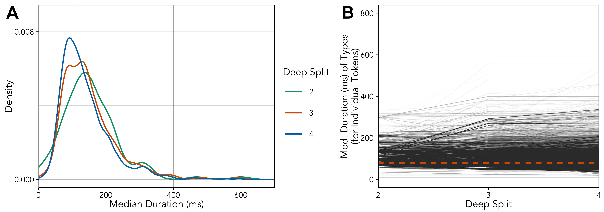
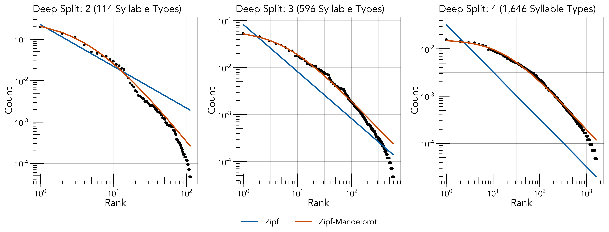

```{r, echo = FALSE, eval = FALSE}
#optionally hide all code
knitr::opts_chunk$set(echo = FALSE)

#set fonts of flextables
flextable::set_flextable_defaults(font.family = "Garamond", font.size = 10, padding.top = 1, padding.bottom = 1, keep_with_next = FALSE)
```

```{r echo = FALSE, message = FALSE}
#load libraries
library(flextable)
library(officer)
library(dplyr)
```

# Links {-}

* [Main text](https://masonyoungblood.github.io/linguistic_efficiency/)
* [Supplementary information](https://masonyoungblood.github.io/linguistic_efficiency/supplement/supplement.html)
* [PsyArXiv preprint](https://psyarxiv.com/bghqm)
* [GitHub repository](https://github.com/masonyoungblood/linguistic_efficiency)

# Data

Recordings from 1975 were collected with a Nagra III reel-to-reel tape recorder and a Sennheiser 804 shotgun microphone and converted to digital files (32 bit, 96 kHz) by the Cornell Lab of Ornithology in 2013 [@Ju2019]. Recordings from 2012 (16 bit, 44.1 kHz) and 2019 (32 bit, 48 kHz) were collected with a Marantz PD661 solid-state recorder and a Sennheiser ME66 shotgun microphone. The recordings from 1975 were downsampled to 48 kHz prior to analysis (Luscinia processes both 44.1 kHz and 48 kHz files). In all three years special precautions were taken to avoid recording the same bird twice [@Mundinger1975, @Ju2019]. Each site was visited only once. Within a site, only one individual was recorded within a 160 m radius until they stopped singing or flew away.

All songs were analyzed by @youngbloodContentBiasCultural2022 using Luscinia, a database and analysis program developed specifically for birdsong (https://rflachlan.github.io/Luscinia/). Songs were analyzed with a high-pass threshold of 2000 Hz, a maximum frequency of 9000 Hz and 5 dB of noise removal. 965 songs (26.2%) were excluded from the analysis due to high levels of noise. Continuous traces with more than 20 ms between them were classified as syllables [@Mundinger1975].

Figure S\@ref(fig:figure-song-example) shows an example of the first ten syllables of a house finch song recorded by @Mundinger1975 and analyzed in Luscinia, where the blue line is the mean frequency over time.

```{r figure-song-example, echo = FALSE, fig.align = "center", out.width = "100%", fig.cap = "The first 10 syllables from a song recorded by @Mundinger1975 and analyzed in Luscinia. Each red bar corresponds to a syllable, and each green number corresponds to an element within that syllable. The blue traces represent mean frequency. In this song, syllable 3 and syllable 7 were classified as the same syllable type during dynamic time warping, and all other syllables are unique types. Reprinted from @youngbloodContentBiasCultural2022."}
url <- "https://ars.els-cdn.com/content/image/1-s2.0-S000334722100395X-gr2_lrg.jpg"
knitr::include_graphics(url)
```

# Clustering

The deep split parameter ($DS$) determines the granularity of clustering by controlling the value of two other parameters: the maximum core scatter ($MCS$), which controls the maximum within-group variation, and the minimum gap ($MG$), which controls the minimum between-group variation [@langfelder_etal08; @ju16]. $DS = \{0, 1, 2, 3, 4\}$ correspond to $MCS = \{0.64, 0.73, 0.82, 0.91, 0.95\}$, and $MG = (1 - MCS)*0.75$. In their analyses of house finch song, @Ju2019 and @Roginek2018 manually set $MCS = 1$ and $MG = 0.5$ while @youngbloodContentBiasCultural2022 used $DS = 3$ (corresponding to $MCS = 0.91$ and $MG = 0.0675$), all of which led to a similar number of syllable types. I will follow @youngbloodContentBiasCultural2022 in using the simpler deep split parameter to control granularity in clustering, as this approach is recommended by the creators of dynamic tree cut [@langfelder_etal08] and has been widely used for a variety of applications [@liu_etal22; @zhao_etal20] including vocal analysis [@burkett_etal15].

## Sampling Coverage

Unseen species models, fit using the iNEXT package in R [@hsiehINEXTPackageRarefaction2016], were used to assess sampling coverage (see caption for details).

```{r figure-unseen-species, echo = FALSE, fig.align = "center", out.width = "100%", fig.cap = "The results of unseen species models applied to the full frequency distribution of syllables classified at each level of deep split, run using the iNEXT package in R [@hsiehINEXTPackageRarefaction2016]. The point in each plot marks the observed richness (y-axis) for the total number syllables sampled (x-axis). The solid lines mark interpolated richness, the dashed lines mark extrapolated richness, and the shaded areas mark 95% confidence intervals. The interpolated richness values are the number of types you observe if you subsample that number of tokens from the real data. The extrapolated values are the projected number of types you would observe if you were able to continue sampling tokens from the same population. More details can be found in Hsieh et al. [@hsiehINEXTPackageRarefaction2016]: https://doi.org/10.1111/2041-210X.12613. We appear to have complete coverage of syllable types regardless of the level of deep split that is used."}

```

## Assessment of Duration Bias

Automated clustering methods may detect more variation in the features of longer syllables compared to shorter syllables, leading to a bias in classification where longer syllables are parsed into more categories. The risk of such bias should be minimized due to the use of dynamic time warping, which warps signals in the time domain (in this study up to 10% of the average signal length) before computing similarity [@Ratanamahatana2005], and dynamic tree cut, which varies the granularity of classification to maximize the connectedness of items at the tips of branches [@langfelder_etal08], but it is still worth highlighting.

If a hierarchical clustering algorithm is less sensitive to variation in short syllables, then it should tend to over-lump them into types with longer syllables at all cut heights. However, it is likely to over-lump them less at lower cut heights, where syllables are already being parsed into types with greater granularity. Based on this logic, I would predict two things from a hierarchical clustering algorithm that is biased with respect to duration:

1. First, I would expect the distribution of the median durations of syllable types to vary across different levels of granularity (tested in Figure S\@ref(fig:figure-explore-durations)A).
2. My second prediction requires more explanation. As granularity in clustering changes, the type that a syllable token is assigned to changes as well. This means that we can track the average duration of types that individual syllables are assigned to as granularity increases, which I will refer to as “trajectories”. I would expect a biased clustering algorithm to lead to biased trajectories, where the duration of types that syllables are assigned to changes systematically in one direction over time (tested in Figure S\@ref(fig:figure-explore-durations)B).

```{r figure-explore-durations, echo = FALSE, fig.align = "center", out.width = "100%", fig.cap = "Panel A shows the median duration of types from each level of granularity in syllable clustering. The black lines in panel B are the \"trajectories\" of individual syllable tokens&mdash;the median duration of types that individual tokens are assigned to with increasing levels of granularity. The orange dotted line is the median value across all syllables."}

```

There is a subtle decrease in the distribution of the median duration of types as the granularity of clustering increases (Figure S\@ref(fig:figure-explore-durations)A), but the effect is not significant in a simple linear model (duration ~ granularity) (p > 0.05). If we track the median duration of the types that individual tokens are assigned to at increasing levels of granularity (Figure S\@ref(fig:figure-explore-durations)B), there appears to be no clear trend (avg. is the orange line). A simple linear model with type as a random effect (duration ~ granularity + (1|type)) does detect a significant increase in the median duration of types that tokens are assigned to with increasing granularity (estimate: 0.0018; 95% CI: 0.00061, 0.0029), but this effect is extremely low and only comes out to an increase of about 1 ms per unit increase in deep split (for signals that are ~100 ms on average).

Based on this analysis, I think that duration-bias in clustering is unlikely to be an issue in the analysis, but just to be sure I have replicated the results for Zipf's law of abbreviation with manually-classified syllables from an experimental cross-fostering study conducted in house finches [@Mann2020]. See [Replication with Data from Mann et al.] below for details.

## Variance Captured by Types

The hierarchical clustering leads to syllable types that explain a large amount of the variation in the duration, bandwidth, and excursion of tokens, but only captures concavity at the higher levels of deep split.

<br>

```{r, echo = FALSE}
#load models
load("../data_models/token_var_by_type.RData")

#format table
token_var_by_type <- round(token_var_by_type, digits = 2)
token_var_by_type <- cbind(Parameter = rownames(token_var_by_type), token_var_by_type)

#print table
flextable(token_var_by_type) %>% 
  theme_vanilla() %>% set_table_properties(layout = "autofit") %>%
  set_caption("The proportion of the variance (R^2^) in the acoustic features of tokens that is accounted for by types identified at all three levels of granularity in syllable clustering, computed from frequentist models with the following specification: feature ~ (1|type).")
```

<br>

# Zipf's Rank-Frequency Law

```{r figure-zipf-rank, echo = FALSE, fig.align = "center", out.width = "100%", fig.cap = "The relationship between rank (x-axis) and count (y-axis) at each level of deep split (left, center, and right). The blue and orange lines denote the expected distributions according to Zipf's rank-frequency law (blue) and Mandelbrot's extension of it (orange)."}

```

## Expanded Description of the Model

Mandelbrot's generalization of Zipf's rank-frequency law takes the following form [@Mandelbrot1953; @Mandelbrot1962]:

\begin{equation}
f(r) = \frac{c}{(r + \beta)^\alpha}
(\#eq:zipf-rf-a)
\end{equation}

where $f(r)$ is the normalized frequency at each rank $r$, $c$ is a normalization term, and $\alpha$ and $\beta$ are parameters that control slope and convexity (respectively). According to @izsak06, the bounds of \@ref(eq:zipf-rf-a) are $\alpha > 1$, $\beta > -1$, and $c > 1$. When $\beta = 0$, this function simplifies to the original form of Zipf's rank-frequency law: $f(r) \propto 1/r^\alpha$.

$c$ is usually a normalization constant [@izsak06; @mouillot_lepretre00; @macutek22] defined as:

\begin{equation}
c = \sum_{i=1}^{\infty}\frac{1}{(r + \beta)^\alpha}
(\#eq:zipf-rf-b)
\end{equation}

In practice, this form of Zipf's rank-frequency law is notoriously difficult to fit to data due to strong correlations between $\alpha$ and $\beta$, which in turn determine $c$ [@mouillot_lepretre00; @izsak06; @macutek22]. Here, I use a simplified version of \@ref(eq:zipf-rf-a) that treats $c$ as a third parameter that is estimated alongside $\alpha$ and $\beta$ [@ausloos14], as has been done in studies of chickadee calls [@hailman94; @freeberg_lucas12; @ficken_etal94], which should be interpreted as an approximation of the Zipf-Mandelbrot distribution.

The model was fit as a non-linear model on the original scale, as opposed to the log-log scale.

## Priors and Diagnostics

<br>

```{r, echo = FALSE}
#load models
load("../data_models/zipf_rf_models.RData")

#format table
ids <- which(zipf_rf_models$prior$prior != "")
zipf_rf_prior_table <- data.frame(Parameter = zipf_rf_models$prior$nlpar, Class = zipf_rf_models$prior$class, Prior = zipf_rf_models$prior$prior, "Lower Bound" = zipf_rf_models$prior$lb, check.names = FALSE)[ids, ]

#print table
flextable(zipf_rf_prior_table) %>% 
  theme_vanilla() %>% set_table_properties(layout = "autofit") %>%
  set_caption("Prior specification for the Zipf and Zipf-Mandelbrot models fit across the three levels of granularity.")
```

<br>

```{r, echo = FALSE}
#format table
zipf_rf_waic_table <- round(zipf_rf_models$waic)
zipf_rf_waic_table <- cbind(rownames(zipf_rf_waic_table), zipf_rf_waic_table)
colnames(zipf_rf_waic_table) <- c("DS", "Zipf", "Zipf-Mandelbrot")

#print table
flextable(zipf_rf_waic_table) %>% 
  theme_vanilla() %>% set_table_properties(layout = "autofit") %>%
  set_caption("WAIC values from the Zipf and Zipf-Mandelbrot models fit across the three levels of granularity.")
```

<br>

## Deep Split: 2

<br>

```{r, echo = FALSE}
#format zipf model
temp <- zipf_rf_models$zipf[[1]][, -2]
temp[, c(1:3)] <- round(temp[, c(1:3)], digits = 2)
temp[, c(4:6)] <- round(temp[, c(4:6)], digits = 0)
temp <- cbind(Param. = substr(rownames(temp), 1, 1), temp)
flextable(temp) %>%
  theme_vanilla() %>% set_table_properties(layout = "autofit") %>%
  set_caption("Estimates and diagnostics for the Zipf model.")
```
 
 <br>
 
```{r, echo = FALSE}
#format zipf-mandelbrot model
temp <- zipf_rf_models$mand[[1]][, -2]
temp[, c(1:3)] <- round(temp[, c(1:3)], digits = 2)
temp[, c(4:6)] <- round(temp[, c(4:6)], digits = 0)
temp <- cbind(Param. = substr(rownames(temp), 1, 1), temp)
flextable(temp) %>%
  theme_vanilla() %>% set_table_properties(layout = "autofit") %>%
  set_caption("Estimates and diagnostics for the Zipf-Mandelbrot model.")
```

<br>

## Deep Split: 3

<br>

```{r, echo = FALSE}
#format zipf model
temp <- zipf_rf_models$zipf[[2]][, -2]
temp[, c(1:3)] <- round(temp[, c(1:3)], digits = 2)
temp[, c(4:6)] <- round(temp[, c(4:6)], digits = 0)
temp <- cbind(Param. = substr(rownames(temp), 1, 1), temp)
flextable(temp) %>%
  theme_vanilla() %>% set_table_properties(layout = "autofit") %>%
  set_caption("Estimates and diagnostics for the Zipf model.")
```

<br>

```{r, echo = FALSE}
#format zipf-mandelbrot model
temp <- zipf_rf_models$mand[[2]][, -2]
temp[, c(1:3)] <- round(temp[, c(1:3)], digits = 2)
temp[, c(4:6)] <- round(temp[, c(4:6)], digits = 0)
temp <- cbind(Param. = substr(rownames(temp), 1, 1), temp)
flextable(temp) %>%
  theme_vanilla() %>% set_table_properties(layout = "autofit") %>%
  set_caption("Estimates and diagnostics for the Zipf-Mandelbrot model.")
```

<br>

## Deep Split: 4

<br>

```{r, echo = FALSE}
#format zipf model
temp <- zipf_rf_models$zipf[[3]][, -2]
temp[, c(1:3)] <- round(temp[, c(1:3)], digits = 2)
temp[, c(4:6)] <- round(temp[, c(4:6)], digits = 0)
temp <- cbind(Param. = substr(rownames(temp), 1, 1), temp)
flextable(temp) %>%
  theme_vanilla() %>% set_table_properties(layout = "autofit") %>%
  set_caption("Estimates and diagnostics for the Zipf model.")
```

<br>

```{r, echo = FALSE}
#format zipf-mandelbrot model
temp <- zipf_rf_models$mand[[3]][, -2]
temp[, c(1:3)] <- round(temp[, c(1:3)], digits = 2)
temp[, c(4:6)] <- round(temp[, c(4:6)], digits = 0)
temp <- cbind(Param. = substr(rownames(temp), 1, 1), temp)
flextable(temp) %>%
  theme_vanilla() %>% set_table_properties(layout = "autofit") %>%
  set_caption("Estimates and diagnostics for the Zipf-Mandelbrot model.")
```

<br>

## Analysis by Year

<br>

```{r, echo = FALSE}
#load table
load("../data_models/zipf_rf_models_year.RData")

#format table
zipf_rf_models_year_table <- rbind(-c(zipf_rf_models_year[[1]]$waic[, 1] - zipf_rf_models_year[[1]]$waic[, 2]),
                                   -c(zipf_rf_models_year[[2]]$waic[, 1] - zipf_rf_models_year[[2]]$waic[, 2]),
                                   -c(zipf_rf_models_year[[3]]$waic[, 1] - zipf_rf_models_year[[3]]$waic[, 2]))
zipf_rf_models_year_table <- round(zipf_rf_models_year_table)
zipf_rf_models_year_table <- as.data.frame(zipf_rf_models_year_table)
zipf_rf_models_year_table <- cbind(c("1975", "2012", "2019"), zipf_rf_models_year_table)
colnames(zipf_rf_models_year_table) <- c("Year", "DS: 2", "DS: 3", "DS: 4")

#print table
flextable(zipf_rf_models_year_table) %>% 
  theme_vanilla() %>% set_table_properties(layout = "autofit") %>%
  set_caption("\u0394WAIC comparing the fit of Zipf-Mandelbrot to Zipf's law separately to the data from each year at each level of deep split. Zipf-Mandelbrot provides a better fit in all conditions.")
```

<br>

```{r, echo = FALSE}
#format table
zipf_rf_models_year_r2 <- rbind(zipf_rf_models_year[[1]]$r2[4:6],
                                 zipf_rf_models_year[[2]]$r2[4:6],
                                 zipf_rf_models_year[[3]]$r2[4:6])
zipf_rf_models_year_r2 <- round(zipf_rf_models_year_r2, digits = 3)
zipf_rf_models_year_r2 <- as.data.frame(zipf_rf_models_year_r2)
zipf_rf_models_year_r2 <- cbind(c("1975", "2012", "2019"), zipf_rf_models_year_r2)
colnames(zipf_rf_models_year_r2) <- c("Year", "DS: 2", "DS: 3", "DS: 4")

#print table
flextable(zipf_rf_models_year_r2) %>% 
  theme_vanilla() %>% set_table_properties(layout = "autofit") %>%
  set_caption("The R\u00B2 for the Zipf-Mandelbrot distribution fit separately to the data from each year at each level of deep split.")
```

<br>

## Departures at High Ranks

It appears that the Zipf-Mandelbrot distribution has a poorer fit to the rarer syllable types. Systematic departure from the Zipf-Mandelbrot distribution at high ranks is a well-known phemonenon in human language [@ferrericancho_sole01; @montemurro01; @piantadosi14]. It is thought to be caused by suboptimal sample sizes [@gorina_etal20] and other data quality issues [@cristelli_etal12], and can be reproduced by more sophisticated models of Zipf’s rank-frequency law [@montemurro_zanette02; @tunnicliffe_hunter22].

Below are some simple simulations that demonstrate this principle in the house finch song data, conducted with the following steps at the intermediate level of granularity in syllable clustering (deep split of 3):

1. The fitted parameter values of the Zipf-Mandelbrot distribution (a = 1.20, b = 5.69, c = 0.52) were used to generate the expected frequencies of the 596 possible syllable types.
2. Tokens were pseudorandomly sampled with probability equal to the expected frequencies of the types.
3. The simulated frequency and rank of types was plotted alongside the theoretical distribution from the fitted parameter values.

```{r figure-rank-count-sim, echo = FALSE, fig.align = "center", out.width = "66%", fig.cap = "The relationship between rank (x-axis) and count (y-axis) at the intermediate granularity level (DS = 3, 596 syllable types). The orange lines denote the expected distributions according to Mandelbrot's extension of Zipf's rank-frequency law (a = 1.20, b = 5.69, c = 0.52). The points in the left and right panel are the expected counts and ranks when 42,099 and 1,000,000 tokens are sampled, respectively."}

```

As you can see, there is a subtle but systematic departure from the Zipf-Mandelbrot distribution at high ranks when 42,099 tokens are sampled from the theoretical distribution (the same number observed in the real dataset). When 1,000,000 tokens are sampled this departure disappears. The logic here is that when sample sizes are limited rare types tend to be under-counted, leading to a "droop" [@tunnicliffe_hunter22] in the curve at higher ranks.

# Zipf's Law of Abbreviation

```{r figure-zipf-abbr, echo = FALSE, fig.align = "center", out.width = "100%", fig.cap = "The relationship between four measures of production cost (x-axis) and count (y-axis) for each syllable type at each level of deep split (left, center, right). Each point shows the median value for a syllable type, so the orange best fit lines are from a simple Poisson model (count ~ cost) rather than the full log-normal model."}
knitr::include_graphics("../plots/dists.png")
```

```{r figure-zipf-abbr-tokens, echo = FALSE, fig.align = "center", out.width = "100%", fig.cap = "The relationship between four measures of production cost (x-axis) and count (y-axis) for each token (observation of each syllable type) at each level of deep split (left, center, right). Note that the y-axis is the count of each syllable type, which is why values are repeated across the individual tokens."}

```

## Priors and Diagnostics

<br>

```{r echo = FALSE}
#load table
load("../data_models/zipf_models.RData")

#format table
ids <- which(zipf_models[[1]][[4]]$prior != "")
zipf_prior_table <- data.frame(Class = zipf_models[[1]][[4]]$class, Prior = zipf_models[[1]][[4]]$prior, "Lower Bound" = zipf_models[[1]][[4]]$lb, check.names = FALSE)[ids, ]

#print table
flextable(zipf_prior_table) %>% 
  theme_vanilla() %>% set_table_properties(layout = "autofit") %>%
  set_caption("Prior specification for all four models of Zipf's law of abbreviation.")
```

<br>

```{r echo = FALSE}
#format table
base_table <- round(rbind(zipf_models$duration[[1]][, 5:7], zipf_models$duration[[2]][, 5:7], zipf_models$duration[[3]][, 5:7],
                          zipf_models$bandwidth[[1]][, 5:7], zipf_models$bandwidth[[2]][, 5:7], zipf_models$bandwidth[[3]][, 5:7],
                          zipf_models$concavity[[1]][, 5:7], zipf_models$concavity[[2]][, 5:7], zipf_models$concavity[[3]][, 5:7],
                          zipf_models$excursion[[1]][, 5:7], zipf_models$excursion[[2]][, 5:7], zipf_models$excursion[[3]][, 5:7]), digits = 0)
base_table <- cbind(rep(c("Duration", "Bandwidth", "Concavity", "Excursion"), each = 6), rep(c(2, 2, 3, 3, 4, 4), 4), rep(c("Intercept", "Count"), 12), base_table)
colnames(base_table) <- c("Outcome", "DS", "Predictor", "Rhat", "Bulk ESS", "Tail ESS")

#print table
flex_table <- flextable(base_table) %>% 
  merge_at(1:6, 1) %>% merge_at(7:12, 1) %>% merge_at(13:18, 1) %>% merge_at(19:24, 1) %>%
  merge_at(1:2, 2) %>% merge_at(3:4, 2) %>% merge_at(5:6, 2) %>% merge_at(7:8, 2) %>% 
  merge_at(9:10, 2) %>% merge_at(11:12, 2) %>% merge_at(13:14, 2) %>% merge_at(15:16, 2) %>% 
  merge_at(17:18, 2) %>% merge_at(19:20, 2) %>% merge_at(21:22, 2) %>% merge_at(23:24, 2) %>%
  theme_vanilla() %>% set_table_properties(layout = "autofit") %>%
  set_caption("The model diagnostics for each model of Zipf's law of abbreviation.")
flex_table
```

<br>

## Analysis by Year

<br>

```{r echo = FALSE}
#load data
load("../data_models/zipf_models_year.RData")

#format table
base_table <- as.data.frame(round(do.call(rbind, zipf_models_year), digits = 2))
base_table <- cbind(rep(c("duration ~ count", "bandwidth ~ count", "concavity ~ count", "excursion ~ count"), each = 3), rep(c(2, 3, 4), 4), base_table)
base_table <- cbind(base_table, ifelse(base_table[, 4]*base_table[, 5] > 0, "*", ""))
colnames(base_table) <- c("Model", "DS", "Est.", "2.5%", "97.5%", " ")
rownames(base_table) <- NULL

#print table
flex_table <- flextable(base_table) %>% 
  merge_at(1:3, 1) %>% merge_at(4:6, 1) %>% merge_at(7:9, 1) %>% merge_at(10:12, 1) %>%
  theme_vanilla() %>% set_table_properties(layout = "autofit") %>%
  set_caption("The estimated effect of count on each measure of production cost, in frequentist models that include year as a varying intercept, using the syllable classifications from each level of deep split. 95% confidence intervals that do not overlap with 0 are marked with an asterisk. The results are qualitatively identical to the main analysis.")
flex_table
```

<br>

## Replication using Kendall's tau

<br>

I replicated the analysis using a method recently proposed by Lewis et al. [@lewis_etal23] and released as the R package ZLAvian by Gilman et al. [@gilman_etal23]. This method computes Kendall's tau, or the concordance between duration and frequency, where (tau + 1)/2 is the probability that if two random syllables are sampled (from either individuals or from the population) the longer note will be more common. The estimated tau is then compared against a null distribution that conservatively accounts for social learning [@gilman_etal23].

At the population level, Kendall’s tau is significantly lower than the null for all four measures of production cost at every level of granularity in syllable clustering. There is also an individual level effect for bandwidth and excursion at all three levels of granularity, but the results are more mixed for duration and concavity. I think this is likely because we only have a median of 6 songs recorded for individual birds. I also replicated the analysis using data from a cross-fostering experiment [@Mann2020], where individual birds were much more heavily sampled (100, 64, and 62 songs recorded for each one), and found individual level effects of duration, bandwidth, and excursion (see [Replication with Data from Mann et al.] below).

<br>

```{r echo = FALSE}
#load data
load("../data_models/zla_kendall_table.RData")

#format table
base_table <- zla_kendall_table
base_table$tau <- round(base_table$tau, digits = 2)
base_table$p <- format(base_table$p, scientific = TRUE, digits = 2)
colnames(base_table) <- c("Parameter", "DS", "Level", "tau", "p-value", " ")
rownames(base_table) <- NULL

#print table
flex_table <- flextable(base_table) %>% 
  merge_at(1:6, 1) %>% merge_at(7:12, 1) %>% merge_at(13:18, 1) %>% merge_at(19:24, 1) %>%
  merge_at(1:2, 2) %>% merge_at(3:4, 2) %>% merge_at(5:6, 2) %>% merge_at(7:8, 2) %>%
  merge_at(9:10, 2) %>% merge_at(11:12, 2) %>% merge_at(13:14, 2) %>% merge_at(15:16, 2) %>%
  merge_at(17:18, 2) %>% merge_at(19:20, 2) %>% merge_at(21:22, 2) %>% merge_at(23:24, 2) %>%
  theme_vanilla() %>% set_table_properties(layout = "autofit") %>%
  set_caption("The estimate of Kendall's tau, computed using the method of Lewis et al. [@lewis_etal23] and Gilman et al. [@gilman_etal23] from the ZLAvian package in R. p-values values are marked with stars to denote their level of statistical significance: * for p < 0.05, ** for p < 0.01, *** for p < 0.001, **** for p < 0.0001.")
flex_table
```

<br>

## Replication with Data from Mann et al.

<br>

I contacted two labs with large corpora of field-recorded house finches, and neither of them had manually-classified syllables with analyzed acoustic features. However, there is one cross-fostering study conducted by Paul Mundinger in 1972, and analyzed and published by Mann et al. in 2021 [@Mann2020], that includes both manually-classified syllables and acoustic features. I replicated the analysis using these data to ensure that my results for Zipf's law of abbreviation were not an artifact of the automated classification procedure.

Mann et al. [@Mann2020] compared the acoustic features of songs from (1) house finches tutored by other house finches, (2) house finches tutored by canaries, (3) house finches reared without tutors, and (4) canaries. Mann et al. [@Mann2020] classified syllable types separately for each individual bird, so I analyzed the repertoires of the most heavily sampled bird from the first three categories (B1-74 (house finch tutor): 62 songs; B1 (canary tutor): 100 songs; D4 (no tutor): 64 songs). The results of the model, run with the exact same specification as the in main analysis, can been seen below.

<br>

```{r echo = FALSE}
#load libraries
library(flextable)
library(dplyr)

#load data
load("../data_models/mann_zipf_replication.RData")

#format table
base_table <- as.data.frame(round(do.call(rbind, mann_zipf_replication[[1]]), digits = 4))
base_table <- cbind(rep(c("duration ~ count", "bandwidth ~ count", "concavity ~ count", "excursion ~ count"), each = 3), rep(c("House Finch", "Canary", "None"), 4), base_table)
base_table <- cbind(base_table, ifelse(base_table[, 5]*base_table[, 6] > 0, "*", ""))
colnames(base_table) <- c("Model", "Tutor", "Est.", "Err.", "2.5%", "97.5%", " ")
rownames(base_table) <- NULL

#print table
flex_table <- flextable(base_table) %>% 
  merge_at(1:3, 1) %>% merge_at(4:6, 1) %>% merge_at(7:9, 1) %>% merge_at(10:12, 1) %>%
  theme_vanilla() %>% set_table_properties(layout = "autofit") %>%
  set_caption("The estimated effect of count on each measure of production cost, using the syllable classifications from individual birds from Mann et al. [@Mann2020] who were tutored by a house finch, a canary, or were reared without a tutor. 95% confidence intervals that do not overlap with 0 are marked with an asterisk.")
flex_table
```

<br>

Under typical circumstances, where a house finch learns song from another house finch, the results are qualitatively the same as the main analysis&mdash;duration, bandwidth, and excursion all have strong negative effects on count. Interestingly, only duration and excursion negatively predict count in the canary-tutored house finch, and only bandwidth negatively predicts count in the house finch reared without a tutor.

I also replicated the analysis using a method recently proposed by Lewis et al. [@lewis_etal23] and released as the R package ZLAvian by Gilman et al. [@gilman_etal23]. This method computes Kendall's tau, or the concordance between duration and frequency, where (tau + 1)/2 is the probability that if two random syllables are sampled the longer note will be more common. The estimated tau is then compared against a null distribution that conservatively accounts for social learning [@gilman_etal23]. Kendall's tau can be computed at the population level (i.e. random syllables are sampled from the population rather than a single bird, see above), but here I only report the results at the individual level since I am using data from individual repertoires.

<br>

```{r echo = FALSE}
#load data
load("../data_models/mann_zipf_replication.RData")

#format table
base_table <- as.data.frame(round(do.call(rbind, mann_zipf_replication[[2]]), digits = 3))
base_table <- cbind(rep(c("duration", "bandwidth", "concavity", "excursion"), each = 3), rep(c("house finch", "canary", "none"), 4), base_table)
base_table$sig <- ""
base_table$sig <- ""
base_table$sig[which(base_table[, 4] < 0.05)] <- "*"
base_table$sig[which(base_table[, 4] < 0.01)] <- "**"
base_table$sig[which(base_table[, 4] < 0.001)] <- "***"
base_table$sig[which(base_table[, 4] < 0.0001)] <- "****"
colnames(base_table) <- c("Parameter", "Tutor", "tau", "p", " ")
rownames(base_table) <- NULL

#print table
flex_table <- flextable(base_table) %>% 
  merge_at(1:3, 1) %>% merge_at(4:6, 1) %>% merge_at(7:9, 1) %>% merge_at(10:12, 1) %>%
  theme_vanilla() %>% set_table_properties(layout = "autofit") %>%
  set_caption("The estimate of Kendall's tau, computed using the method of Lewis et al. [@lewis_etal23] and Gilman et al. [@gilman_etal23] from the ZLAvian package in R. In this case, were data represent individual repertoires, tau is only computed at the individual level. p-values less than 0.05 are marked with a single star, and values less than 0.01 are marked with two stars.")
flex_table
```

<br>

The results are mostly consistent with the Bayesian model above: Kendall's tau is significantly negative for duration under all conditions, for bandwidth when birds learned from a house finch or were raised in isolation, and for excursion when birds learned from a house finch or a canary. Interestingly, we found that Kendall's tau for duration is consistently significantly negative at the individual level for the Mann et al. [@Mann2020] data, whereas it is only consistently significantly negative at the population level for the Youngblood and Lahti [@youngbloodContentBiasCultural2022] data (see [Replication using Kendall's tau] above). This is likely because there are many more songs recorded from the individual birds in the Mann et al. [@Mann2020] data (N = 100, 64, and 62) compared to the Youngblood and Lahti [@youngbloodContentBiasCultural2022] data (median of 6).

<br>

## Robustness to Lognormality Assumption

<br>

```{r echo = FALSE}
#load data
load("../data_models/zipf_models_check_lognormal.RData")

#format table
base_table <- as.data.frame(round(do.call(rbind, zipf_models_check_lognormal), digits = 2))
base_table <- cbind(rep(c("duration ~ count", "bandwidth ~ count", "concavity ~ count", "excursion ~ count"), each = 3), rep(c(2, 3, 4), 4), base_table)
base_table <- cbind(base_table, ifelse(base_table[, 4]*base_table[, 5] > 0, "*", ""))
colnames(base_table) <- c("Model", "DS", "Est.", "2.5%", "97.5%", " ")
rownames(base_table) <- NULL

#print table
flex_table <- flextable(base_table) %>% 
  merge_at(1:3, 1) %>% merge_at(4:6, 1) %>% merge_at(7:9, 1) %>% merge_at(10:12, 1) %>%
  theme_vanilla() %>% set_table_properties(layout = "autofit") %>%
  set_caption("The estimated effect of count on each measure of production cost in frequentist models that drop the lognormality assumption and do not log-transform the y-axis, using the syllable classifications from each level of deep split. 95% confidence intervals that do not overlap with 0 are marked with an asterisk. The results are qualitatively identical to the main analysis.")
flex_table
```

<br>

## Robustness to Long Tail

<br>

```{r echo = FALSE}
#load data
load("../data_models/zipf_models_check_90.RData")

#format table
base_table <- as.data.frame(round(do.call(rbind, zipf_models_check_90), digits = 2))
base_table <- cbind(rep(c("duration ~ count", "bandwidth ~ count", "concavity ~ count", "excursion ~ count"), each = 3), rep(c(2, 3, 4), 4), base_table)
base_table <- cbind(base_table, ifelse(base_table[, 4]*base_table[, 5] > 0, "*", ""))
colnames(base_table) <- c("Model", "DS", "Est.", "2.5%", "97.5%", " ")
rownames(base_table) <- NULL

#print table
flex_table <- flextable(base_table) %>% 
  merge_at(1:3, 1) %>% merge_at(4:6, 1) %>% merge_at(7:9, 1) %>% merge_at(10:12, 1) %>%
  theme_vanilla() %>% set_table_properties(layout = "autofit") %>%
  set_caption("The estimated effect of count on each measure of production cost in frequentist models that only include the middle 90% of the distribution, using the syllable classifications from each level of deep split. 95% confidence intervals that do not overlap with 0 are marked with an asterisk. The results are qualitatively identical to the main analysis.")
flex_table
```

<br>

# Menzerath's Law

## Priors and Diagnostics

<br>

```{r echo = FALSE}
#load table
load("../data_models/menz_models.RData")

#format table
ids <- which(menz_models$prior$prior != "")
menz_prior_table <- data.frame(Class = menz_models$prior$class, Prior = menz_models$prior$prior, "Lower Bound" = menz_models$prior$lb, check.names = FALSE)[ids, ]

#print table
flextable(menz_prior_table) %>% 
  theme_vanilla() %>% set_table_properties(layout = "autofit") %>%
  set_caption("Prior specification for the model of Menzerath's law.")
```

<br>

```{r echo = FALSE}
#print table
temp <- menz_models$actual$estimates
temp <- temp[, -2]
temp[, c(1:3)] <- round(temp[, c(1:3)], digits = 2)
temp[, c(4:6)] <- round(temp[, c(4:6)], digits = 0)
temp <- cbind(Param. = c("Intercept", "Song Length"), temp)
flextable(temp) %>%
  theme_vanilla() %>% set_table_properties(layout = "autofit") %>%
  set_caption("Estimates and diagnostics for the model of Menzerath's law applied to the real data.")
```

<br>

```{r echo = FALSE}
#format table
rhat_table <- cbind(1:nrow(menz_models$simple_null$rhats), menz_models$simple_null$rhats[, 1:2], menz_models$prod_null$rhats[, 1:2])
colnames(rhat_table) <- c(1:ncol(rhat_table))

#print table
flextable(rhat_table) %>% 
  theme_vanilla() %>% set_table_properties(layout = "autofit") %>%
  set_header_labels(values = c("Dataset", "Intercept", "Song Length", "Intercept", "Song Length")) %>%
  add_header_row(values = c("", "Simple Null Model", "Production Null Model"), colwidths = c(1, 2, 2)) %>%
  align(part = c("header"), align = "center") %>%
  align(part = c("body"), align = "center") %>%
  vline(j = c(1, 3)) %>%
  set_caption("The R-hat values from the two null models applied to each of the 10 simulated datasets.")
```

<br>

## Analysis by Year

<br>

```{r, echo = FALSE}
#load table
load("../data_models/menz_models_year.RData")

#format table
menz_models_year_table <- cbind(c("Intercept", "Song Length"), as.data.frame(signif(menz_models_year, digits = 2)))
colnames(menz_models_year_table) <- c("Param.", "Estimate", "2.5%", "97.5%")

#print table
flextable(menz_models_year_table) %>%
  theme_vanilla() %>% set_table_properties(layout = "autofit") %>%
  set_caption("Estimates for a frequentist version of the model of Menzerath's law applied to the real data, with year added as a varying intercept. The results are qualitatively identical to the main analysis.")
```

<br>

# Small-Worldness Index

## Analysis by Year

<br>

```{r, echo = FALSE}
#load table
load("../data_models/small_world_year.RData")

#format table
small_world_year <- cbind(rownames(small_world_year), round(small_world_year, digits = 2))
colnames(small_world_year)[1] <- "Year"

#print table
flextable(small_world_year) %>% 
  theme_vanilla() %>% set_table_properties(layout = "autofit") %>%
  set_caption("The small-worldness index computed separately from the data from each year at each level of deep split.")
```

<br>

# Mutual Information

<br>

```{r mi-table, echo = FALSE, message = FALSE}
#load packages
library(flextable)
library(dplyr)

#load data
load("../data_models/mi_models.RData")

#format table
base_table <- data.frame(rbind(cbind(mi_models[[1]]$waic, mi_models[[1]]$r2[, 1]),
                               cbind(mi_models[[2]]$waic, mi_models[[2]]$r2[, 1]),
                               cbind(mi_models[[3]]$waic, mi_models[[3]]$r2[, 1])))
base_table[, 1] <- round(base_table[, 1], digits = 0)
base_table[, 2] <- round(base_table[, 2], digits = 3)
base_table <- cbind(rep(c(2, 3, 4), each = 3), rep(c("Exponential", "Power-Law", "Composite"), 3), base_table)
colnames(base_table) <- c("DS", "Model", "WAIC", "R-Sq")
rownames(base_table) <- NULL

#print table
flex_table <- flextable(base_table) %>% 
  merge_at(1:3, 1) %>% merge_at(4:6, 1) %>% merge_at(7:9, 1) %>% 
  theme_vanilla() %>% set_table_properties(layout = "autofit") %>%
  set_caption("The WAIC and R-Squared value for each model at each level of deep split.")
flex_table
```

<br>

## Priors and Diagnostics

<br>

```{r echo = FALSE}
#load table
load("../data_models/mi_models.RData")

#format table
mi_prior_table <- data.frame(Parameter = mi_models[[1]]$priors$nlpar, Prior = mi_models[[1]]$priors$prior, "Lower Bound" = mi_models[[1]]$priors$lb, check.names = FALSE)[c(1, 3, 5, 7), ]

#print table
flextable(mi_prior_table) %>% 
  theme_vanilla() %>% set_table_properties(layout = "autofit") %>%
  set_caption("Prior specification for all three models of mutual information decay.")
```

<br>

```{r echo = FALSE}
#load table
load("../data_models/waic_test.RData")

#format table
waic_table <- round(do.call(cbind, waic_test), digits = 0)
waic_table <- cbind(rownames(waic_table), waic_table)
colnames(waic_table) <- 1:ncol(waic_table)

#print table
flextable(waic_table) %>% 
  theme_vanilla() %>% set_table_properties(layout = "autofit") %>%
  set_header_labels(values = c("", rep(c("Exp", "PL", "Comp"), 3))) %>%
  add_header_row(values = c("", "2", "3", "4"), colwidths = c(1, 3, 3, 3)) %>%
  align(part = c("header"), align = "center") %>%
  align(part = c("body"), align = "center") %>%
  vline(j = c(1, 4, 7)) %>% 
  set_caption("The WAIC values for each model, at each level of deep split, for increasing maximum distances between syllables.")
```

<br>

## Deep Split: 2

<br>

```{r echo = FALSE}
#store temporary object
temp <- mi_models[[1]]

#print exponential table
temp$exponential_fit <- temp$exponential_fit[, -2]
temp$exponential_fit[, c(1:3)] <- round(temp$exponential_fit[, c(1:3)], digits = 2)
temp$exponential_fit[, c(4:6)] <- round(temp$exponential_fit[, c(4:6)], digits = 0)
temp$exponential_fit <- cbind(Param. = substr(rownames(temp$exponential_fit), 1, 1), temp$exponential_fit)
flextable(temp$exponential_fit) %>%
  theme_vanilla() %>% set_table_properties(layout = "autofit") %>%
  set_caption("Estimates and diagnostics for exponential model.")
```

<br>

```{r, echo = FALSE}
#print power-law table
temp$power_law_fit <- temp$power_law_fit[, -2]
rownames(temp$power_law_fit) <- substr(rownames(temp$power_law_fit), 1, 1)
temp$power_law_fit[, c(1:3)] <- round(temp$power_law_fit[, c(1:3)], digits = 2)
temp$power_law_fit[, c(4:6)] <- round(temp$power_law_fit[, c(4:6)], digits = 0)
temp$power_law_fit <- cbind(Param. = substr(rownames(temp$power_law_fit), 1, 1), temp$power_law_fit)
flextable(temp$power_law_fit) %>%
  theme_vanilla() %>% set_table_properties(layout = "autofit") %>%
  set_caption("Estimates and diagnostics for power-law model.")
```

<br>

```{r, echo = FALSE}
#print composite table
temp$composite_fit <- temp$composite_fit[, -2]
rownames(temp$composite_fit) <- substr(rownames(temp$composite_fit), 1, 1)
temp$composite_fit[, c(1:3)] <- round(temp$composite_fit[, c(1:3)], digits = 2)
temp$composite_fit[, c(4:6)] <- round(temp$composite_fit[, c(4:6)], digits = 0)
temp$composite_fit <- cbind(Param. = substr(rownames(temp$composite_fit), 1, 1), temp$composite_fit)
flextable(temp$composite_fit) %>%
  theme_vanilla() %>% set_table_properties(layout = "autofit") %>%
  set_caption("Estimates and diagnostics for composite model.")
```

<br>

## Deep Split: 3

<br>

```{r echo = FALSE}
#store temporary object
temp <- mi_models[[2]]

#print exponential table
temp$exponential_fit <- temp$exponential_fit[, -2]
temp$exponential_fit[, c(1:3)] <- round(temp$exponential_fit[, c(1:3)], digits = 2)
temp$exponential_fit[, c(4:6)] <- round(temp$exponential_fit[, c(4:6)], digits = 0)
temp$exponential_fit <- cbind(Param. = substr(rownames(temp$exponential_fit), 1, 1), temp$exponential_fit)
flextable(temp$exponential_fit) %>%
  theme_vanilla() %>% set_table_properties(layout = "autofit") %>%
  set_caption("Estimates and diagnostics for exponential model.")
```

<br>

```{r, echo = FALSE}
#print power-law table
temp$power_law_fit <- temp$power_law_fit[, -2]
rownames(temp$power_law_fit) <- substr(rownames(temp$power_law_fit), 1, 1)
temp$power_law_fit[, c(1:3)] <- round(temp$power_law_fit[, c(1:3)], digits = 2)
temp$power_law_fit[, c(4:6)] <- round(temp$power_law_fit[, c(4:6)], digits = 0)
temp$power_law_fit <- cbind(Param. = substr(rownames(temp$power_law_fit), 1, 1), temp$power_law_fit)
flextable(temp$power_law_fit) %>%
  theme_vanilla() %>% set_table_properties(layout = "autofit") %>%
  set_caption("Estimates and diagnostics for power-law model.")
```

<br>

```{r, echo = FALSE}
#print composite table
temp$composite_fit <- temp$composite_fit[, -2]
rownames(temp$composite_fit) <- substr(rownames(temp$composite_fit), 1, 1)
temp$composite_fit[, c(1:3)] <- round(temp$composite_fit[, c(1:3)], digits = 2)
temp$composite_fit[, c(4:6)] <- round(temp$composite_fit[, c(4:6)], digits = 0)
temp$composite_fit <- cbind(Param. = substr(rownames(temp$composite_fit), 1, 1), temp$composite_fit)
flextable(temp$composite_fit) %>%
  theme_vanilla() %>% set_table_properties(layout = "autofit") %>%
  set_caption("Estimates and diagnostics for composite model.")
```

<br>

## Deep Split: 4

<br>

```{r echo = FALSE}
#store temporary object
temp <- mi_models[[3]]

#print exponential table
temp$exponential_fit <- temp$exponential_fit[, -2]
temp$exponential_fit[, c(1:3)] <- round(temp$exponential_fit[, c(1:3)], digits = 2)
temp$exponential_fit[, c(4:6)] <- round(temp$exponential_fit[, c(4:6)], digits = 0)
temp$exponential_fit <- cbind(Param. = substr(rownames(temp$exponential_fit), 1, 1), temp$exponential_fit)
flextable(temp$exponential_fit) %>%
  theme_vanilla() %>% set_table_properties(layout = "autofit") %>%
  set_caption("Estimates and diagnostics for exponential model.")
```

<br>

```{r, echo = FALSE}
#print power-law table
temp$power_law_fit <- temp$power_law_fit[, -2]
rownames(temp$power_law_fit) <- substr(rownames(temp$power_law_fit), 1, 1)
temp$power_law_fit[, c(1:3)] <- round(temp$power_law_fit[, c(1:3)], digits = 2)
temp$power_law_fit[, c(4:6)] <- round(temp$power_law_fit[, c(4:6)], digits = 0)
temp$power_law_fit <- cbind(Param. = substr(rownames(temp$power_law_fit), 1, 1), temp$power_law_fit)
flextable(temp$power_law_fit) %>%
  theme_vanilla() %>% set_table_properties(layout = "autofit") %>%
  set_caption("Estimates and diagnostics for power-law model.")
```

<br>

```{r, echo = FALSE}
#print composite table
temp$composite_fit <- temp$composite_fit[, -2]
rownames(temp$composite_fit) <- substr(rownames(temp$composite_fit), 1, 1)
temp$composite_fit[, c(1:3)] <- round(temp$composite_fit[, c(1:3)], digits = 2)
temp$composite_fit[, c(4:6)] <- round(temp$composite_fit[, c(4:6)], digits = 0)
temp$composite_fit <- cbind(Param. = substr(rownames(temp$composite_fit), 1, 1), temp$composite_fit)
flextable(temp$composite_fit) %>%
  theme_vanilla() %>% set_table_properties(layout = "autofit") %>%
  set_caption("Estimates and diagnostics for composite model.")
```

<br>

## Analysis by Year

<br>

```{r, echo = FALSE}
#load table
load("../data_models/mi_models_year.RData")

#format table
mi_models_year[, 3:5] <- round(mi_models_year[, 3:5])
mi_models_year$Year <- as.character(mi_models_year$Year)

flextable(mi_models_year) %>% 
  merge_at(1:3, 1) %>% merge_at(4:6, 1) %>% merge_at(7:9, 1) %>%
  theme_vanilla() %>% set_table_properties(layout = "autofit") %>%
  set_caption("The WAIC values for the exponential, power-law, and composite models applied to the mutual information calculated separately from the data from each year at each level of deep split. The composite model outcompetes both alternatives in all conditions.")
```

<br>

## Analysis with Song Sequences

<br>

```{r, echo = FALSE}
library(dplyr)
library(flextable)

#load table
load("../data_models/mi_models_song_lengths.RData")

#format table
mi_models_song_lengths[, 2:4] <- round(mi_models_song_lengths[, 2:4])

flextable(mi_models_song_lengths) %>% 
  theme_vanilla() %>% set_table_properties(layout = "autofit") %>%
  set_caption("The WAIC values for the exponential, power-law, and composite models applied to the mutual information calculated from individual song sequences rather than from concatenated song bouts. The exponential model outcompetes both alternatives at deep split values of 3 and 4, while the power-law and composite models outcompete the exponential model at deep split of 2.")
```

<br>

## Analysis of Information in Bouts

This analysis was conducted to ensure that the ordering of songs within song bouts contributes mutual information to the decay curves.

Long-range dependencies in song sequences come from two places: the ordering of syllables within very long songs, and the ordering of songs within song bouts. To isolate the statistical signals of the latter, I created a “dummy” dataset where syllable sequences within songs were shuffled, but the ordering of bouts was the same. As a comparison, I created a second “dummy” dataset that has the same song sequences as the first, but with random song bouts (shuffled within individuals).

Wilcoxon signed-rank tests and t-tests show that the first dataset contains significantly more information than the second at all three levels of granularity in syllable clustering.

<br>

```{r, echo = FALSE}
library(dplyr)
library(flextable)

#load table
load("../data_models/mi_models_bout_level.RData")

#format table
mi_models_bout_level <- rbind(sapply(1:3, function(x){mi_models_bout_level$wilcox[[x]]$p.value}),
                              sapply(1:3, function(x){mi_models_bout_level$ttest[[x]]$p.value}))
mi_models_bout_level <- format(mi_models_bout_level, scientific = TRUE, digits = 2)
mi_models_bout_level <- cbind(c("Wilcoxon signed-rank test", "t-test"), mi_models_bout_level)
mi_models_bout_level <- as.data.frame(mi_models_bout_level)
colnames(mi_models_bout_level) <- c(" ", "DS: 2", "DS: 3", "DS: 4")
rownames(mi_models_bout_level) <- NULL

flextable(mi_models_bout_level) %>% 
  theme_vanilla() %>% set_table_properties(layout = "autofit") %>%
  set_caption("The p-values from Wilcoxon signed-rank tests and t-tests comparing the amount of information contained in two \"dummy\" datasets: one that isolates the information contained in song bouts by shuffling syllable sequences within songs, and another that further shuffles song bout order within individuals. The first contains more information than the second (p < 0.05) across all three levels of granularity in syllable clustering.")
```

<br>

# Extended Discussion

A long-standing critique of Zipf's laws is that they may be statistical artifacts of other processes [@caplan_etal20], starting with Miller's observation that randomly typing on keyboards can produce similar patterns [@miller57]. That being said, random typing accounts are not realistic causal descriptions of how communication systems emerge, and there are good empirical reasons to doubt that they undermine efficiency accounts [@piantadosi14]. Randomly-generated texts produce rank-frequency distributions that differ from those in real corpora [@ferrer-i-cancho_elvevag10], random typing models are not truly neutral as they can be mathematically reframed as minimizing costs [@ferrer-i-cancho16; @ferrer-i-cancho_etal22], and there is direct experimental evidence that Zipfian abbreviation emerges from pressure for efficient communication [@kanwal_etal17]. In my view, the most important contribution of the random typing account is to highlight that the problem of equifinality---different processes leading to similar outcomes [@Barrett2019]---means that patterns resembling Zipf's laws are not sufficient to make conclusions about efficiency [@kanwal17; @semple_etal22]. Multiple lines of evidence should be presented alongside other work demonstrating that efficiency is shaping the system (e.g. physical [@Mann2020] and environmental [@bermudez-cuamatzin_etal23] constraints), as I have done here. See @semple_etal22, @piantadosi14, and @kanwal17 for more complete summaries of this debate.

Outside of linguistics, efficiency and complexity are often discussed in relation to cumulative cultural evolution (CCE). Definitions of CCE vary and a full review is outside of the scope of this study, but for convenience we will use the definition of @williamsCumulativeCulturalEvolution2022: "the accumulation of sequential changes within a single socially learned behavior that results in improved function". Discussions of CCE often focus on increasing complexity over time [@wilks_blakey18], which was once thought to be a hallmark of human culture [@tomasello99] but has now been observed in several non-human communication systems including humpback whale [@garland_etal22] and Savannah sparrow song [@williamsCumulativeCulturalEvolution2022]. @gruber_etal22 make a convincing argument that efficiency deserves more attention in CCE, as increases in complexity in one domain require increases in efficiency in another (see Equation 1 in the Introduction). House finch song may be a good research model for how the interplay between efficiency and complexity drives CCE, as male house finches have a social learning bias for more complex syllables [@youngbloodContentBiasCultural2022], possibly as an adaptation to female preferences for more complex songs [@Nolan2004; @Mennill2006; @Ciaburri2019], and there appears to be pressure for efficiency at the level of both syllables and songs. That being said, CCE may not be the best framework for understanding the interaction between efficiency and complexity in birdsong, as its logic is more difficult to apply to "aesthetic" behavior [@sinclair_etal22] especially when it is optimized for female preferences that evolve to maximize inclusive fitness rather than the specific properties of songs that males sing [@geller_lahti23].

House finch song exhibits language-like efficiency and structure, but music-like structure has not been similarly studied in this species. In the last two decades researchers have identified aspects of birdsong, such as rhythm and pitch intervals in thrush nightingales [@roeskeCategoricalRhythmsAre2020; @roeske_etal18; @rothenberg_etal14], that closely resemble aspects of human music. Future studies should explore language- and music-like properties of birdsong in parallel across multiple levels of granularity to inform the ongoing debate about whether birdsong is more akin to music or language [@fitch06; @shannon16; @rohrmeier_etal15].

# References {-}

<div id="refs"></div>

<!-- Get rid of extra white space at the bottom caused by table of contents -->
<div class="tocify-extend-page" data-unique="tocify-extend-page" style="height: 0;"></div>

<br><br>
