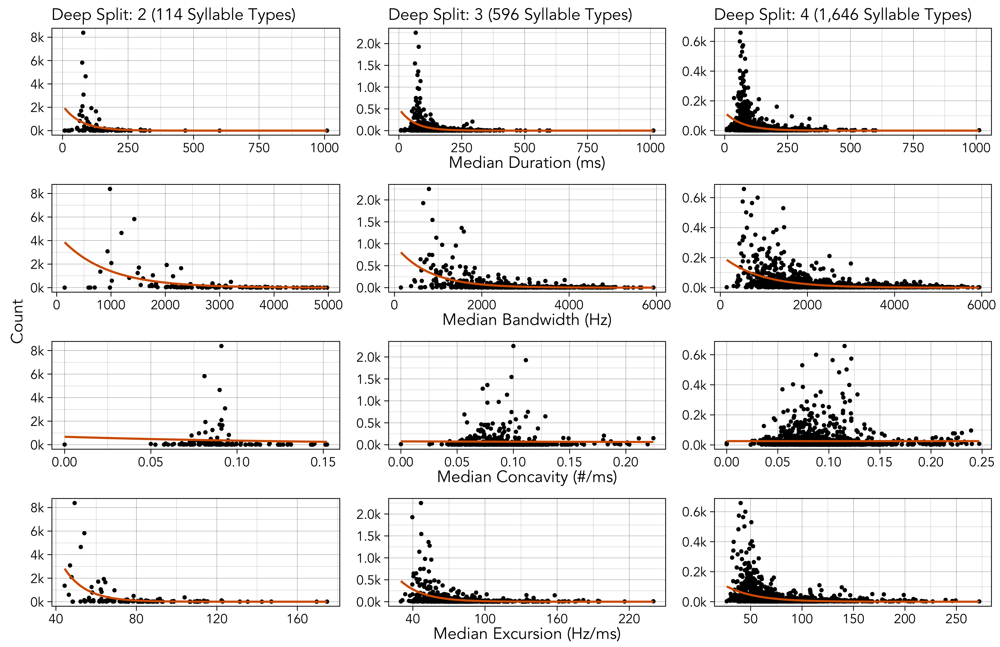

```{r, echo = FALSE, eval = FALSE}
#optionally hide all code
knitr::opts_chunk$set(echo = FALSE)

#set fonts of flextables
flextable::set_flextable_defaults(font.family = "Garamond", font.size = 10, padding.top = 1, padding.bottom = 1, keep_with_next = FALSE)
```

```{r echo = FALSE, message = FALSE}
#load libraries
library(flextable)
library(officer)
library(dplyr)
```

# Links {-}

* Main text: https://masonyoungblood.github.io/linguistic_efficiency/
* Supplementary information: https://masonyoungblood.github.io/linguistic_efficiency/supplement/supplement.html
* PsyArXiv preprint: https://psyarxiv.com/bghqm
* GitHub repository: https://github.com/masonyoungblood/linguistic_efficiency

# Data

Recordings from 1975 were collected with a Nagra III reel-to-reel tape recorder and a Sennheiser 804 shotgun microphone and converted to digital files (32 bit, 96 kHz) by the Cornell Lab of Ornithology in 2013 [@Ju2019]. Recordings from 2012 (16 bit, 44.1 kHz) and 2019 (32 bit, 48 kHz) were collected with a Marantz PD661 solid-state recorder and a Sennheiser ME66 shotgun microphone. The recordings from 1975 were downsampled to 48 kHz prior to analysis (Luscinia processes both 44.1 kHz and 48 kHz files). In all three years special precautions were taken to avoid recording the same bird twice [@Mundinger1975, @Ju2019]. Each site was visited only once. Within a site, only one individual was recorded within a 160 m radius until they stopped singing or flew away.

All songs were analyzed by @youngbloodContentBiasCultural2022 using Luscinia, a database and analysis program developed specifically for birdsong (https://rflachlan.github.io/Luscinia/). Songs were analyzed with a high-pass threshold of 2000 Hz, a maximum frequency of 9000 Hz and 5 dB of noise removal. 965 songs (26.2%) were excluded from the analysis due to high levels of noise. Continuous traces with more than 20 ms between them were classified as syllables [@Mundinger1975].

Figure \@ref(fig:figure-song-example) shows an example of the first ten syllables of a house finch song recorded by @Mundinger1975 and analyzed in Luscinia, where the blue line is the mean frequency over time.

```{r figure-song-example, echo = FALSE, fig.align = "center", out.width = "100%", fig.cap = "The first 10 syllables from a song recorded by @Mundinger1975 and analyzed in Luscinia. Each red bar corresponds to a syllable, and each green number corresponds to an element within that syllable. The blue traces represent mean frequency. In this song, syllable 3 and syllable 7 were classified as the same syllable type during dynamic time warping, and all other syllables are unique types. Reprinted from @youngbloodContentBiasCultural2022."}
url <- "https://ars.els-cdn.com/content/image/1-s2.0-S000334722100395X-gr2_lrg.jpg"
knitr::include_graphics(url)
```

# Clustering

The deep split parameter ($DS$) determines the granularity of clustering by controlling the value of two other parameters: the maximum core scatter ($MCS$), which controls the maximum within-group variation, and the minimum gap ($MG$), which controls the minimum between-group variation [@langfelder_etal08; @ju16]. $DS = \{0, 1, 2, 3, 4\}$ correspond to $MCS = \{0.64, 0.73, 0.82, 0.91, 0.95\}$, and $MG = (1 - MCS)*0.75$. In their analyses of house finch song, @Ju2019 and @Roginek2018 manually set $MCS = 1$ and $MG = 0.5$ while @youngbloodContentBiasCultural2022 used $DS = 3$ (corresponding to $MCS = 0.91$ and $MG = 0.0675$), all of which led to a similar number of syllable types. I will follow @youngbloodContentBiasCultural2022 in using the simpler deep split parameter to control granularity in clustering, as this approach is recommended by the creators of dynamic tree cut [@langfelder_etal08] and has been widely used for a variety of applications [@liu_etal22; @zhao_etal20] including vocal analysis [@burkett_etal15].

# Zipf's Rank-Frequency Law

```{r figure-zipf-rank, echo = FALSE, fig.align = "center", out.width = "100%", fig.cap = "The relationship between rank (x-axis) and count (y-axis) at each level of deep split (left, center, and right). The blue and orange lines denote the expected distributions according to Zipf's rank-frequency law (blue) and Mandelbrot's extension of it (orange)."}
knitr::include_graphics("../plots/rank_count.png")
```

## Priors and Diagnostics

<br>

```{r, echo = FALSE}
#load models
load("../data_models/zipf_rf_models.RData")

#format table
ids <- which(zipf_rf_models$prior$prior != "")
zipf_rf_prior_table <- data.frame(Parameter = zipf_rf_models$prior$nlpar, Class = zipf_rf_models$prior$class, Prior = zipf_rf_models$prior$prior, "Lower Bound" = zipf_rf_models$prior$lb, check.names = FALSE)[ids, ]

#print table
flextable(zipf_rf_prior_table) %>% 
  theme_vanilla() %>% set_table_properties(layout = "autofit") %>%
  set_caption("Prior specification for the Zipf and Zipf-Mandelbrot models fit across the three levels of granularity.")
```

<br>

```{r, echo = FALSE}
#format table
zipf_rf_waic_table <- round(zipf_rf_models$waic)
zipf_rf_waic_table <- cbind(rownames(zipf_rf_waic_table), zipf_rf_waic_table)
colnames(zipf_rf_waic_table) <- c("DS", "Zipf", "Zipf-Mandelbrot")

#print table
flextable(zipf_rf_waic_table) %>% 
  theme_vanilla() %>% set_table_properties(layout = "autofit") %>%
  set_caption("WAIC values from the Zipf and Zipf-Mandelbrot models fit across the three levels of granularity.")
```

<br>

## Deep Split: 2

<br>

```{r, echo = FALSE}
#format zipf model
temp <- zipf_rf_models$zipf[[1]][, -2]
temp[, c(1:3)] <- round(temp[, c(1:3)], digits = 2)
temp[, c(4:6)] <- round(temp[, c(4:6)], digits = 0)
temp <- cbind(Param. = substr(rownames(temp), 1, 1), temp)
flextable(temp) %>%
  theme_vanilla() %>% set_table_properties(layout = "autofit") %>%
  set_caption("Estimates and diagnostics for the Zipf model.")
```
 
 <br>
 
```{r, echo = FALSE}
#format zipf-mandelbrot model
temp <- zipf_rf_models$mand[[1]][, -2]
temp[, c(1:3)] <- round(temp[, c(1:3)], digits = 2)
temp[, c(4:6)] <- round(temp[, c(4:6)], digits = 0)
temp <- cbind(Param. = substr(rownames(temp), 1, 1), temp)
flextable(temp) %>%
  theme_vanilla() %>% set_table_properties(layout = "autofit") %>%
  set_caption("Estimates and diagnostics for the Zipf-Mandelbrot model.")
```

<br>

## Deep Split: 3

<br>

```{r, echo = FALSE}
#format zipf model
temp <- zipf_rf_models$zipf[[2]][, -2]
temp[, c(1:3)] <- round(temp[, c(1:3)], digits = 2)
temp[, c(4:6)] <- round(temp[, c(4:6)], digits = 0)
temp <- cbind(Param. = substr(rownames(temp), 1, 1), temp)
flextable(temp) %>%
  theme_vanilla() %>% set_table_properties(layout = "autofit") %>%
  set_caption("Estimates and diagnostics for the Zipf model.")
```

<br>

```{r, echo = FALSE}
#format zipf-mandelbrot model
temp <- zipf_rf_models$mand[[2]][, -2]
temp[, c(1:3)] <- round(temp[, c(1:3)], digits = 2)
temp[, c(4:6)] <- round(temp[, c(4:6)], digits = 0)
temp <- cbind(Param. = substr(rownames(temp), 1, 1), temp)
flextable(temp) %>%
  theme_vanilla() %>% set_table_properties(layout = "autofit") %>%
  set_caption("Estimates and diagnostics for the Zipf-Mandelbrot model.")
```

<br>

## Deep Split: 4

<br>

```{r, echo = FALSE}
#format zipf model
temp <- zipf_rf_models$zipf[[3]][, -2]
temp[, c(1:3)] <- round(temp[, c(1:3)], digits = 2)
temp[, c(4:6)] <- round(temp[, c(4:6)], digits = 0)
temp <- cbind(Param. = substr(rownames(temp), 1, 1), temp)
flextable(temp) %>%
  theme_vanilla() %>% set_table_properties(layout = "autofit") %>%
  set_caption("Estimates and diagnostics for the Zipf model.")
```

<br>

```{r, echo = FALSE}
#format zipf-mandelbrot model
temp <- zipf_rf_models$mand[[3]][, -2]
temp[, c(1:3)] <- round(temp[, c(1:3)], digits = 2)
temp[, c(4:6)] <- round(temp[, c(4:6)], digits = 0)
temp <- cbind(Param. = substr(rownames(temp), 1, 1), temp)
flextable(temp) %>%
  theme_vanilla() %>% set_table_properties(layout = "autofit") %>%
  set_caption("Estimates and diagnostics for the Zipf-Mandelbrot model.")
```

<br>

## Analysis by Year

<br>

```{r, echo = FALSE}
#load table
load("../data_models/zipf_rf_models_year.RData")

#format table
zipf_rf_models_year_table <- rbind(-c(zipf_rf_models_year[[1]]$waic[, 1] - zipf_rf_models_year[[1]]$waic[, 2]),
                                   -c(zipf_rf_models_year[[2]]$waic[, 1] - zipf_rf_models_year[[2]]$waic[, 2]),
                                   -c(zipf_rf_models_year[[3]]$waic[, 1] - zipf_rf_models_year[[3]]$waic[, 2]))
zipf_rf_models_year_table <- round(zipf_rf_models_year_table)
zipf_rf_models_year_table <- as.data.frame(zipf_rf_models_year_table)
zipf_rf_models_year_table <- cbind(c("1975", "2012", "2019"), zipf_rf_models_year_table)
colnames(zipf_rf_models_year_table) <- c("Year", "DS: 2", "DS: 3", "DS: 4")

#print table
flextable(zipf_rf_models_year_table) %>% 
  theme_vanilla() %>% set_table_properties(layout = "autofit") %>%
  set_caption("\u0394WAIC comparing the fit of Zipf-Mandelbrot to Zipf's law separately to the data from each year at each level of deep split. Zipf-Mandelbrot provides a better fit in all conditions.")
```

<br>

```{r, echo = FALSE}
#format table
zipf_rf_models_year_r2 <- rbind(zipf_rf_models_year[[1]]$r2[4:6],
                                 zipf_rf_models_year[[2]]$r2[4:6],
                                 zipf_rf_models_year[[3]]$r2[4:6])
zipf_rf_models_year_r2 <- round(zipf_rf_models_year_r2, digits = 3)
zipf_rf_models_year_r2 <- as.data.frame(zipf_rf_models_year_r2)
zipf_rf_models_year_r2 <- cbind(c("1975", "2012", "2019"), zipf_rf_models_year_r2)
colnames(zipf_rf_models_year_r2) <- c("Year", "DS: 2", "DS: 3", "DS: 4")

#print table
flextable(zipf_rf_models_year_r2) %>% 
  theme_vanilla() %>% set_table_properties(layout = "autofit") %>%
  set_caption("The R\u00B2 for the Zipf-Mandelbrot distribution fit separately to the data from each year at each level of deep split.")
```

<br>

# Zipf's Law of Abbreviation

```{r figure-zipf-abbr, echo = FALSE, fig.align = "center", out.width = "100%", fig.cap = "The relationship between four measures of production cost (x-axis) and count (y-axis) for each level of deep split (left, center, right). Each point shows the median value for a syllable type, so the orange best fit lines are from a simple Poisson model (count ~ cost) rather than the full log-normal model."}

```

## Priors and Diagnostics

<br>

```{r echo = FALSE}
#load table
load("../data_models/zipf_models.RData")

#format table
ids <- which(zipf_models[[1]][[4]]$prior != "")
zipf_prior_table <- data.frame(Class = zipf_models[[1]][[4]]$class, Prior = zipf_models[[1]][[4]]$prior, "Lower Bound" = zipf_models[[1]][[4]]$lb, check.names = FALSE)[ids, ]

#print table
flextable(zipf_prior_table) %>% 
  theme_vanilla() %>% set_table_properties(layout = "autofit") %>%
  set_caption("Prior specification for all four models of Zipf's law of abbreviation.")
```

<br>

```{r echo = FALSE}
#format table
base_table <- round(rbind(zipf_models$duration[[1]][, 5:7], zipf_models$duration[[2]][, 5:7], zipf_models$duration[[3]][, 5:7],
                          zipf_models$bandwidth[[1]][, 5:7], zipf_models$bandwidth[[2]][, 5:7], zipf_models$bandwidth[[3]][, 5:7],
                          zipf_models$concavity[[1]][, 5:7], zipf_models$concavity[[2]][, 5:7], zipf_models$concavity[[3]][, 5:7],
                          zipf_models$excursion[[1]][, 5:7], zipf_models$excursion[[2]][, 5:7], zipf_models$excursion[[3]][, 5:7]), digits = 0)
base_table <- cbind(rep(c("Duration", "Bandwidth", "Concavity", "Excursion"), each = 6), rep(c(2, 2, 3, 3, 4, 4), 4), rep(c("Intercept", "Count"), 12), base_table)
colnames(base_table) <- c("Outcome", "DS", "Predictor", "Rhat", "Bulk ESS", "Tail ESS")

#print table
flex_table <- flextable(base_table) %>% 
  merge_at(1:6, 1) %>% merge_at(7:12, 1) %>% merge_at(13:18, 1) %>% merge_at(19:24, 1) %>%
  merge_at(1:2, 2) %>% merge_at(3:4, 2) %>% merge_at(5:6, 2) %>% merge_at(7:8, 2) %>% 
  merge_at(9:10, 2) %>% merge_at(11:12, 2) %>% merge_at(13:14, 2) %>% merge_at(15:16, 2) %>% 
  merge_at(17:18, 2) %>% merge_at(19:20, 2) %>% merge_at(21:22, 2) %>% merge_at(23:24, 2) %>%
  theme_vanilla() %>% set_table_properties(layout = "autofit") %>%
  set_caption("The model diagnostics for each model of Zipf's law of abbreviation.")
flex_table
```

<br>

## Analysis by Year

<br>

```{r echo = FALSE}
#load data
load("../data_models/zipf_models_year.RData")

#format table
base_table <- as.data.frame(round(do.call(rbind, zipf_models_year), digits = 2))
base_table <- cbind(rep(c("duration ~ count", "bandwidth ~ count", "concavity ~ count", "excursion ~ count"), each = 3), rep(c(2, 3, 4), 4), base_table)
base_table <- cbind(base_table, ifelse(base_table[, 4]*base_table[, 5] > 0, "*", ""))
colnames(base_table) <- c("Model", "DS", "Est.", "2.5%", "97.5%", " ")
rownames(base_table) <- NULL

#print table
flex_table <- flextable(base_table) %>% 
  merge_at(1:3, 1) %>% merge_at(4:6, 1) %>% merge_at(7:9, 1) %>% merge_at(10:12, 1) %>%
  theme_vanilla() %>% set_table_properties(layout = "autofit") %>%
  set_caption("The estimated effect of count on each measure of production cost, in frequentist models that include year as a varying intercept, using the syllable classifications from each level of deep split. 95% confidence intervals that do not overlap with 0 are marked with an asterisk. The results are qualitatively identical to the main analysis.")
flex_table
```

<br>

# Menzerath's Law

## Priors and Diagnostics

<br>

```{r echo = FALSE}
#load table
load("../data_models/menz_models.RData")

#format table
ids <- which(menz_models$prior$prior != "")
menz_prior_table <- data.frame(Class = menz_models$prior$class, Prior = menz_models$prior$prior, "Lower Bound" = menz_models$prior$lb, check.names = FALSE)[ids, ]

#print table
flextable(menz_prior_table) %>% 
  theme_vanilla() %>% set_table_properties(layout = "autofit") %>%
  set_caption("Prior specification for the model of Menzerath's law.")
```

<br>

```{r echo = FALSE}
#print table
temp <- menz_models$actual$estimates
temp <- temp[, -2]
temp[, c(1:3)] <- round(temp[, c(1:3)], digits = 2)
temp[, c(4:6)] <- round(temp[, c(4:6)], digits = 0)
temp <- cbind(Param. = c("Intercept", "Song Length"), temp)
flextable(temp) %>%
  theme_vanilla() %>% set_table_properties(layout = "autofit") %>%
  set_caption("Estimates and diagnostics for the model of Menzerath's law applied to the real data.")
```

<br>

```{r echo = FALSE}
#format table
rhat_table <- cbind(1:nrow(menz_models$simple_null$rhats), menz_models$simple_null$rhats[, 1:2], menz_models$prod_null$rhats[, 1:2])
colnames(rhat_table) <- c(1:ncol(rhat_table))

#print table
flextable(rhat_table) %>% 
  theme_vanilla() %>% set_table_properties(layout = "autofit") %>%
  set_header_labels(values = c("Dataset", "Intercept", "Song Length", "Intercept", "Song Length")) %>%
  add_header_row(values = c("", "Simple Null Model", "Production Null Model"), colwidths = c(1, 2, 2)) %>%
  align(part = c("header"), align = "center") %>%
  align(part = c("body"), align = "center") %>%
  vline(j = c(1, 3)) %>%
  set_caption("The R-hat values from the two null models applied to each of the 10 simulated datasets.")
```

<br>

## Analysis by Year

<br>

```{r, echo = FALSE}
#load table
load("../data_models/menz_models_year.RData")

#format table
menz_models_year_table <- cbind(c("Intercept", "Song Length"), as.data.frame(signif(menz_models_year, digits = 2)))
colnames(menz_models_year_table) <- c("Param.", "Estimate", "2.5%", "97.5%")

#print table
flextable(menz_models_year_table) %>%
  theme_vanilla() %>% set_table_properties(layout = "autofit") %>%
  set_caption("Estimates for a frequentist version of the model of Menzerath's law applied to the real data, with year added as a varying intercept. The results are qualitatively identical to the main analysis.")
```

<br>

# Small-Worldness Index

## Analysis by Year

<br>

```{r, echo = FALSE}
#load table
load("../data_models/small_world_year.RData")

#format table
small_world_year <- cbind(rownames(small_world_year), round(small_world_year, digits = 2))
colnames(small_world_year)[1] <- "Year"

#print table
flextable(small_world_year) %>% 
  theme_vanilla() %>% set_table_properties(layout = "autofit") %>%
  set_caption("The small-worldness index computed separately from the data from each year at each level of deep split.")
```

<br>

# Mutual Information

<br>

```{r mi-table, echo = FALSE, message = FALSE}
#load packages
library(flextable)
library(dplyr)

#load data
load("../data_models/mi_models.RData")

#format table
base_table <- data.frame(rbind(cbind(mi_models[[1]]$waic, mi_models[[1]]$r2[, 1]),
                               cbind(mi_models[[2]]$waic, mi_models[[2]]$r2[, 1]),
                               cbind(mi_models[[3]]$waic, mi_models[[3]]$r2[, 1])))
base_table[, 1] <- round(base_table[, 1], digits = 0)
base_table[, 2] <- round(base_table[, 2], digits = 3)
base_table <- cbind(rep(c(2, 3, 4), each = 3), rep(c("Exponential", "Power-Law", "Composite"), 3), base_table)
colnames(base_table) <- c("DS", "Model", "WAIC", "R-Sq")
rownames(base_table) <- NULL

#print table
flex_table <- flextable(base_table) %>% 
  merge_at(1:3, 1) %>% merge_at(4:6, 1) %>% merge_at(7:9, 1) %>% 
  theme_vanilla() %>% set_table_properties(layout = "autofit") %>%
  set_caption("The WAIC and R-Squared value for each model at each level of deep split.")
flex_table
```

<br>

## Priors and Diagnostics

<br>

```{r echo = FALSE}
#load table
load("../data_models/mi_models.RData")

#format table
mi_prior_table <- data.frame(Parameter = mi_models[[1]]$priors$nlpar, Prior = mi_models[[1]]$priors$prior, "Lower Bound" = mi_models[[1]]$priors$lb, check.names = FALSE)[c(1, 3, 5, 7), ]

#print table
flextable(mi_prior_table) %>% 
  theme_vanilla() %>% set_table_properties(layout = "autofit") %>%
  set_caption("Prior specification for all three models of mutual information decay.")
```

<br>

```{r echo = FALSE}
#load table
load("../data_models/waic_test.RData")

#format table
waic_table <- round(do.call(cbind, waic_test), digits = 0)
waic_table <- cbind(rownames(waic_table), waic_table)
colnames(waic_table) <- 1:ncol(waic_table)

#print table
flextable(waic_table) %>% 
  theme_vanilla() %>% set_table_properties(layout = "autofit") %>%
  set_header_labels(values = c("", rep(c("Exp", "PL", "Comp"), 3))) %>%
  add_header_row(values = c("", "2", "3", "4"), colwidths = c(1, 3, 3, 3)) %>%
  align(part = c("header"), align = "center") %>%
  align(part = c("body"), align = "center") %>%
  vline(j = c(1, 4, 7)) %>% 
  set_caption("The WAIC values for each model, at each level of deep split, for increasing maximum distances between syllables.")
```

<br>

## Deep Split: 2

<br>

```{r echo = FALSE}
#store temporary object
temp <- mi_models[[1]]

#print exponential table
temp$exponential_fit <- temp$exponential_fit[, -2]
temp$exponential_fit[, c(1:3)] <- round(temp$exponential_fit[, c(1:3)], digits = 2)
temp$exponential_fit[, c(4:6)] <- round(temp$exponential_fit[, c(4:6)], digits = 0)
temp$exponential_fit <- cbind(Param. = substr(rownames(temp$exponential_fit), 1, 1), temp$exponential_fit)
flextable(temp$exponential_fit) %>%
  theme_vanilla() %>% set_table_properties(layout = "autofit") %>%
  set_caption("Estimates and diagnostics for exponential model.")
```

<br>

```{r, echo = FALSE}
#print power-law table
temp$power_law_fit <- temp$power_law_fit[, -2]
rownames(temp$power_law_fit) <- substr(rownames(temp$power_law_fit), 1, 1)
temp$power_law_fit[, c(1:3)] <- round(temp$power_law_fit[, c(1:3)], digits = 2)
temp$power_law_fit[, c(4:6)] <- round(temp$power_law_fit[, c(4:6)], digits = 0)
temp$power_law_fit <- cbind(Param. = substr(rownames(temp$power_law_fit), 1, 1), temp$power_law_fit)
flextable(temp$power_law_fit) %>%
  theme_vanilla() %>% set_table_properties(layout = "autofit") %>%
  set_caption("Estimates and diagnostics for power-law model.")
```

<br>

```{r, echo = FALSE}
#print composite table
temp$composite_fit <- temp$composite_fit[, -2]
rownames(temp$composite_fit) <- substr(rownames(temp$composite_fit), 1, 1)
temp$composite_fit[, c(1:3)] <- round(temp$composite_fit[, c(1:3)], digits = 2)
temp$composite_fit[, c(4:6)] <- round(temp$composite_fit[, c(4:6)], digits = 0)
temp$composite_fit <- cbind(Param. = substr(rownames(temp$composite_fit), 1, 1), temp$composite_fit)
flextable(temp$composite_fit) %>%
  theme_vanilla() %>% set_table_properties(layout = "autofit") %>%
  set_caption("Estimates and diagnostics for composite model.")
```

<br>

## Deep Split: 3

<br>

```{r echo = FALSE}
#store temporary object
temp <- mi_models[[2]]

#print exponential table
temp$exponential_fit <- temp$exponential_fit[, -2]
temp$exponential_fit[, c(1:3)] <- round(temp$exponential_fit[, c(1:3)], digits = 2)
temp$exponential_fit[, c(4:6)] <- round(temp$exponential_fit[, c(4:6)], digits = 0)
temp$exponential_fit <- cbind(Param. = substr(rownames(temp$exponential_fit), 1, 1), temp$exponential_fit)
flextable(temp$exponential_fit) %>%
  theme_vanilla() %>% set_table_properties(layout = "autofit") %>%
  set_caption("Estimates and diagnostics for exponential model.")
```

<br>

```{r, echo = FALSE}
#print power-law table
temp$power_law_fit <- temp$power_law_fit[, -2]
rownames(temp$power_law_fit) <- substr(rownames(temp$power_law_fit), 1, 1)
temp$power_law_fit[, c(1:3)] <- round(temp$power_law_fit[, c(1:3)], digits = 2)
temp$power_law_fit[, c(4:6)] <- round(temp$power_law_fit[, c(4:6)], digits = 0)
temp$power_law_fit <- cbind(Param. = substr(rownames(temp$power_law_fit), 1, 1), temp$power_law_fit)
flextable(temp$power_law_fit) %>%
  theme_vanilla() %>% set_table_properties(layout = "autofit") %>%
  set_caption("Estimates and diagnostics for power-law model.")
```

<br>

```{r, echo = FALSE}
#print composite table
temp$composite_fit <- temp$composite_fit[, -2]
rownames(temp$composite_fit) <- substr(rownames(temp$composite_fit), 1, 1)
temp$composite_fit[, c(1:3)] <- round(temp$composite_fit[, c(1:3)], digits = 2)
temp$composite_fit[, c(4:6)] <- round(temp$composite_fit[, c(4:6)], digits = 0)
temp$composite_fit <- cbind(Param. = substr(rownames(temp$composite_fit), 1, 1), temp$composite_fit)
flextable(temp$composite_fit) %>%
  theme_vanilla() %>% set_table_properties(layout = "autofit") %>%
  set_caption("Estimates and diagnostics for composite model.")
```

<br>

## Deep Split: 4

<br>

```{r echo = FALSE}
#store temporary object
temp <- mi_models[[3]]

#print exponential table
temp$exponential_fit <- temp$exponential_fit[, -2]
temp$exponential_fit[, c(1:3)] <- round(temp$exponential_fit[, c(1:3)], digits = 2)
temp$exponential_fit[, c(4:6)] <- round(temp$exponential_fit[, c(4:6)], digits = 0)
temp$exponential_fit <- cbind(Param. = substr(rownames(temp$exponential_fit), 1, 1), temp$exponential_fit)
flextable(temp$exponential_fit) %>%
  theme_vanilla() %>% set_table_properties(layout = "autofit") %>%
  set_caption("Estimates and diagnostics for exponential model.")
```

<br>

```{r, echo = FALSE}
#print power-law table
temp$power_law_fit <- temp$power_law_fit[, -2]
rownames(temp$power_law_fit) <- substr(rownames(temp$power_law_fit), 1, 1)
temp$power_law_fit[, c(1:3)] <- round(temp$power_law_fit[, c(1:3)], digits = 2)
temp$power_law_fit[, c(4:6)] <- round(temp$power_law_fit[, c(4:6)], digits = 0)
temp$power_law_fit <- cbind(Param. = substr(rownames(temp$power_law_fit), 1, 1), temp$power_law_fit)
flextable(temp$power_law_fit) %>%
  theme_vanilla() %>% set_table_properties(layout = "autofit") %>%
  set_caption("Estimates and diagnostics for power-law model.")
```

<br>

```{r, echo = FALSE}
#print composite table
temp$composite_fit <- temp$composite_fit[, -2]
rownames(temp$composite_fit) <- substr(rownames(temp$composite_fit), 1, 1)
temp$composite_fit[, c(1:3)] <- round(temp$composite_fit[, c(1:3)], digits = 2)
temp$composite_fit[, c(4:6)] <- round(temp$composite_fit[, c(4:6)], digits = 0)
temp$composite_fit <- cbind(Param. = substr(rownames(temp$composite_fit), 1, 1), temp$composite_fit)
flextable(temp$composite_fit) %>%
  theme_vanilla() %>% set_table_properties(layout = "autofit") %>%
  set_caption("Estimates and diagnostics for composite model.")
```

<br>

## Analysis by Year

<br>

```{r, echo = FALSE}
#load table
load("../data_models/mi_models_year.RData")

#format table
mi_models_year[, 3:5] <- round(mi_models_year[, 3:5])
mi_models_year$Year <- as.character(mi_models_year$Year)

flextable(mi_models_year) %>% 
  merge_at(1:3, 1) %>% merge_at(4:6, 1) %>% merge_at(7:9, 1) %>%
  theme_vanilla() %>% set_table_properties(layout = "autofit") %>%
  set_caption("The WAIC values for the exponential, power-law, and composite models applied to the mutual information calculated separately from the data from each year at each level of deep split. The composite model outcompetes both alternatives in all conditions.")
```

# References {-}

<div id="refs"></div>

<!-- Get rid of extra white space at the bottom caused by table of contents -->
<div class="tocify-extend-page" data-unique="tocify-extend-page" style="height: 0;"></div>

<br><br>
